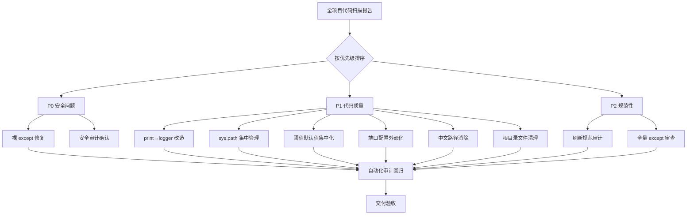
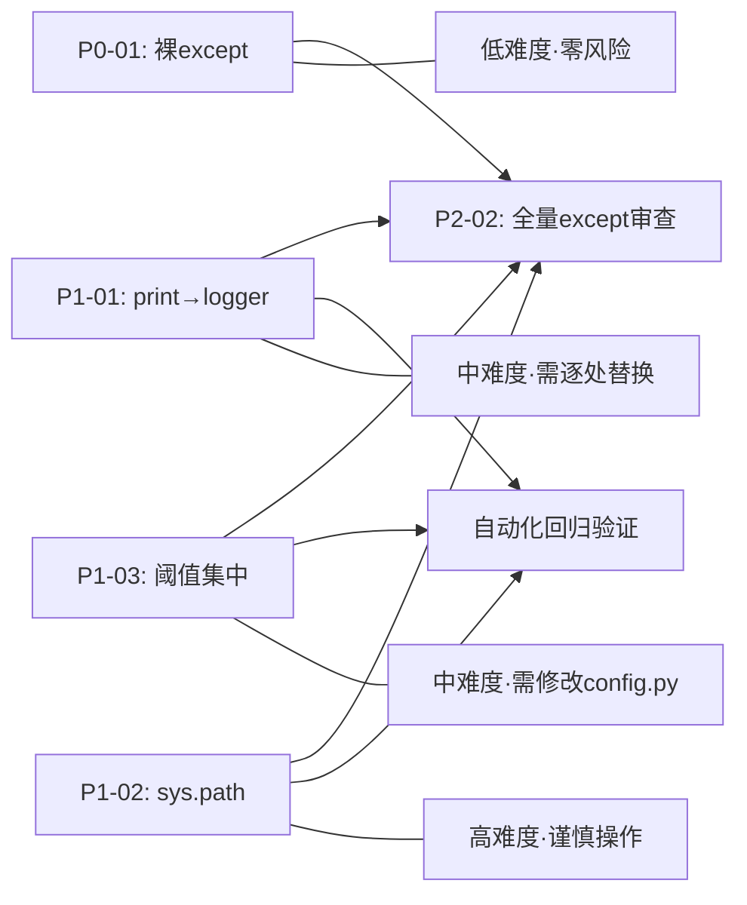

# DESIGN - 全项目代码质量整改设计方案

## 1. 整体架构

### 1.1 整改策略图



### 1.2 依赖关系



## 2. 分层设计方案

### 2.1 配置层（config.py 增强）

```python
# 当前 config.py 需扩展的配置项

# === 超时配置 ===
REQUEST_TIMEOUT = {
    'FAST': int(os.getenv('REQUEST_TIMEOUT_FAST', '5')),
    'NORMAL': int(os.getenv('REQUEST_TIMEOUT_NORMAL', '10')),
    'LONG': int(os.getenv('REQUEST_TIMEOUT_LONG', '30')),
    'QUICK': int(os.getenv('REQUEST_TIMEOUT_QUICK', '3')),
    'EXTRA': int(os.getenv('REQUEST_TIMEOUT_EXTRA', '30')),
}

# === 数据库连接超时 ===
DB_CONNECT_TIMEOUT = int(os.getenv('DB_CONNECT_TIMEOUT', '3'))
SQLITE_TIMEOUT = int(os.getenv('SQLITE_TIMEOUT', '10'))

# === 端口配置 ===
FLASK_PORT = int(os.getenv('FLASK_PORT', '5008'))
REDIS_PORT = int(os.getenv('REDIS_PORT', '6379'))

# === 断路器配置 ===
CB_FAILURE_THRESHOLD = int(os.getenv('CB_FAILURE_THRESHOLD', '50'))
CB_SUCCESS_THRESHOLD = int(os.getenv('CB_SUCCESS_THRESHOLD', '3'))
CB_FAILURE_RATE_THRESHOLD = float(os.getenv('CB_FAILURE_RATE_THRESHOLD', '0.5'))
CB_HALF_OPEN_REQUESTS = int(os.getenv('CB_HALF_OPEN_REQUESTS', '3'))
CB_OPEN_TIMEOUT = int(os.getenv('CB_OPEN_TIMEOUT', '30'))
```

### 2.2 日志层（logger 统一）

```python
# 所有生产文件统一日志模式
import logging

logger = logging.getLogger(__name__)

# print() 替换规则：
# print('xxx', flush=True)  →  logger.info('xxx')
# print(f'[WARN] xxx')      →  logger.warning('xxx')
# print(f'[ERROR] xxx')     →  logger.error('xxx')
# print(f'[云端] xxx')       →  logger.info('[云端] xxx')
```

### 2.3 路径管理层（sys.path 集中）

```
当前模式（BAD）:
  每个入口/脚本文件都做:
    sys.path.insert(0, os.path.join(...))
  
目标模式（GOOD）:
  仅 config.py 中设置一次:
    sys.path.insert(0, BASE_DIR)
    sys.path.insert(0, PARENT_DIR)
  
  其他所有模块直接:
    from config import BASE_DIR, PROJECT_ROOT
```

## 3. 原子任务拆分

### T1: P0-01 裸 except 修复
- 文件: dispatch_center.py
- 行: 343, 1758
- 操作: `except:` → `except Exception as e:` + `logger.exception()`
- 风险: 低

### T2: P1-01 print→logger 改造
- 范围: dispatch_center.py (生产路径), debug_compare5.py 等调试文件
- 操作: 逐处替换，注意保留 `flush=True` 语义
- 特殊规则: 启动 banner（`print("=" * 60)` 等）可保留或改用 logger
- 风险: 中 - 需区分生产路径和测试路径

### T3: P1-02 sys.path 集中
- 范围: 生产入口文件（dispatch_center.py, app.py, wechat_server.py 等）
- 操作: 在 config.py 中统一设置，其他文件删除重复代码
- 注意: 脚本/tests 文件保留原有模式，不修改
- 风险: 高 - 需确保 import 顺序不打破

### T4: P1-03 阈值默认值集中
- 范围: 全项目所有 `os.environ.get('KEY', 'default')`
- 操作: 迁移到 config.py 中统一定义
- 替换模式: `int(os.environ.get('KEY', '5'))` → `from config import REQUEST_TIMEOUT_FAST`
- 风险: 中

### T5: P1-04 端口配置外部化
- 范围: start_debug.py, run_app.py, modules/health_checker.py
- 操作: 从 config.py 读取端口值
- 风险: 低

### T6: P1-05 中文路径消除
- 范围: tests/test_collect.py 等 5 个文件
- 操作: 替换为 `os.path.dirname(os.path.abspath(__file__))` 推导
- 风险: 低

### T7: P1-06 根目录文件清理
- 范围: debug_compare5.py, _verify*.py, __test_*.py, _bootstrap_check.py, _check_routes.py, debug_start.py
- 操作: 
  - 有价值的 → 移入 scripts/tools/
  - 无用的 → 删除
- 风险: 低（需先确认文件是否被引用）

### T8: P2-02 全量 except 审查
- 范围: 全项目所有 `except:` 语句
- 操作: 审查是否为裸 except，是否需加 Exception 类型
- 风险: 低

## 4. 数据流向

```
整改前:
  config.py (少量配置)
       ↓
  dispatch_center.py ← print(), sys.path.insert(), 硬编码阈值
  app.py ← sys.path.insert()
  10+文件 ← 各自管理阈值默认值

整改后:
  config.py (统一配置入口)
       ↓
  dispatch_center.py → logger.info(), from config import ..., from config import TIMEOUT
  app.py → from config import BASE_DIR (无需 sys.path)
  各模块 → from config import REQUEST_TIMEOUT_FAST
```

## 5. 异常处理策略

| 场景 | 策略 |
|------|------|
| 替换 print 后 logger 未初始化 | `logging.basicConfig(level=logging.INFO)` 兜底 |
| sys.path 统一后 import 失败 | 在 config.py 中加 try-except 并输出诊断信息 |
| 阈值迁移后模块找不到配置 | 保留旧 `os.environ.get()` 兼容代码，逐步迁移 |
| 删除文件后其他模块依赖 | 先 grep 确认无引用，再操作 |
