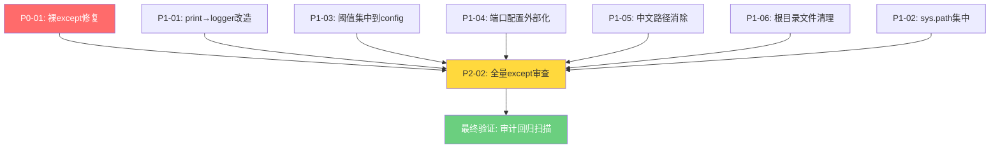

# TASK - 全项目代码质量整改原子任务

## 任务依赖图



## 任务清单

---

### T1: P0-01 裸 except 修复

| 属性 | 内容 |
|------|------|
| **优先级** | P0 - CRITICAL |
| **难度** | 低 |
| **预估工时** | 5分钟 |
| **前置依赖** | 无 |

**输入契约**
- dispatch_center.py 中存在裸 `except:` 语句
- 已有 logger 引用

**操作步骤**
1. 定位行 343 的 `except:`
2. 改为 `except Exception as e:`
3. 在异常块内添加 `logger.exception(...)`
4. 定位行 1758 的 `except:`
5. 同样修改

**输出契约**
- 裸 except: 零残留
- 每个 except 块记录异常日志

**验收标准**
- `grep -n "^\s*except\s*:" dispatch_center.py` 结果为空
- 代码审查通过

---

### T2: P1-01 print→logger 改造

| 属性 | 内容 |
|------|------|
| **优先级** | P1 - HIGH |
| **难度** | 中 |
| **预估工时** | 30分钟 |
| **前置依赖** | T1 |

**输入契约**
- 生产代码（dispatch_center.py, wechat_server.py, sync_bridge_server.py）中存在 print()
- 测试/脚本/调试文件中的 print() 可保留

**操作步骤**
1. 在 dispatch_center.py 中替换生产路径下的 print() 为 logger.info()/warning()/error()
2. 保留 `=*60` 等启动 banner（或改用 logger）
3. 检查 wechat_server.py 的 print()（在 `if __name__ == '__main__'` 中的可保留）
4. 检查 sync_bridge_server.py 的 print()（启动信息保留或转 logger）

**替换映射表**
| 原代码 | 替换为 |
|--------|--------|
| `print('xxx', flush=True)` | `logger.info('xxx')` |
| `print('[云端] xxx', flush=True)` | `logger.info('[云端] xxx')` |
| `print(f'[OK] xxx')` | `logger.info(f'[OK] xxx')` |
| `print(f'[WARN] xxx')` | `logger.warning(f'[WARN] xxx')` |
| `print(f'[ERROR] xxx')` | `logger.error(f'[ERROR] xxx')` |
| `print("="*60)` (启动banner) | 可保留或用logger.info |

**注意**
- 启动 banner 对外展示给运维人员看，保留 print 有一定合理性，可自行决策
- `if __name__ == '__main__'` 块中的 print() 可保留或转 logger

**输出契约**
- 生产路径代码中 print() 清零
- 启动 banner 可保留或转 logger

**验收标准**
- `grep -n "^\s*print(" dispatch_center.py` 中仅 `__main__` 块中和启动 banner 可保留
- 所有生产路径 print 替换为对应级别的 logger 调用

---

### T3: P1-02 sys.path 集中管理

| 属性 | 内容 |
|------|------|
| **优先级** | P1 - HIGH |
| **难度** | **高** - 需谨慎操作 |
| **预估工时** | 60分钟 |
| **前置依赖** | 无（但建议最后做） |

**输入契约**
- 全项目 60 处 sys.path.insert()
- 生产入口文件的 sys.path.insert 需要整合

**操作步骤**
1. 分析 config.py 当前是否已设置 BASE_DIR/PARENT_DIR
2. 确保 config.py 中已设置：`sys.path.insert(0, BASE_DIR)`, `sys.path.insert(0, PARENT_DIR)`
3. 对生产入口文件（dispatch_center.py, app.py, wechat_server.py 等）：
   - 保留 sys.path.insert，确保启动时路径正确
   - 其他模块中删除重复的 sys.path.insert，改为 `from config import BASE_DIR`
4. 脚本/tests 文件 **不修改**（它们是独立运行的）

**风险控制**
- 先备份 dispatch_center.py
- 修改后运行一次完整启动测试
- 如果 import 失败，立即回退

**输出契约**
- 生产入口文件中 sys.path.insert 保留（config.py 已设置）
- 非入口生产模块中无重复 sys.path.insert

**验收标准**
- 项目能正常启动
- 各 API 端点工作正常

---

### T4: P1-03 阈值默认值集中到 config

| 属性 | 内容 |
|------|------|
| **优先级** | P1 - HIGH |
| **难度** | 中 |
| **预估工时** | 45分钟 |
| **前置依赖** | 无 |

**输入契约**
- 全项目 60+ 处 `os.environ.get('KEY', 'default')`
- 6+ 种 timeout 变量名

**操作步骤**
1. 在 config.py 中增加所有阈值配置项（见 DESIGN 文档 2.1 节）
2. 逐文件替换 `int(os.environ.get('REQUEST_TIMEOUT_FAST', '5'))` 为 `from config import REQUEST_TIMEOUT_FAST; REQUEST_TIMEOUT_FAST`
3. 替换 `connect_timeout=3` 为 `connect_timeout=DB_CONNECT_TIMEOUT`
4. 注意保留兼容性：不改动 `os.environ.get()` 兜底逻辑，只将默认值移入 config.py

**注意**
- wechat_server.py 为云端专用，有独立规范，谨慎修改
- 断路器配置（CB_*）已使用环境变量，只需加 config.py 声明

**输出契约**
- config.py 包含所有阈值配置项
- 各模块引用 config.py 中的配置

**验收标准**
- `grep "environ\.get.*'".*"'" config.py` 之外的硬编码默认值清零
- 所有 `connect_timeout=N` 改为引用配置

---

### T5: P1-04 端口配置外部化

| 属性 | 内容 |
|------|------|
| **优先级** | P1 - HIGH |
| **难度** | 低 |
| **预估工时** | 10分钟 |
| **前置依赖** | 无 |

**输入契约**
- start_debug.py:19: `port=5008`
- run_app.py:10: `port=5008`
- modules/health_checker.py:429: `redis_port=6379`

**操作步骤**
1. 确认 config.py 中已有 FLASK_PORT / REDIS_PORT 定义
2. 修改 start_debug.py: `port=config.FLASK_PORT`
3. 修改 run_app.py: `port=config.FLASK_PORT`
4. 修改 health_checker.py: `redis_port=config.REDIS_PORT`

**输出契约**
- 端口值均从 config.py 或环境变量读取
- 无硬编码端口号

**验收标准**
- `grep "port=\d{4}" *.py --include='*.py'` 结果不含硬编码端口（redis_port 默认值除外）

---

### T6: P1-05 中文路径消除

| 属性 | 内容 |
|------|------|
| **优先级** | P1 - HIGH |
| **难度** | 低 |
| **预估工时** | 10分钟 |
| **前置依赖** | 无 |

**输入契约**
- 5 个文件包含中文硬编码路径

**操作步骤**
1. `tests/test_collect.py:2`: 替换为 `os.path.dirname(os.path.dirname(os.path.abspath(__file__)))`
2. `tests/test_api_internal.py:2`: 同上
3. `tests/test_api_internal2.py:2`: 同上
4. `scripts/test_template_render.py:3`: 替换为 `os.path.join(os.path.dirname(__file__), '..', '..')` 后做 `os.path.abspath`
5. `_check_routes.py:3`: 替换为 `os.path.dirname(os.path.abspath(__file__))`

**输出契约**
- 全项目中无中文硬编码路径

**验收标准**
- `grep -r "r'["']d:" --include='*.py'` 结果为空

---

### T7: P1-06 根目录文件清理

| 属性 | 内容 |
|------|------|
| **优先级** | P1 - HIGH |
| **难度** | 低 |
| **预估工时** | 10分钟 |
| **前置依赖** | 无 - 但需先确认文件是否被引用 |

**输入契约**
- 根目录下存在多个调试/验证文件

**操作步骤**
1. 对每个文件执行 `grep -r "import.*文件名"` 和 `grep -r "文件名\."` 确认无外部引用
2. 有价值的文件移入 `scripts/tools/`（如 _verify_*.py 类验证脚本）
3. 无用的调试文件删除

**文件处理指南**
| 文件 | 建议操作 | 说明 |
|------|---------|------|
| debug_compare5.py | 移入 scripts/tools/ | 数据对比调试脚本 |
| debug_start.py | 删除 | 已被 start_debug.py 替代 |
| _verify_step2/3/4.py | 移入 scripts/tools/ | 验证脚本 |
| _verify_fix.py | 移入 scripts/tools/ | 验证修复脚本 |
| _bootstrap_check.py | 移入 scripts/tools/ | 启动检查脚本 |
| _check_routes.py | 删除或移入 scripts/tools/ | 路由检查 |
| __test_import.py | 删除 | 一次性测试 |
| __test_redis.py | 删除 | 一次性测试 |

**输出契约**
- 根目录整洁
- 有价值的文件归入 scripts/tools/

**验收标准**
- 根目录下无 _verify*.py, _check*.py, debug_*.py, __test_*.py 等散乱文件

---

### T8: P2-02 全量 except 审查

| 属性 | 内容 |
|------|------|
| **优先级** | P2 - MEDIUM |
| **难度** | 低 |
| **预估工时** | 15分钟 |
| **前置依赖** | T1, T2, T4, T5, T6, T7 |

**输入契约**
- 全项目所有 except 语句

**操作步骤**
1. `grep -n "except\s*:" mobile_api_ai/**/*.py` 确认裸 except 位置
2. 逐处审查：
   - 如果是 `except Exception as e:` → ✅ 合规
   - 如果是 `except:` → ❌ 改为 `except Exception as e:`
   - 如果是 `except (A, B):` → 检查是否过于宽泛
3. 确认无 `except: pass` 模式

**输出契约**
- 全项目 except 语句均合规
- 无静默吞异常模式

**验收标准**
- `grep -n "^\s*except\s*:" $(find . -name '*.py' -not -path './scripts/*' -not -path './tests/*')` 结果全为 `except Exception` 或 `except SpecificError`
- 零 `except: pass`

---

### TV: 最终验证 - 审计回归扫描

| 属性 | 内容 |
|------|------|
| **优先级** | P0 - CRITICAL |
| **难度** | 低 |
| **预估工时** | 5分钟 |
| **前置依赖** | T1 ~ T8 |

**验证命令集**
```bash
# 1. 裸 except 检查
grep -n "^\s*except\s*:" dispatch_center.py

# 2. print 检查（生产代码）
grep -n "^\s*print(" dispatch_center.py

# 3. sys.path 检查（入口文件以外）
grep -rn "sys\.path\.(insert|append)" --include='*.py' \
  --exclude-dir=scripts --exclude-dir=tests \
  --exclude-dir=__pycache__

# 4. 硬编码阈值检查
grep -rn "connect_timeout=\d" --include='*.py'

# 5. 中文路径检查
grep -rn "r'["']d:" --include='*.py'

# 6. 端口硬编码检查
grep -rn "port=\d{4}" --include='*.py' | grep -v "os.environ"
```

**验收标准**
- 上列命令均返回空结果或合规结果
- 项目能正常启动运行
