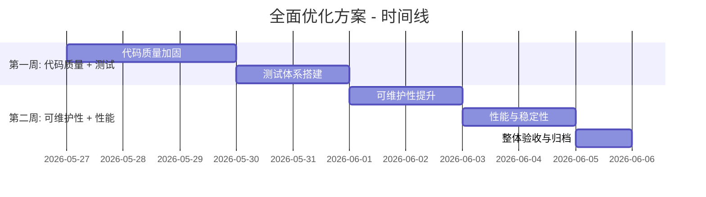
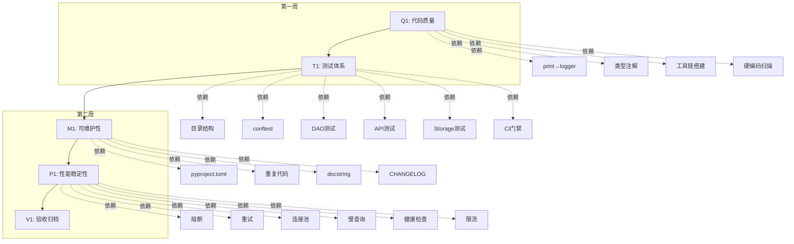
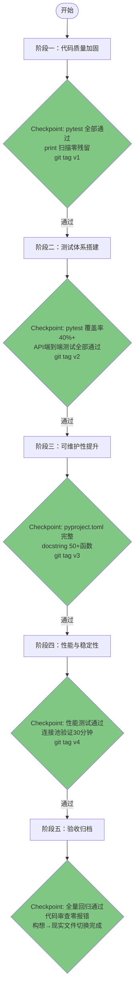

# 全面优化方案（DESIGN）

## 版本历史

| 版本 | 日期 | 作者 | 变更说明 |
|------|------|------|---------|
| v1.0 | 2026-05-26 | AI架构师 | 初始版本 |

---

## 1. 优化目标与范围

### 1.1 总体目标

在 **2周+** 时间窗口内，完成对 `mobile_api_ai/` 服务端的全方位治理，覆盖以下四个优先级领域：

| 领域 | 当前评分 | 目标评分 | 提升策略 |
|------|---------|---------|---------|
| 代码质量加固 | 6.5/10 | 8.5/10 | print→logger治理、类型注解补全、代码风格工具链、硬编码消除 |
| 测试体系搭建 | 3/10 | 7/10 | pytest框架标准化、核心模块UT覆盖、CI集成 |
| 可维护性提升 | 7/10 | 8.5/10 | 工具链统一、重复代码抽取、文档补全、配置管理 |
| 性能与稳定性 | 7/10 | 8.5/10 | 熔断/重试、连接池、查询优化、健康检查 |

### 1.2 范围边界

| 包含 | 不包含 |
|------|--------|
| `mobile_api_ai/` 服务端代码（约300+ .py文件） | `core/` 桌面端代码 |
| `scripts/` 中生产环境使用的工具脚本 | 已归档的 miniprogram、mobile_api |
| `.github/workflows/` CI配置 | 数据库Schema重构 |
| `tests/` 测试目录（约35个.py文件） | 业务功能新增或改造 |
| `docs/` 文档体系 | 架构层面的重构（如FastAPI迁移） |

### 1.3 设计原则

1. **增量改造，不动存量**：改造现有文件时只增不减，保持原有结构和接口不变
2. **先治理后扩展**：优先修复现有问题，不引入新功能
3. **可测量可验证**：每个优化项有明确的验收标准和量化指标
4. **工具自动化**：能用工具的不用手动，降低长期维护成本

---

## 2. 阶段规划（2周+）

### 总体路线图



### 阶段一：代码质量加固（第1-3天）

#### 目标
- 消除生产代码中的 `print()` → `logger` 转换（37处）
- 关键文件类型注解覆盖率提升至 50%+
- 建立代码风格工具链（flake8 + black + isort + pre-commit）
- 消除配置硬编码和裸except

#### 行动项

| 编号 | 任务 | 涉及文件 | 工作量评估 | 优先级 |
|------|------|---------|-----------|-------|
| Q1.1 | print→logger替换 | container_center_v5.py (19处), cloud_poller.py (9处), enhanced_backup.py (9处) | 2h | P0 |
| Q1.2 | 类型注解补全 | dispatch_center.py (313函数, 14%→50%), wechat_work_bot_v2.py (78函数, 0%→50%), face_checkin/__init__.py (60函数, 0%→50%) | 6h | P0 |
| Q1.3 | 代码风格工具链搭建（骨架） | 新建 pyproject.toml（仅工具链骨架: black/isort/flake8/pytest 配置），.flake8, .pre-commit-config.yaml。项目元数据留待阶段三 M1.1 填充 | 2h | P0 |
| Q1.4 | 生产代码硬编码扫描 | 全局扫描 + 整改 scripts/ 中生产脚本 | 3h | P1 |
| Q1.5 | 裸except治理 | 全局扫描 + 补全日志和异常类型 | 2h | P1 |

#### 验收标准
- [ ] `container_center_v5.py` 中0处 `print()`
- [ ] `cloud_poller.py` 中0处 `print()`
- [ ] `enhanced_backup.py` 中0处 `print()`
- [ ] `dispatch_center.py` 类型注解覆盖率 ≥ 50%
- [ ] `wechat_work_bot_v2.py` 类型注解覆盖率 ≥ 50%
- [ ] `face_checkin/__init__.py` 类型注解覆盖率 ≥ 50%
- [ ] `pyproject.toml` 配置完成，`flake8` 零报错
- [ ] `.pre-commit-config.yaml` 配置完成，提交前自动检查
- [ ] 全局无裸 `except:` 语句

---

### 阶段二：测试体系搭建（第4-5天）

#### 目标
- 测试文件从35个→50个+，核心模块覆盖率 ≥ 40%
- 建立 pytest 标准化目录结构
- 实现 DAO层 + API层 + Storage层 的关键测试
- CI流水线中集成测试覆盖率门禁

#### 行动项

| 编号 | 任务 | 涉及文件 | 工作量评估 | 优先级 |
|------|------|---------|-----------|-------|
| T1.1 | 测试目录结构重组 | tests/ → tests/unit/, tests/integration/, tests/fixtures/ | 1h | P0 |
| T1.2 | conftest.py 增强 | 添加Mock DB、Mock API Client、Mock Storage fixtures | 2h | P0 |
| T1.3 | DAO层单元测试 | models/base_dao.py, storage_layer.py 核心方法 | 3h | P0 |
| T1.4 | API层集成测试 | api/ 下14个Blueprint的端点测试（每个至少1个happy path + 1个error case） | 4h | P0 |
| T1.5 | Storage层测试 | storage_mysql.py 的 CRUD 操作验证 | 2h | P1 |
| T1.6 | CI门禁配置 | .github/workflows/ci.yml 增加 coverage 阈值（≥40%）、pytest强制通过 | 1h | P0 |

#### 验收标准
- [ ] `tests/unit/`、`tests/integration/`、`tests/fixtures/` 目录结构就绪
- [ ] conftest.py 包含 Mock DB / Mock API Client / Mock Storage 三个 fixture
- [ ] DAO层测试覆盖 `save/update/delete/get_by_id` 四个核心方法
- [ ] API层测试覆盖 ≥ 7个Blueprint（至少50%覆盖率）
- [ ] CI流水线中 pytest 全部通过，coverage ≥ 40%
- [ ] 测试用例总数 ≥ 50个（含现有）

---

### 阶段三：可维护性提升（第6-7天）

#### 目标
- 建立统一的项目元信息（pyproject.toml）
- 抽取重复代码至公共工具模块
- 完善关键模块的文档注释
- 建立 Changelog 和版本管理

#### 行动项

| 编号 | 任务 | 涉及文件 | 工作量评估 | 优先级 |
|------|------|---------|-----------|-------|
| M1.1 | pyproject.toml 填充项目元数据 | 在 Q1.3 骨架基础上填充项目元数据（name/version/author/description）+ build-system 配置，工具链部分保持 Q1.3 不变 | 1h | P0 |
| M1.2 | 重复代码抽取 | 搜索跨文件重复的DB查询模式、错误处理模式，抽取至 utils/ 或公共基类 | 4h | P0 |
| M1.3 | 关键模块文档注释 | dispatch_center.py 各函数添加 docstring（313函数） | 4h (分批进行) | P1 |
| M1.4 | CHANGELOG.md 建立 | 创建版本变更记录，汇总历史变更 | 1h | P1 |
| M1.5 | .gitignore 审计 | 检查是否遗漏 logs/、__pycache__/、.env 等 | 0.5h | P2 |

#### 验收标准
- [ ] `pyproject.toml` 包含完整的项目元数据（name/version/author/description）+ 工具链配置（black/isort/flake8/pytest）
- [ ] 至少2处重复代码模式被抽取为公共函数
- [ ] `dispatch_center.py` 关键业务函数（top 50）有 docstring
- [ ] CHANGELOG.md 包含所有重要版本变更记录
- [ ] `.gitignore` 覆盖所有需要忽略的目录和文件类型

---

### 阶段四：性能与稳定性（第8-9天）

#### 目标
- 为关键外部调用添加熔断/重试机制
- 优化数据库连接池配置
- 添加健康检查和自愈能力
- 优化慢查询和N+1问题

#### 行动项

| 编号 | 任务 | 涉及文件 | 工作量评估 | 优先级 |
|------|------|---------|-----------|-------|
| P1.1 | 熔断机制接入 | modules/circuit_breaker.py → bots/、sync/ 等外部调用路径 | 3h | P0 |
| P1.2 | 重试+退避策略 | modules/fault_tolerance.py → 企业微信API调用等易失败场景 | 2h | P0 |
| P1.3 | 数据库连接池优化 | core/database.py（MySQL连接池调优，增加 pool_recycle/pre_ping）+ config.py（HTTP连接池环境变量化） | 1h | P1 |
| P1.4 | 慢查询分析 | 采集dispatch_center.py中数据库查询耗时，标注慢查询 | 2h | P1 |
| P1.5 | 健康检查端点 | 新建 `/api/health` 端点，返回各组件状态（DB/Redis/Bot等） | 1.5h | P0 |
| P1.6 | 请求限流 | 为API端点添加 flask-limiter 限流配置 | 1h | P1 |

#### 验收标准
- [ ] `circuit_breaker.py` 在 bots/ 或 sync/ 的易失败调用中生效
- [ ] 企业微信API调用实现指数退避重试（max 3次）
- [ ] `core/database.py` 中 MySQL 连接池增加 pool_recycle/pre_ping 配置合理，`config.py` 中 HTTP 连接池 MAX_CONNECTIONS 环境变量化
- [ ] 存在 `/api/health` 端点，返回 DB/Bot 连通状态
- [ ] API端点已有限流配置（flask-limiter）

---

### 阶段五：整体验收与归档（第10天）

#### 目标
- 全量回归验证
- 文档归档
- 交付确认

#### 行动项

| 编号 | 任务 | 工作量评估 | 优先级 |
|------|------|-----------|-------|
| V1.1 | 全量测试回归 | 2h | P0 |
| V1.2 | 代码审查（自检） | 2h | P0 |
| V1.3 | 验收文档编写 | 1h | P1 |
| V1.4 | 构想文件→现实文件切换 | 0.5h | P1 |

#### 验收标准
- [ ] 所有测试通过（pytest零失败）
- [ ] flake8/black/isort 零报错
- [ ] 无 `print()` 残留在生产代码中
- [ ] CI流水线全部通过
- [ ] 验收文档（ACCEPTANCE）完成

---

## 3. 模块依赖关系



## 4. 执行顺序约束

| 前置条件 | 后置依赖 | 说明 |
|---------|---------|------|
| 阶段一（代码质量） | 阶段二（测试） | 代码质量修复后，测试代码才能基于干净的代码编写 |
| 阶段二（测试） | 阶段三（可维护性） | 测试覆盖确保重构安全性 |
| 阶段三（可维护性） | 阶段四（性能） | 优化前先确保代码可维护 |
| 阶段四（性能） | 阶段五（验收） | 所有优化完成后统一验收 |

## 5. 风险与应对

| 风险 | 影响 | 概率 | 应对策略 |
|------|------|------|---------|
| 类型注解补全工作量超预期 | 延期 | 中 | 优先补全关键文件（dispatch_center.py），非关键文件延后 |
| 现有测试用例不稳定 | 影响CI门禁 | 低 | 先修复/标记flake测试，确保CI基线稳定 |
| 熔断/重试引入新bug | 稳定性下降 | 低 | 先添加单元测试覆盖，逐步灰度 |
| print→logger改动影响调试 | 开发效率下降 | 低 | 保留`DEBUG`级别日志，启动时可通过环境变量控制 |
| 性能优化无显著提升 | 目标未达成 | 中 | 优化前先做基准测试（benchmark），确保可量化 |

## 6. 资源估算

| 资源 | 估算 | 说明 |
|------|------|------|
| 开发工时 | 10个工作日（80小时） | 含编码、测试、自检 |
| 核心参与文件 | ~50个 | 预计涉及的文件修改范围 |
| 测试新增 | ~30个测试用例 | 覆盖DAO、API、Storage三层 |
| 工具配置 | ~5个新文件 | pyproject.toml, .flake8, .pre-commit-config.yaml 等 |

## 7. 架构图

```mermaid
graph LR
    subgraph "优化前状态"
        A[代码: print()|裸except|无类型] --> B[测试: 35个零散用例]
        B --> C[CI: 无覆盖率门禁]
        C --> D[维护: 无pyproject.toml]
        D --> E[性能: 无熔断/重试/限流]
    end

    subgraph "优化后状态"
        A'[代码: logger|规范异常|类型注解50%+] --> B'[测试: 50+标准化用例]
        B' --> C'[CI: coverage≥40%门禁]
        C' --> D'[维护: pyproject.toml|CHANGELOG|pre-commit]
        D' --> E'[性能: 熔断|重试|限流|健康检查]
    end

    优化前状态 -->|2周+全面治理| 优化后状态
```

---

## 8. 与既有规范兼容性

### 8.1 规范兼容矩阵

| 规范文件 | 兼容性 | 说明 |
|---------|--------|------|
| `dispatch_center_refresh.md`（调度中心刷新规范） | ✅ 兼容 | 优化方案聚焦代码质量和性能，不涉及刷新函数的增删改逻辑 |
| `wechat_server_cloud_only.md`（云端专用规范） | ✅ 兼容 + 约束 | 本方案**不修改** `wechat_server.py`；所有优化均在 `dispatch_center.py` 及本地服务端代码中进行 |
| `业务领域概念定义.md`（Process/SubStep 定义） | ✅ 兼容 | 优化不涉及流程推进、工序报工等业务逻辑的修改 |
| `版本归档管理.md`（已归档项目冻结） | ✅ 兼容 | 优化范围限定于 `mobile_api_ai/`，不涉及已归档的 miniprogram、mobile_api、inventory_api |
| `jgs7 技术执行规范` | ✅ 已遵循 | 本方案已覆盖 print→logger、类型注解、config 管理等要求 |

### 8.2 关键约束说明

1. **不修改 `wechat_server.py`**：所有调度中心相关优化（类型注解、慢查询分析等）仅在 `dispatch_center.py` 中进行
2. **不触碰已归档项目**：优化范围严格限定在 `mobile_api_ai/` 服务端代码，不涉及已归档的 mini-program、旧版 API、库存服务
3. **刷新规范保持原样**：`dispatch_center_refresh.md` 中的操作→刷新映射规则不变，优化方案不引入新的刷新函数或修改现有刷新逻辑
4. **业务概念不动**：Process 和 SubStep 的核心定义和操作逻辑保持不变

---

## 9. 安全执行约束

### 9.1 通用执行规则（所有子任务强制执行）

| # | 规则 | 说明 | 违规后果 |
|---|------|------|---------|
| G1 | **增量提交** | 每个子任务完成后 `git commit`，不合并提交，不跨任务提交 | 回退困难 |
| G2 | **先测试后修改** | 修改代码前先 `pytest` 运行基线，确保修改后零回归 | 不允许跳过 |
| G3 | **只增不减** | 改造现有文件时只增不减，不删除、不重命名现有函数/类/变量 | 重构范围失控 |
| G4 | **不改接口契约** | 禁止修改已有 API 的输入/输出 JSON 格式、路由路径、HTTP 方法 | 影响联调方 |
| G5 | **不改数据库表结构** | 禁止执行 DDL、修改表名/列名、新增表 | 数据安全 |
| G6 | **不修改 wechat_server.py** | `wechat_server.py` 为云端专用，禁止任何修改 | 违反云端规范 |
| G7 | **不触碰已归档项目** | 优化范围严格限定在 `mobile_api_ai/` | 违反归档冻结 |
| G8 | **checkpoint 打 tag** | 每阶段完成后 `git tag v{阶段编号}`，确保可 `git checkout` 快速回退 | 回退无锚点 |
| G9 | **分批部署** | 代码修改逐日部署（低风险）；P1.3 连接池修改需低峰期+先验证后部署 | 生产隐患 |
| G10 | **不留 print() 残留** | 任何修改后 `grep -n "print("` 检查，确认无新引入的 print() | 代码质量回退 |

### 9.2 阶段间执行门禁



**门禁规则**：
- 前一个阶段的 checkpoint 未通过 → **禁止**进入下一阶段
- checkpoint 失败 → 回退修改，重新运行验证，通过后再继续
- 任何阶段内的子任务失败 → 只回退该子任务（利用 git tag 定位）

### 9.3 按子任务的安全约束速查表

| 子任务 | 操作类型 | 风险等级 | 禁止操作 | 安全验证 |
|--------|---------|---------|---------|---------|
| **Q1.1** print→logger | 文本替换 | 🟢 低 | 禁止修改非 print() 行的任何代码逻辑 | pytest 基线通过 |
| **Q1.2** 类型注解 | 代码新增 | 🟡 中 | 禁止修改函数返回值逻辑；禁止引入第三方依赖 | pytest 基线通过；mypy 仅告警级别 |
| **Q1.3** 工具链骨架 | 新建文件 | 🟢 低 | 禁止修改项目现有代码；不填充项目元数据 | 文件校验 |
| **Q1.4** 硬编码抽离 | 代码修改 | 🟢 低 | 禁止修改主服务入口代码（app.py/main.py） | 仅针对 scripts/ 目录 |
| **Q1.5** 裸 except 修复 | 代码修改 | 🟡 中 | 禁止删除/修改 except 块内的功能代码 | pytest 基线通过 |
| **T1.1-T1.6** 测试搭建 | 新建+修改 | 🟢 低 | 禁止修改生产代码（仅修改测试文件、conftest、配置文件） | — |
| **M1.1** 元数据填充 | 配置修改 | 🟢 低 | 禁止覆盖 Q1.3 已配置的工具链部分 | diff 校验 |
| **M1.2** 重复代码抽取 | 重构 | 🟡 中 | 禁止修改原有函数签名（只新增公共函数，不改调用方） | 抽取前 pytest 基线 |
| **M1.3** 文档注释 | 纯注释 | 🟢 低 | **禁止修改任何代码逻辑**；只添加 docstring，不修改参数/返回值 | 代码 diff 审查 |
| **M1.4** CHANGELOG | 新建文件 | 🟢 低 | 禁止修改生产代码 | — |
| **M1.5** .gitignore | 配置修改 | 🟢 低 | 禁止修改生产代码 | — |
| **P1.1** 熔断 | 接入装饰器 | 🟢 低 | 禁止修改核心业务逻辑；装饰器内部不改变返回值格式 | pytest 基线通过 |
| **P1.2** 重试 | 接入装饰器 | 🟢 低 | 仅针对网络级异常重试，禁止对业务异常重试 | pytest 基线通过 |
| **P1.3** 连接池 | 配置修改 | 🟡 中 | 禁止修改 core/database.py 其他非连接池配置 | 测试环境验证30分钟 |
| **P1.4** 慢查询 | 只读分析 | 🟢 低 | 禁止修改 dispatch_center.py 任何代码 | 不写代码 |
| **P1.5** 健康检查 | 新增端点 | 🟢 低 | 禁止修改现有 Blueprint 注册方式和路由 | pytest 基线通过 |
| **P1.6** 限流 | 配置新增 | 🟡 中 | 限流阈值不低于默认值（60/分钟），敏感端点不低于10/分钟 | 限流不阻断正常请求 |
| **V1.1-V1.4** 验收归档 | 只读+文档 | 🟢 低 | 禁止修改任何生产代码 | — |

### 9.4 违规监控清单（执行期间实时检查）

```yaml
违规检测项:
  - 检测: git diff 中包含删除行（以 "-" 开头的非注释行）
    严重程度: CRITICAL
    处理: 立即拦截，要求只增不减

  - 检测: 涉及文件超出子任务声明的范围
    严重程度: HIGH
    处理: 退回重做

  - 检测: 修改了 wechat_server.py
    严重程度: CRITICAL
    处理: git checkout 还原，通报

  - 检测: 提交消息中同时包含多个子任务ID
    严重程度: MEDIUM
    处理: 要求拆分为独立提交

  - 检测: 新增了 print() 调用
    严重程度: HIGH
    处理: 必须替换为 logger 后重新提交

  - 检测: 修改了数据库 model/table 定义
    严重程度: CRITICAL
    处理: 禁止提交

  - 检测: 提交前未运行 pytest
    严重程度: HIGH
    处理: 补充测试运行，确认通过后提交
```

### 9.5 回退策略

| 场景 | 回退方式 | 预计耗时 |
|------|---------|---------|
| 单个子任务引入错误 | `git revert <该子任务的 commit>` | 5分钟 |
| 整个阶段出现问题 | `git checkout tags/v{上一阶段}` | 5分钟 |
| 连接池修改导致生产异常 | `git revert P1.3 commit` + 重启服务 | 10分钟 |
| 限流配置误伤正常流量 | 临时调高阈值，后续修复配置 | 2分钟 |
