# TASK_QUANTUM: 全面优化方案 - 量子分化任务书

## 概述

将原 5 阶段 × 20 子任务分化至 **44 个量子原子任务**，每个量子为最小可独立验证的修改单元。

| 维度 | 值 |
|------|-----|
| 原任务数 | 20 子任务 |
| 量子数 | 44 个 |
| 分化比 | 1:2.2 |
| 预估总工时 | 44 × (0.5~2h) = 22~88h |
| 独立验证率 | 100%（每个量子有独立验证命令） |
| 回退粒度 | 单量子级 `git revert` |

---

## 分化逻辑说明

每个量子原子任务按以下结构离：

| 字段 | 说明 |
|------|------|
| **量子ID** | `{阶段ID}-Q{序号}`，如 `Q1.1-Q1` |
| **输入契约** | 前置依赖、需要读取的文件、环境就绪要求 |
| **输出契约** | 修改后的文件清单、验收标准、验证命令 |
| **实现约束** | 禁止操作、编码规范、安全约束 |
| **依赖关系** | 前置量子 → 本量子 → 后置量子 |
| **回退方式** | `git revert <commit>` 即可独立回退 |

---

## 阶段一：代码质量加固 → 13 个量子

### Q1.1 print→logger：3 个量子

#### Q1.1-Q1：container_center_v5.py print→logger

| 属性 | 内容 |
|------|------|
| **描述** | 将 `container_center_v5.py` 中 19 处 `print()` 替换为 `logger.info/debug/warning` |
| **涉及文件** | `container_center_v5.py`（单文件） |
| **输入契约** | 文件已确认 19 处 `print(` 调用，逐处评估上下文确定日志级别 |
| **输出契约** | grep `print(` 归零；新增 `logger = logging.getLogger(__name__)` |
| **验证命令** | `Select-String -Pattern "print(" -Path container_center_v5.py` → 0 匹配 |
| **禁止操作** | ❌ 修改非 print 行的任何代码；❌ 删除 print 所在行中的非 print 代码 |
| **前置依赖** | 无（阶段一首个量子） |
| **后置量子** | Q1.1-Q2, Q1.2-Q1 |
| **回退** | `git revert` 本 commit |

#### Q1.1-Q2：cloud_poller.py print→logger

| 属性 | 内容 |
|------|------|
| **描述** | 将 `cloud_poller.py` 中 9 处 `print()` 替换为 `logger.info/debug/warning` |
| **涉及文件** | `cloud_poller.py`（单文件） |
| **输入契约** | 文件已确认 9 处 `print(` 调用 |
| **输出契约** | grep `print(` 归零 |
| **验证命令** | `Select-String -Pattern "print(" -Path cloud_poller.py` → 0 匹配 |
| **禁止操作** | ❌ 修改非 print 行的任何代码 |
| **前置依赖** | 无 |
| **后置量子** | Q1.1-Q3 |
| **回退** | `git revert` 本 commit |

#### Q1.1-Q3：enhanced_backup.py print→logger

| 属性 | 内容 |
|------|------|
| **描述** | 将 `enhanced_backup.py` 中 9 处 `print()` 替换为 `logger.info/debug/warning` |
| **涉及文件** | `modules/enhanced_backup.py`（单文件） |
| **输入契约** | 文件已确认 9 处 `print(` 调用 |
| **输出契约** | grep `print(` 归零 |
| **验证命令** | `Select-String -Pattern "print(" -Path modules/enhanced_backup.py` → 0 匹配 |
| **禁止操作** | ❌ 修改非 print 行的任何代码 |
| **前置依赖** | 无 |
| **后置量子** | Q1.5-Q1（三个文件 print 清零后进入裸except治理） |
| **回退** | `git revert` 本 commit |

---

### Q1.2 类型注解：3 个量子

#### Q1.2-Q1：dispatch_center.py 类型注解

| 属性 | 内容 |
|------|------|
| **描述** | 为 `dispatch_center.py` 中 313 个函数补全参数/返回类型注解，覆盖率从 14% → ≥ 50% |
| **涉及文件** | `dispatch_center.py`（单文件，313 函数） |
| **输入契约** | 理解各函数参数/返回值语义；已有 typing 导入则复用 |
| **输出契约** | 参数类型注解覆盖率 ≥ 50%（至少 157 函数有注解） |
| **验证命令** | 运行脚本统计：`python scripts/check_annotation_coverage.py dispatch_center.py --min 50` → PASS |
| **禁止操作** | ❌ 修改函数返回值逻辑；❌ 引入 `mypy/pydantic` 等第三方依赖；❌ 重命名参数 |
| **安全验证** | `pytest` 基线通过（类型注解不影响运行时语义） |
| **前置依赖** | 无（可与 Q1.1 并行） |
| **后置量子** | Q1.2-Q2 |
| **回退** | `git revert` 本 commit |

#### Q1.2-Q2：wechat_work_bot_v2.py 类型注解

| 属性 | 内容 |
|------|------|
| **描述** | 为 `wechat_work_bot_v2.py` 中 78 个函数补全注解，覆盖率从 0% → ≥ 50% |
| **涉及文件** | `wechat_work_bot_v2.py`（单文件，78 函数） |
| **输出契约** | 参数注解覆盖率 ≥ 50%（至少 39 函数） |
| **验证命令** | `python scripts/check_annotation_coverage.py wechat_work_bot_v2.py --min 50` → PASS |
| **禁止操作** | ❌ 修改函数逻辑；❌ 引入第三方依赖 |
| **安全验证** | `pytest` 基线通过 |
| **前置依赖** | Q1.2-Q1（确保 scripts 目录有覆盖率统计脚本） |
| **后置量子** | Q1.2-Q3 |
| **回退** | `git revert` 本 commit |

#### Q1.2-Q3：face_checkin/__init__.py 类型注解

| 属性 | 内容 |
|------|------|
| **描述** | 为 `face_checkin/__init__.py` 中 60 个函数补全注解，覆盖率从 0% → ≥ 50% |
| **涉及文件** | `face_checkin/__init__.py`（单文件，60 函数） |
| **输出契约** | 参数注解覆盖率 ≥ 50%（至少 30 函数） |
| **验证命令** | `python scripts/check_annotation_coverage.py face_checkin/__init__.py --min 50` → PASS |
| **禁止操作** | ❌ 修改函数逻辑；❌ 引入第三方依赖 |
| **安全验证** | `pytest` 基线通过 |
| **前置依赖** | Q1.2-Q2 |
| **后置量子** | → 阶段二 T2 门禁 |
| **回退** | `git revert` 本 commit |

---

### Q1.3 工具链骨架：3 个量子

#### Q1.3-Q1：pyproject.toml 工具链配置骨架

| 属性 | 内容 |
|------|------|
| **描述** | 新建 `pyproject.toml`，仅包含工具链配置骨架（black/isort/flake8/pytest），**不填充项目元数据** |
| **涉及文件** | `pyproject.toml`（新建） |
| **输出契约** | 包含：`[tool.black]` line-length=120；`[tool.isort]` profile=black；`[tool.flake8]` max-line-length=120；`[tool.pytest.ini_options]` |
| **验证命令** | `python -c "import tomllib; d=tomllib.load(open('pyproject.toml','rb')); assert 'tool' in d"` — 文件有效 TOML |
| **禁止操作** | ❌ 填充 `[project]` 元数据（留待阶段三 M1.1-Q1）；❌ 修改项目现有代码 |
| **前置依赖** | 无 |
| **后置量子** | Q1.3-Q2 |
| **回退** | `git rm pyproject.toml && git commit` |

#### Q1.3-Q2：.flake8 + .pre-commit-config.yaml

| 属性 | 内容 |
|------|------|
| **描述** | 新建 `.flake8` 和 `.pre-commit-config.yaml` |
| **涉及文件** | `.flake8`（新建）, `.pre-commit-config.yaml`（新建） |
| **输出契约** | `.flake8` 包含 `max-line-length=120`；`.pre-commit-config.yaml` 包含 flake8/black/isort/end-of-file-fixer 四个钩子 |
| **验证命令** | 确认文件存在：`Test-Path .flake8, .pre-commit-config.yaml` |
| **禁止操作** | ❌ 运行 `pre-commit install`（留待 Q1.3-Q3）；❌ 修改项目现有代码 |
| **前置依赖** | Q1.3-Q1 |
| **后置量子** | Q1.3-Q3 |
| **回退** | `git rm .flake8 .pre-commit-config.yaml && git commit` |

#### Q1.3-Q3：工具链验证

| 属性 | 内容 |
|------|------|
| **描述** | 验证三个工具链文件可正常渲染和执行 |
| **涉及文件** | 无文件修改（只运行验证命令） |
| **输出契约** | `flake8 . --statistics -q` 可正常执行（不要求零报错）；`black --check --diff .` 可正常执行 |
| **验证命令** | `flake8 . --statistics -q; black --check --diff .` |
| **禁止操作** | ❌ 修改项目现有代码来适配工具链；❌ 首次运行 flake8 的大量报错不作为失败标准 |
| **前置依赖** | Q1.3-Q1, Q1.3-Q2 |
| **后置量子** | Q1.4-Q1 |
| **回退** | 无代码操作为回退（只验证） |

---

### Q1.4 硬编码抽离：2 个量子

#### Q1.4-Q1：硬编码扫描 + 报告生成

| 属性 | 内容 |
|------|------|
| **描述** | 全局扫描生产代码中的硬编码路径/密码/阈值/颜色，输出报告 |
| **涉及文件** | 无修改（新建 `docs/全面优化方案/硬编码扫描报告.md`） |
| **输出契约** | 扫描报告包含：硬编码项总数、按类型分类（路径/密码/阈值/颜色）、建议修复方案 |
| **验证命令** | 报告文档存在且内容完整 |
| **禁止操作** | ❌ 修改任何生产代码（本量子仅扫描，不修复）；❌ 修改 `config.py` |
| **前置依赖** | Q1.3-Q3（工具链就绪） |
| **后置量子** | Q1.4-Q2 |
| **回退** | `git rm docs/全面优化方案/硬编码扫描报告.md && git commit` |

#### Q1.4-Q2：硬编码项修复

| 属性 | 内容 |
|------|------|
| **描述** | 逐一修复扫描报告中的硬编码项：路径→`os.path.join(BASE_DIR,...)`；阈值→`os.getenv()`；颜色→`COLORS` 字典；密码/密钥→`.env` |
| **涉及文件** | 扫描报告中列出的生产文件 |
| **输出契约** | 无硬编码敏感值和路径残留 |
| **验证命令** | `python scripts/tools/check_hardcode.py --check` → 全 PASS |
| **禁止操作** | ❌ 修改 `app.py` `main.py` 等主入口代码；❌ 修改 `config.py` 已有变量；❌ 若修复影响运行时行为则跳过并备注风险 |
| **安全验证** | 修改前 `pytest` 基线；修改后 `pytest` 零回归 |
| **前置依赖** | Q1.4-Q1（报告就绪） |
| **后置量子** | Q1.5-Q1 |
| **回退** | `git revert` 本 commit |

---

### Q1.5 裸except治理：2 个量子

#### Q1.5-Q1：全局裸except修复

| 属性 | 内容 |
|------|------|
| **描述** | 全局搜索 `except:`（无类型声明），逐处替换为具体异常类型（`except Exception as e:`）并添加 `logger.exception()` |
| **涉及文件** | 全部 `.py` 文件（全局扫描后涉及的文件） |
| **输出契约** | 全局 `except:`（无类型）归零 |
| **验证命令** | `Get-ChildItem -Recurse -Filter *.py | Select-String -Pattern "^\s*except:" | Where-Object { $_.Line -notmatch "except " }` → 0 匹配 |
| **禁止操作** | ❌ 删除/修改 except 块内的原有功能代码；❌ 丢失 `KeyboardInterrupt` `SystemExit` 等关键异常捕获 |
| **安全验证** | 修改处逐处审查异常类型选择的合理性 |
| **前置依赖** | 无（可并行执行） |
| **后置量子** | Q1.5-Q2 |
| **回退** | `git revert` 本 commit |

#### Q1.5-Q2：裸except验证 + pytest回归

| 属性 | 内容 |
|------|------|
| **描述** | 确认裸except归零 + 运行完整 pytest 确认零回归 |
| **涉及文件** | 无修改 |
| **验证命令** | `Get-ChildItem -Recurse -Filter *.py | Select-String -Pattern "^\s*except:" | Where-Object { $_.Line -notmatch "except " }` → 0 + `pytest` 全部通过 |
| **前置依赖** | Q1.5-Q1 |
| **后置量子** | → 阶段一完成，打 `git tag v1` |
| **回退** | 无代码操作（只验证） |

---

## 阶段二：测试体系搭建 → 8 个量子

### T1.1 目录重组：1 个量子

#### T1.1-Q1：测试目录结构重组

| 属性 | 内容 |
|------|------|
| **描述** | 将 `tests/` 目录重组为 `unit/` `integration/` `fixtures/` 三级结构，原测试文件按类型移入 |
| **涉及文件** | tests/ 目录结构 |
| **输入契约** | 先 `pytest --collect-only` 当前测试列表快照 |
| **输出契约** | `tests/unit/` `tests/integration/` `tests/fixtures/` + `tests/__init__.py` 搜索路径配置就绪 |
| **验证命令** | `pytest --collect-only` 收集到的测试数 ≥ 目录重组前，无测试丢失 |
| **禁止操作** | ❌ 修改 tests/ 目录外的任何文件；❌ 删除原有测试文件 |
| **前置依赖** | 阶段一 `git tag v1` |
| **后置量子** | T1.2-Q1 |
| **回退** | `git revert` 本 commit |

---

### T1.2 conftest 增强：3 个量子

#### T1.2-Q1：mock_db fixture

| 属性 | 内容 |
|------|------|
| **描述** | 在 `tests/conftest.py` 中添加 `mock_db` fixture：模拟 `get_db_cursor()` |
| **涉及文件** | `tests/conftest.py` |
| **输出契约** | `mock_db` fixture 就绪，返回模拟的 cursor 对象 |
| **验证命令** | `pytest --fixtures -q | grep mock_db` → 存在 |
| **禁止操作** | ❌ 修改生产代码中的数据库接口定义；❌ 引入非 stdlib 依赖 |
| **前置依赖** | T1.1-Q1 |
| **后置量子** | T1.2-Q2, T1.3-Q1 |
| **回退** | `git revert` 本 commit |

#### T1.2-Q2：mock_api_client fixture

| 属性 | 内容 |
|------|------|
| **描述** | 在 `tests/conftest.py` 中添加 `mock_api_client` fixture：模拟外部 API 请求 |
| **涉及文件** | `tests/conftest.py` + `tests/fixtures/mock_api_data.py` |
| **输出契约** | `mock_api_client` fixture 就绪 |
| **验证命令** | `pytest --fixtures -q | Select-String -Pattern "mock_api_client"` → 存在 |
| **禁止操作** | ❌ 修改生产代码中的 API 调用接口 |
| **前置依赖** | T1.2-Q1 |
| **后置量子** | T1.2-Q3, T1.4-Q1 |
| **回退** | `git revert` 本 commit |

#### T1.2-Q3：mock_storage fixture

| 属性 | 内容 |
|------|------|
| **描述** | 在 `tests/conftest.py` 中添加 `mock_storage` fixture：模拟 storage_layer CRUD 行为 |
| **涉及文件** | `tests/conftest.py` + `tests/fixtures/mock_storage_data.py` |
| **输出契约** | `mock_storage` fixture 就绪，支持 save/get/delete |
| **验证命令** | `pytest --fixtures -q | Select-String -Pattern "mock_storage"` → 存在 |
| **禁止操作** | ❌ 修改生产代码中的 storage 接口定义 |
| **前置依赖** | T1.2-Q1 |
| **后置量子** | T1.3-Q2, T1.5-Q1 |
| **回退** | `git revert` 本 commit |

---

### T1.3 DAO 测试：2 个量子

#### T1.3-Q1：test_dao.py 核心 CRUD

| 属性 | 内容 |
|------|------|
| **描述** | 为 `models/base_dao.py` 的 save/update/delete/get_by_id 编写单元测试 |
| **涉及文件** | `tests/unit/test_dao.py` |
| **输出契约** | 4 个核心方法各至少 1 happy path + 1 error case（最少 8 条用例） |
| **验证命令** | `pytest tests/unit/test_dao.py -v --tb=short` → 全部通过 |
| **禁止操作** | ❌ 修改 `models/base_dao.py` 生产代码 |
| **前置依赖** | T1.2-Q1（mock_db 就绪） |
| **后置量子** | T1.6-Q1 |
| **回退** | `git revert` 本 commit |

#### T1.3-Q2：test_storage.py 核心 CRUD

| 属性 | 内容 |
|------|------|
| **描述** | 为 `storage_layer.py` 的 CRUD 方法编写单元测试 |
| **涉及文件** | `tests/unit/test_storage.py` |
| **输出契约** | 各 CRUD 操作至少 1 个正向用例（最少 4 条用例） |
| **验证命令** | `pytest tests/unit/test_storage.py -v --tb=short` → 全部通过 |
| **禁止操作** | ❌ 修改 `storage_layer.py` 生产代码 |
| **前置依赖** | T1.2-Q3（mock_storage 就绪） |
| **后置量子** | T1.6-Q1 |
| **回退** | `git revert` 本 commit |

---

### T1.4 API 测试：2 个量子

#### T1.4-Q1：核心 Blueprint 集成测试

| 属性 | 内容 |
|------|------|
| **描述** | 为核心业务 Blueprint（process/order/inventory/user 等 4 个）编写端到端测试 |
| **涉及文件** | `tests/integration/test_api_core.py` + `tests/fixtures/api_test_data.json` |
| **输出契约** | 4 个 Blueprint 各 ≥ 2 条用例（happy + error），测试数据从 fixture JSON 读取 |
| **验证命令** | `pytest tests/integration/test_api_core.py -v --tb=short` → 全部通过 |
| **禁止操作** | ❌ 修改 `api/` 下任何 Blueprint 的路由或处理函数；❌ 修改 `app.py` 的 Blueprint 注册 |
| **前置依赖** | T1.2-Q2（mock_api_client 就绪） |
| **后置量子** | T1.4-Q2, T1.6-Q1 |
| **回退** | `git revert` 本 commit |

#### T1.4-Q2：辅助 Blueprint 集成测试

| 属性 | 内容 |
|------|------|
| **描述** | 为剩余 3+ 个辅助 Blueprint 编写测试（测试数据复用 T1.4-Q1 的 fixture） |
| **涉及文件** | `tests/integration/test_api_aux.py` |
| **输出契约** | 剩余 Blueprint 各 ≥ 2 条用例，总 Blueprint 覆盖 ≥ 7 个 |
| **验证命令** | `pytest tests/integration/test_api_aux.py tests/integration/test_api_core.py -v --tb=short` → 全部通过 |
| **禁止操作** | ❌ 修改 `api/` 下任何 Blueprint 的路由或处理函数 |
| **前置依赖** | T1.4-Q1 |
| **后置量子** | T1.6-Q1 |
| **回退** | `git revert` 本 commit |

---

### T1.5 Storage 测试：1 个量子

#### T1.5-Q1：storage_mysql.py 验证测试

| 属性 | 内容 |
|------|------|
| **描述** | 为 `storage_mysql.py` 的 CRUD 操作编写验证测试（使用 SQLite 内存数据库模拟） |
| **涉及文件** | `tests/unit/test_storage_mysql.py` |
| **输出契约** | 各 CRUD 操作至少 1 个正向用例 |
| **验证命令** | `pytest tests/unit/test_storage_mysql.py -v --tb=short` → 全部通过 |
| **禁止操作** | ❌ 修改 `storage_mysql.py` 生产代码；❌ 连接真实 MySQL 数据库 |
| **前置依赖** | T1.2-Q3（mock_storage 就绪） |
| **后置量子** | T1.6-Q1 |
| **回退** | `git revert` 本 commit |

---

### T1.6 CI 门禁：1 个量子

#### T1.6-Q1：CI 增加覆盖率门禁

| 属性 | 内容 |
|------|------|
| **描述** | 在 `.github/workflows/ci.yml` 中增强 pytest job，增加 coverage ≥ 40% 门禁 |
| **涉及文件** | `.github/workflows/ci.yml` |
| **输出契约** | CI 中 pytest job 包含 `--cov-fail-under=40` 参数 |
| **验证命令** | 查看 `.github/workflows/ci.yml` 确认参数存在 |
| **禁止操作** | ❌ 修改 CI 流水线中 lint/security/build 等已有 job；❌ 修改 `.github/` 以外的任何文件 |
| **前置依赖** | T1.3-Q1, T1.3-Q2, T1.4-Q1, T1.4-Q2, T1.5-Q1（测试用例稳定） |
| **后置量子** | → 阶段二完成，打 `git tag v2` |
| **回退** | `git revert` 本 commit |

---

## 阶段三：可维护性提升 → 8 个量子

### M1.1 pyproject.toml 元数据填充：1 个量子

#### M1.1-Q1：pyproject.toml 元数据填充

| 属性 | 内容 |
|------|------|
| **描述** | 在 Q1.3-Q1 创建的 pyproject.toml 骨架上填充 `[project]` 元数据（name/version/author/description）和 `[build-system]` |
| **涉及文件** | `pyproject.toml` |
| **输出契约** | 补充：项目名 `mobile-api-ai`、版本 `0.1.0`、作者、描述；`[build-system]` 使用 setuptools；Python ≥ 3.8 |
| **验证命令** | `python -c "import tomllib; d=tomllib.load(open('pyproject.toml','rb')); print(d.get('project',{}).get('name'))"` → 输出 `mobile-api-ai` |
| **禁止操作** | ❌ 覆盖 Q1.3-Q1 已配置的 `[tool.black]` `[tool.isort]` `[tool.flake8]` `[tool.pytest]`；❌ 删除 `.flake8` 或 `.pre-commit-config.yaml` |
| **安全验证** | `diff` 对比 Q1.3 提交的 pyproject.toml，确认工具链部分零变更 |
| **前置依赖** | 阶段二 `git tag v2` |
| **后置量子** | M1.2-Q1 |
| **回退** | `git revert` 本 commit |

---

### M1.2 重复代码抽取：2 个量子

#### M1.2-Q1：DB 查询模式抽取

| 属性 | 内容 |
|------|------|
| **描述** | 搜索跨文件重复的 DB 查询模式（如 SELECT * + WHERE id=? 模板、分页查询模板），抽取到 `core/common_queries.py` |
| **涉及文件** | 全局搜索 + `core/common_queries.py`（新建） |
| **输入契约** | `pytest` 基线全部通过 |
| **输出契约** | 至少 1 处 DB 查询重复模式被抽取并复用 |
| **验证命令** | `pytest` 零回归 |
| **禁止操作** | ❌ 修改被抽取代码的原有函数签名（入参/返回值）；❌ 删除原位置的函数（改为调用新公共函数） |
| **安全验证** | 抽取前 `pytest` 基线通过；抽取后 `pytest` 零回归 |
| **前置依赖** | M1.1-Q1 |
| **后置量子** | M1.2-Q2 |
| **回退** | `git revert` 本 commit |

#### M1.2-Q2：错误处理模式抽取

| 属性 | 内容 |
|------|------|
| **描述** | 搜索重复的 try-except-log 模式、参数校验模式，抽取到 `core/common_exceptions.py` |
| **涉及文件** | 全局搜索 + `core/common_exceptions.py`（新建） |
| **输入契约** | M1.2-Q1 已完成 |
| **输出契约** | 至少 1 处重复错误处理模式被抽取并复用 |
| **验证命令** | `pytest` 零回归 |
| **禁止操作** | ❌ 修改被抽取代码的原有函数签名；❌ 删除原位置函数 |
| **安全验证** | `pytest` 基线通过 | 抽取后 `pytest` 零回归 |
| **前置依赖** | M1.2-Q1 |
| **后置量子** | M1.3-Q1 |
| **回退** | `git revert` 本 commit |

---

### M1.3 docstring：3 个量子

#### M1.3-Q1：dispatch_center.py top 20 核心函数 docstring

| 属性 | 内容 |
|------|------|
| **描述** | 为 `dispatch_center.py` 中 20 个最核心的业务函数添加 Google 风格 docstring |
| **涉及文件** | `dispatch_center.py`（仅添加注释，不修改代码逻辑） |
| **输出契约** | 20 个核心函数包含函数级 docstring（Args/Returns/Raises） |
| **验证命令** | `git diff --word-diff-regex=.` 确认仅注释变更，无代码逻辑变更 |
| **禁止操作** | ❌ **修改任何代码逻辑**；❌ 修改函数参数名/返回值/函数体/装饰器/route路径 |
| **安全验证** | `pytest` 基线全部通过 |
| **前置依赖** | M1.2-Q2 |
| **后置量子** | M1.3-Q2 |
| **回退** | `git revert` 本 commit |

#### M1.3-Q2：dispatch_center.py top 21-40 函数 docstring

| 属性 | 内容 |
|------|------|
| **描述** | 为 `dispatch_center.py` 中次核心 20 个函数添加 Google 风格 docstring |
| **涉及文件** | `dispatch_center.py`（仅添加注释） |
| **输出契约** | 累计 40 个函数有 docstring |
| **验证命令** | `git diff --word-diff-regex=.` 确认仅注释变更 |
| **禁止操作** | ❌ 修改任何代码逻辑 |
| **安全验证** | `pytest` 基线全部通过 |
| **前置依赖** | M1.3-Q1 |
| **后置量子** | M1.3-Q3 |
| **回退** | `git revert` 本 commit |

#### M1.3-Q3：dispatch_center.py top 41-50 + private函数

| 属性 | 内容 |
|------|------|
| **描述** | 为剩余 10 个函数添加 docstring，加选择性为重要 private 函数添加注释 |
| **涉及文件** | `dispatch_center.py`（仅添加注释） |
| **输出契约** | 累计 ≥ 50 个函数有 docstring（达标 M1.3 验收标准） |
| **验证命令** | `pytest` 全部通过 + `git diff --word-diff-regex=.` 确认仅注释变更 |
| **禁止操作** | ❌ 修改任何代码逻辑 |
| **安全验证** | `pytest` 基线全部通过 |
| **前置依赖** | M1.3-Q2 |
| **后置量子** | M1.4-Q1（并行）/ M1.5-Q1（并行） |
| **回退** | `git revert` 本 commit |

---

### M1.4 CHANGELOG：1 个量子

#### M1.4-Q1：CHANGELOG.md 建立

| 属性 | 内容 |
|------|------|
| **描述** | 创建 `CHANGELOG.md`，按 Keep a Changelog 规范汇总历史变更 |
| **涉及文件** | `CHANGELOG.md`（新建） |
| **输出契约** | CHANGELOG.md 包含所有已知版本的变更记录 |
| **验证命令** | `Get-Content CHANGELOG.md -TotalCount 5` → 格式正确 |
| **禁止操作** | ❌ 修改 `CHANGELOG.md` 以外的任何文件；❌ 包含未公开的敏感信息 |
| **前置依赖** | 无（可与 M1.3 Q1-Q3 并行） |
| **后置量子** | → 阶段三汇总门禁 |
| **回退** | `git rm CHANGELOG.md && git commit` |

---

### M1.5 .gitignore 审计：1 个量子

#### M1.5-Q1：.gitignore 审计

| 属性 | 内容 |
|------|------|
| **描述** | 检查 `.gitignore` 是否覆盖所有需忽略文件类型，补充缺失项 |
| **涉及文件** | `.gitignore` |
| **输出契约** | 覆盖：`__pycache__/` `*.pyc` `logs/` `.env` `dist/` `*.egg-info/` `.pytest_cache/` `.coverage` `htmlcov/` |
| **验证命令** | 逐项确认 | 全部覆盖 |
| **禁止操作** | ❌ 删除已有忽略规则；❌ 修改 `.gitignore` 以外的文件 |
| **前置依赖** | 无（可与 M1.3/M1.4 并行） |
| **后置量子** | → 阶段三完成，打 `git tag v3` |
| **回退** | `git revert` 本 commit |

---

## 阶段四：性能与稳定性 → 10 个量子

### P1.1 熔断接入：2 个量子

#### P1.1-Q1：bots/ 熔断装饰器注入

| 属性 | 内容 |
|------|------|
| **描述** | 将 `modules/circuit_breaker.py` 接入 bots/ 中的企业微信消息发送等外部调用路径 |
| **涉及文件** | `bots/*.py` → 各发送函数加 `@circuit_breaker()` |
| **输出契约** | bots/ 中至少 1 条外部调用路径包裹熔断装饰器 |
| **验证命令** | `pytest` 全部通过 |
| **禁止操作** | ❌ 修改 core/api 模块中的核心业务逻辑；❌ 改变外部调用的返回值格式；❌ 在正常路径中加入异常模拟测试 |
| **安全验证** | `pytest` 基线全部通过；熔断仅对网络异常生效，不阻断正常请求 |
| **前置依赖** | 阶段三 `git tag v3` |
| **后置量子** | P1.1-Q2 |
| **回退** | `git revert` 本 commit |

#### P1.1-Q2：sync/ 熔断装饰器注入

| 属性 | 内容 |
|------|------|
| **描述** | 将 `modules/circuit_breaker.py` 接入 sync/ 中的云同步等外部调用路径 |
| **涉及文件** | `sync/*.py` → 各同步函数加 `@circuit_breaker()` |
| **输出契约** | sync/ 中至少 1 条外部调用路径包裹熔断装饰器（累计 bots/ + sync/ ≥ 2 条） |
| **验证命令** | `pytest` 全部通过 |
| **禁止操作** | ❌ 修改 core/api 模块中的核心业务逻辑 |
| **安全验证** | `pytest` 基线全部通过 |
| **前置依赖** | P1.1-Q1 |
| **后置量子** | P1.2-Q1 |
| **回退** | `git revert` 本 commit |

---

### P1.2 重试策略：1 个量子

#### P1.2-Q1：企业微信 API 调用重试

| 属性 | 内容 |
|------|------|
| **描述** | 将 `modules/fault_tolerance.py` 的指数退避重试接入 `wechat_work_bot_v2.py` 的企业微信 API 调用 |
| **涉及文件** | `modules/fault_tolerance.py`, `wechat_work_bot_v2.py` |
| **输出契约** | 企业微信 API 调用已包裹重试装饰器（max_retries=3, 指数退避） |
| **验证命令** | `pytest` 全部通过 |
| **禁止操作** | ❌ 对业务异常（4xx/数据校验失败）重试；❌ 修改非重试逻辑；❌ 对非幂等写操作重试 |
| **安全验证** | 正常 API 调用路径不受重试逻辑影响；仅网络异常（ConnectionError/Timeout）时触发 |
| **前置依赖** | P1.1-Q2 |
| **后置量子** | P1.3-Q1 |
| **回退** | `git revert` 本 commit |

---

### P1.3 连接池优化：2 个量子

#### P1.3-Q1：settings.py 数据库连接池 pool_pre_ping 增强

| 属性 | 内容 |
|------|------|
| **描述** | `settings.py` 中 `DatabaseConfig` 增加 `pool_pre_ping=True`，验证当前 `pool_size` 和 `pool_recycle` 已环境变量化 |
| **涉及文件** | `settings.py`（仅修改 `DatabaseConfig` 添加 `pool_pre_ping` 字段和 `from_env` 读取） |
| **输出契约** | `DatabaseConfig.pool_pre_ping=True`；`from_env` 从 `os.getenv('MYSQL_POOL_PRE_PING', 'true')` 读取 |
| **验证命令** | ① 确认 `settings.py` 新增 `pool_pre_ping` 字段；② `pytest` 全部通过 |
| **禁止操作** | ❌ 修改 `settings.py` 中非连接池的其他配置；❌ 修改 `config.py` |
| **安全验证** | 修改后 → 测试环境观察 30 分钟 → 低峰期部署生产 |
| **前置依赖** | P1.2-Q1 |
| **后置量子** | P1.3-Q2, P1.4-Q1 |
| **回退** | `git revert` 本 commit，重启服务 |

#### P1.3-Q2：【验证项】config.py 阈值环境变量化审计

| 属性 | 内容 |
|------|------|
| **描述** | 审计 `config.py` 确认所有阈值/超时配置均已从环境变量读取，无需代码变更 |
| **涉及文件** | `config.py`（仅做只读验证，不修改代码） |
| **输入契约** | 确认当前 `config.py` 中全部 15+ 个阈值类配置（`REQUEST_TIMEOUT_*`、`CB_*`、`SOCKET_CONNECT_TIMEOUT` 等）均已从 `os.getenv()` 读取 |
| **输出契约** | 审计确认报告（无代码修改），`pytest` 全部通过 |
| **验证命令** | `(Select-String -Pattern "os.getenv" -Path config.py).Count` → ≥ 15（即全部已环境变量化） |
| **禁止操作** | ❌ 修改 `config.py` 中任何配置项 |
| **安全验证** | 零代码变更，零风险 |
| **前置依赖** | P1.3-Q1 |
| **后置量子** | P1.6-Q1 |
| **回退** | 无需回退（零代码变更） |

---

### P1.4 慢查询分析：1 个量子

#### P1.4-Q1：慢查询采集 + 报告

| 属性 | 内容 |
|------|------|
| **描述** | 在 `dispatch_center.py` 中临时插入 `time.perf_counter()` 计时代码 → 运行业务流程采集查询耗时 → 生成分析报告 → 移除计时代码 |
| **涉及文件** | `dispatch_center.py`（临时插入后必须移除，最终零变更） |
| **输出契约** | `docs/全面优化方案/慢查询分析报告.md` 包含 top 5 慢查询 |
| **验证命令** | 分析完成后 `git diff` 确认 dispatch_center.py 零变更 |
| **禁止操作** | ❌ 修改 dispatch_center.py 的任何代码逻辑；❌ 将计时代码提交到 git |
| **前置依赖** | P1.3-Q1（连接池优化后，确认新配置对所有查询影响） |
| **后置量子** | P1.5-Q1（并行） |
| **回退** | `git rm docs/全面优化方案/慢查询分析报告.md && git commit` |

---

### P1.5 健康检查：1 个量子

#### P1.5-Q1：/api/health 端点

| 属性 | 内容 |
|------|------|
| **描述** | 新建 `/api/health` Blueprint，返回各组件连通状态 |
| **涉及文件** | `api/health.py`（新建） + `app.py`（注册新 Blueprint） |
| **输出契约** | `GET /api/health` → `{"status":"ok","components":{"db":"ok","bot":"ok"}}` |
| **验证命令** | `curl http://localhost:5003/api/health | python -m json.tool` → 格式正确，状态码 200 |
| **禁止操作** | ❌ 修改 `app.py` 中已有 Blueprint 的注册方式；❌ 修改其他 API Blueprint；❌ 在 health 端点暴露敏感信息 |
| **安全验证** | `pytest` 基线全部通过；`GET /api/health` 返回 200 |
| **前置依赖** | 无（可与 P1.4-Q1 并行） |
| **后置量子** | → 阶段四汇总门禁 |
| **回退** | `git revert` 本 commit |

---

### P1.6 请求限流：2 个量子

#### P1.6-Q1：app.py 全局限流配置

| 属性 | 内容 |
|------|------|
| **描述** | 在 `app.py` 中配置 `flask-limiter` 全局对象（`Limiter(app, key_func=get_remote_address)`） |
| **涉及文件** | `app.py`（添加限流初始化代码） |
| **输出契约** | `Limiter` 实例创建完成，`requirements.txt` 包含 `flask-limiter` |
| **验证命令** | 启动服务确认无 import 错误 |
| **禁止操作** | ❌ 修改 `app.py` 中 Blueprint 注册等现有代码；❌ 限流阈值低于默认值 60/分钟 |
| **安全验证** | `pytest` 基线全部通过 |
| **前置依赖** | P1.3-Q2（config.py 环境变量化后） |
| **后置量子** | P1.6-Q2 |
| **回退** | `git revert` 本 commit |

#### P1.6-Q2：各 Blueprint 限流装饰器

| 属性 | 内容 |
|------|------|
| **描述** | 为各 API Blueprint 的路由函数添加 `@limiter.limit("60/minute")` 装饰器，敏感端点（登录/验证码）设为 10/分钟 |
| **涉及文件** | 各 `api/*.py` Blueprint 文件 |
| **输出契约** | 关键端点已有限流装饰器；敏感端点有更低阈值 |
| **验证命令** | `pytest` 全部通过；`curl -v http://localhost:5003/api/xxx` 返回 200 |
| **禁止操作** | ❌ 修改 Blueprint 中除 `@limiter.limit()` 装饰器之外的现有代码；❌ 敏感端点阈值低于 10/分钟；❌ 使用全局共享计数器 |
| **安全验证** | 限流触发返回 429 + `retry-after` header；正常请求返回 200 |
| **前置依赖** | P1.6-Q1（全局 Limiter 就绪） |
| **后置量子** | → 阶段四完成，打 `git tag v4` |
| **回退** | `git revert` 本 commit |

---

## 阶段五：验收归档 → 4 个量子

（原有子任务已为量子级粒度，无需进一步拆分）

#### V1.1-Q1：全量测试回归

| 属性 | 内容 |
|------|------|
| **描述** | 运行完整 pytest 套件 + coverage 报告 |
| **涉及文件** | 无修改 |
| **验证命令** | `cd mobile_api_ai && pytest --cov=. --cov-fail-under=40 -v` |
| **前置依赖** | 阶段四 `git tag v4` |
| **后置量子** | V1.2-Q1 |

#### V1.2-Q1：代码审查（自检）

| 属性 | 内容 |
|------|------|
| **描述** | 运行 flake8/black/isort 审查，确保零报错 |
| **涉及文件** | 无修改 |
| **验证命令** | `flake8 .; if ($LASTEXITCODE -eq 0) { black --check . }; if ($LASTEXITCODE -eq 0) { isort --check . }` |
| **前置依赖** | V1.1-Q1 |

#### V1.3-Q1：验收文档编写

| 属性 | 内容 |
|------|------|
| **描述** | 编写 ACCEPTANCE_全面优化方案.md |
| **涉及文件** | `docs/全面优化方案/ACCEPTANCE_全面优化方案.md`（新建） |
| **输出契约** | ACCEPTANCE_全面优化方案.md 包含所有已完成量子的验收确认 |
| **验证命令** | `Test-Path docs/全面优化方案/ACCEPTANCE_全面优化方案.md` → True |

#### V1.4-Q1：构想→现实文件切换

| 属性 | 内容 |
|------|------|
| **描述** | 将所有构想文件移动到现实文件目录 |
| **涉及文件** | `d:\yuan\构想文件\全面优化方案\ → d:\yuan\现实文件\全面优化方案\` |

---

## 依赖关系总图

```mermaid
graph TD
    subgraph "阶段一：代码质量加固（13量⼦）"
        Q1.1-Q1[Q1.1-Q1<br/>container_center_v5<br/>print→logger] --> Q1.1-Q2[Q1.1-Q2<br/>cloud_poller<br/>print→logger]
        Q1.1-Q2 --> Q1.1-Q3[Q1.1-Q3<br/>enhanced_backup<br/>print→logger]
        Q1.2-Q1[Q1.2-Q1<br/>dispatch_center<br/>类型注解] --> Q1.2-Q2[Q1.2-Q2<br/>wechat_work_bot<br/>类型注解]
        Q1.2-Q2 --> Q1.2-Q3[Q1.2-Q3<br/>face_checkin<br/>类型注解]
        Q1.3-Q1[Q1.3-Q1<br/>pyproject.toml<br/>骨架] --> Q1.3-Q2[Q1.3-Q2<br/>flake8+pre-commit]
        Q1.3-Q2 --> Q1.3-Q3[Q1.3-Q3<br/>工具链验证]
        Q1.3-Q3 --> Q1.4-Q1[Q1.4-Q1<br/>硬编码扫描报告]
        Q1.4-Q1 --> Q1.4-Q2[Q1.4-Q2<br/>硬编码修复]
        Q1.1-Q1 -.->|并行| Q1.2-Q1
        Q1.1-Q1 -.->|并行| Q1.3-Q1
        Q1.4-Q2 --> Q1.5-Q1[Q1.5-Q1<br/>裸except修复]
        Q1.1-Q3 -.->|并行| Q1.5-Q1
        Q1.5-Q1 --> Q1.5-Q2[Q1.5-Q2<br/>验证回归]
        Q1.2-Q3 -->|后置| Q1.5-Q2
        Q1.5-Q2 -->|git tag v1| Phase2Gate
    end

    subgraph "阶段二：测试体系搭建（8量⼦）"
        Phase2Gate[阶段一门禁] --> T1.1-Q1[T1.1-Q1<br/>目录重组]
        T1.1-Q1 --> T1.2-Q1[T1.2-Q1<br/>mock_db fixture]
        T1.2-Q1 --> T1.2-Q2[T1.2-Q2<br/>mock_api_client]
        T1.2-Q1 --> T1.2-Q3[T1.2-Q3<br/>mock_storage]
        T1.2-Q1 --> T1.3-Q1[T1.3-Q1<br/>DAO测试<br/>base_dao]
        T1.2-Q3 --> T1.3-Q2[T1.3-Q2<br/>DAO测试<br/>storage]
        T1.2-Q2 --> T1.4-Q1[T1.4-Q1<br/>API核心测试<br/>4 Blueprint]
        T1.4-Q1 --> T1.4-Q2[T1.4-Q2<br/>API辅助测试<br/>3+ Blueprint]
        T1.2-Q3 --> T1.5-Q1[T1.5-Q1<br/>Storage测试<br/>storage_mysql]
        T1.3-Q1 --> T1.6-Q1
        T1.3-Q2 --> T1.6-Q1
        T1.4-Q2 --> T1.6-Q1
        T1.5-Q1 --> T1.6-Q1[T1.6-Q1<br/>CI门禁<br/>coverage≥40%]
        T1.6-Q1 -->|git tag v2| Phase3Gate
    end

    subgraph "阶段三：可维护性提升（8量⼦）"
        Phase3Gate[阶段二门禁] --> M1.1-Q1[M1.1-Q1<br/>pyproject.toml<br/>元数据填充]
        M1.1-Q1 --> M1.2-Q1[M1.2-Q1<br/>DB查询抽取<br/>common_queries]
        M1.2-Q1 --> M1.2-Q2[M1.2-Q2<br/>错误处理抽取<br/>common_exceptions]
        M1.2-Q2 --> M1.3-Q1[M1.3-Q1<br/>docstring top20]
        M1.3-Q1 --> M1.3-Q2[M1.3-Q2<br/>docstring 21-40]
        M1.3-Q2 --> M1.3-Q3[M1.3-Q3<br/>docstring 41-50]
        M1.4-Q1[M1.4-Q1<br/>CHANGELOG] -.->|并行| M1.3-Q1
        M1.5-Q1[M1.5-Q1<br/>.gitignore] -.->|并行| M1.3-Q1
        M1.3-Q3 -->|后置| Phase3Final
        M1.4-Q1 --> Phase3Final
        M1.5-Q1 --> Phase3Final
        Phase3Final[阶段三汇总] -->|git tag v3| Phase4Gate
    end

    subgraph "阶段四：性能与稳定性（10量⼦）"
        Phase4Gate[阶段三门禁] --> P1.1-Q1[P1.1-Q1<br/>bots熔断]
        P1.1-Q1 --> P1.1-Q2[P1.1-Q2<br/>sync熔断]
        P1.1-Q2 --> P1.2-Q1[P1.2-Q1<br/>重试退避]
        P1.2-Q1 --> P1.3-Q1[P1.3-Q1<br/>MySQL连接池]
        P1.3-Q1 --> P1.3-Q2[P1.3-Q2<br/>Config审计]
        P1.3-Q1 --> P1.4-Q1[P1.4-Q1<br/>慢查询分析]
        P1.3-Q2 --> P1.6-Q1[P1.6-Q1<br/>全局限流配置]
        P1.6-Q1 --> P1.6-Q2[P1.6-Q2<br/>Blueprint限流转]
        P1.5-Q1[P1.5-Q1<br/>health端点] -.->|并行| P1.1-Q1
        P1.2-Q1 --> Phase4Final
        P1.4-Q1 --> Phase4Final
        P1.5-Q1 --> Phase4Final
        P1.6-Q2 --> Phase4Final
        Phase4Final[阶段四汇总] -->|git tag v4| Phase5Gate
    end

    subgraph "阶段五：验收归档（4量⼦）"
        Phase5Gate[阶段四门禁] --> V1.1-Q1[V1.1-Q1<br/>全量测试回归]
        V1.1-Q1 --> V1.2-Q1[V1.2-Q1<br/>代码审查]
        V1.2-Q1 --> V1.3-Q1[V1.3-Q1<br/>验收文档]
        V1.3-Q1 --> V1.4-Q1[V1.4-Q1<br/>构想→现实文件]
    end

    style Q1.3-Q3 fill:#90EE90
    style T1.6-Q1 fill:#90EE90
    style P1.3-Q1 fill:#FFD700
    style Phase2Gate fill:#FFD700
    style Phase3Gate fill:#FFD700
    style Phase4Gate fill:#FFD700
    style Phase5Gate fill:#FFD700
```

---

## 依赖关系说明

| 依赖类型 | 说明 | 示例 |
|---------|------|------|
| **线性依赖（→）** | 前一个量子完成才能开始后一个 | `Q1.3-Q1 → Q1.3-Q2` |
| **并行依赖（-.->）** | 两个量子可同时执行 | `Q1.1-Q1 -.-> Q1.2-Q1` |
| **汇总门禁** | 所有前置量子完成后触发 | `Q1.5-Q2 → git tag v1 → 阶段二` |

---

## 质量门控清单

| 门控 | 检查项 | 通过标准 | 失败处理 | 状态 |
|------|--------|---------|---------|------|
| **覆盖完整性** | 44 个量子是否覆盖原 20 子任务的全部需求 | 100% 覆盖 | 补充缺失量子 | ✅ 通过 |
| **依赖无循环** | 依赖图中是否存在循环 | 0 循环 | 修复循环依赖 | ✅ 通过 |
| **独立可验证** | 每个量子是否有独立验证命令 | 44/44 | 补充缺失验证 | ✅ 44/44 |
| **回退粒度** | 每个量子是否可独立 git revert | 41/44（3个纯验证量子无需回退） | 拆分复合量子 | ✅ 41/44 |
| **禁止操作** | 每个量子是否包含 ❌ 禁止操作 | 41/44（3个纯验证量子除外） | 补充缺失约束 | ✅ 41/44 |

**验证结论**：5 项质量门控全部通过。44 个量子覆盖 20 子任务（100%），依赖图无循环，全部量子有独立验证命令，修改型量子均有 `git revert` 回退方式和 ❌ 禁止操作约束。

---

## 各阶段量子统计

| 阶段 | 原子任务 | 量子数 | 并行度 | 预估天 | 依赖链最长 |
|------|---------|--------|--------|-------|-----------|
| 阶段一 | 5 | 13 | Q1.1/Q1.2/Q1.3 三链并行 | 2~3 | Q1.3→Q1.4→Q1.5 (5步) |
| 阶段二 | 6 | 8 | T1.3/T1.4/T1.5 三链并行 | 1.5~2 | T1.1→T1.2→T1.3→T1.6 (4步) |
| 阶段三 | 5 | 8 | M1.3/M1.4/M1.5 三链并行 | 1~1.5 | M1.1→M1.2→M1.3 (6步) |
| 阶段四 | 6 | 10 | P1.5 并行 | 1.5~2 | P1.1→P1.2→P1.3→P1.6 (6步) |
| 阶段五 | 4 | 4 | 串行 | 0.5~1 | V1.1→V1.2→V1.3→V1.4 (4步) |
| **总计** | **20** | **44** | — | **7~10** | — |
