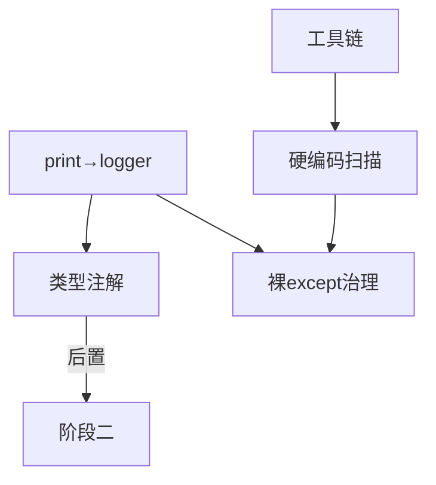

# TASK: 阶段一 - 代码质量加固

## 元信息

| 字段 | 值 |
|------|-----|
| 任务ID | TASK-Q1 |
| 所属阶段 | 阶段一（第1-3天） |
| 前置依赖 | 无（首个执行阶段） |
| 后置任务 | 阶段二（测试体系搭建） |

---

## 通用执行约束（该阶段所有子任务共享）

| # | 规则 | 说明 |
|---|------|------|
| G1 | **增量提交** | 每个子任务完成后 `git commit`，不合并提交，不跨任务提交 |
| G2 | **先测试后修改** | 修改代码前先 `pytest` 运行基线（记录原始测试结果），修改后确保零回归 |
| G3 | **只增不减** | 改造现有文件时只增不减，不删除/不重命名现有函数、类、变量 |
| G4 | **不改接口契约** | 禁止修改已有 API 的输入/输出 JSON 格式、路由路径、HTTP 方法 |
| G5 | **不改数据库** | 禁止执行 DDL、修改表名/列名、新增表 |
| G6 | **不修改 wechat_server.py** | 该文件为云端专用，禁止任何修改 |
| G7 | **不触碰已归档项目** | 优化范围严格限定在 `mobile_api_ai/` 目录 |
| G8 | **打完 tag 再继续** | 本阶段全部验收项完成后打 `git tag v1`，再进入阶段二 |

---

## 子任务清单

### Q1.1 print→logger替换

| 属性 | 内容 |
|------|------|
| **描述** | 将生产代码中的 `print()` 调用替换为 `logger.info/debug/warning` |
| **涉及文件** | `container_center_v5.py` (19处), `cloud_poller.py` (9处), `enhanced_backup.py` (9处) |
| **前置条件** | 确认每个 `print()` 上下文中已有 logger 实例或可注入 |
| **验收标准** | 三文件中 `print(` 调用归零 |
| **实现约束** | `import logging; logger = logging.getLogger(__name__)`；根据语境选 logger.info/logger.warning/logger.debug；禁止 `logger.exception()` 用于非异常场景 |
| **禁止操作** | ❌ 修改 print() 以外的任何代码逻辑；❌ 删除 print() 所在行中的非 print 代码 |
| **安全验证** | 修改后 `grep -n "print("` 三文件确认归零；`pytest` 基线全部通过 |

### Q1.2 类型注解补全

| 属性 | 内容 |
|------|------|
| **描述** | 为关键文件中的函数添加参数类型注解和返回类型注解 |
| **涉及文件** | `dispatch_center.py` (313函数, 14%→50%), `wechat_work_bot_v2.py` (78函数, 0%→50%), `face_checkin/__init__.py` (60函数, 0%→50%) |
| **前置条件** | 理解各函数的参数和返回值语义 |
| **验收标准** | 三文件参数类型注解覆盖率 ≥ 50% |
| **实现约束** | 使用 `typing` 模块（`List`, `Dict`, `Optional`, `Any`）；已有导入则复用；不改变函数签名逻辑 |
| **禁止操作** | ❌ 修改函数返回值逻辑；❌ 引入第三方依赖（如 mypy、pydantic 等）；❌ 重命名现有参数 |
| **安全验证** | `pytest` 基线全部通过（类型注解不影响运行时语义）；`mypy` 仅作告警参考，不设强制门禁 |

### Q1.3 代码风格工具链搭建（骨架）

| 属性 | 内容 |
|------|------|
| **描述** | 新建 `pyproject.toml`（仅工具链骨架：black/isort/flake8/pytest 配置）、`.flake8`、`.pre-commit-config.yaml`。项目元数据（name/version/author）留待阶段三 M1.1 填充 |
| **涉及文件** | `pyproject.toml`（骨架）, `.flake8`, `.pre-commit-config.yaml` |
| **前置条件** | 确认项目Python版本（3.8+） |
| **验收标准** | 工具链配置完成，`flake8 .` 零报错。注意：首次运行 flake8 可能产生大量报错，需额外 +1~2h 处理 |
| **实现约束** | flake8 max-line-length=120；black line-length=120；isort profile=black；pre-commit 包含 flake8/black/isort/end-of-file-fixer |
| **禁止操作** | ❌ 修改项目现有代码；❌ 在 pyproject.toml 中填充项目元数据（name/version/author）；❌ 运行 black/isort 自动格式化整个项目代码（避免大面积修改引入回归） |
| **安全验证** | 确认三文件正确创建；`flake8 . --statistics -q` 可正常执行 |

### Q1.4 生产代码硬编码扫描

| 属性 | 内容 |
|------|------|
| **描述** | 全局扫描硬编码的路径/密码/阈值/颜色，提取至配置或环境变量 |
| **涉及文件** | `scripts/` 中生产脚本，`config.py` 之外的生产代码 |
| **前置条件** | 确认 `.env.example` 中的配置项枚举 |
| **验收标准** | 无硬编码敏感值和路径残留 |
| **实现约束** | 路径使用 `os.path.join(BASE_DIR, ...)`；阈值从 `os.getenv()` 或 `config.py` 读取；颜色统一从 `COLORS` 字典引用 |
| **禁止操作** | ❌ 修改主服务入口代码（`app.py`、`main.py`）；❌ 修改 `config.py` 中已有的变量定义；❌ 修改不受本子任务范围限制的其他模块 |
| **安全验证** | 扫描报告确认硬编码清零；修改前先 `pytest` 建立基线 |

### Q1.5 裸except治理

| 属性 | 内容 |
|------|------|
| **描述** | 全局搜索 `except:` 裸异常并补全异常类型和日志 |
| **涉及文件** | 全部 `.py` 文件 |
| **前置条件** | 无 |
| **验收标准** | 全局 `except:`（无类型）归零 |
| **禁止操作** | ❌ 删除/修改 except 块内的原有功能代码；❌ 将 `except:` 替换为 `except Exception` 后丢失关键异常捕获语义（如 KeyboardInterrupt、SystemExit） |
| **安全验证** | `grep -n '^\s*except:' *.py --include='*.py' -r` 确认归零；修改处逐处审查异常类型选择的合理性 |

---

## 依赖关系图

## 交付物

- [ ] `container_center_v5.py` 中 print() 全部替换为 logger
- [ ] `cloud_poller.py` 中 print() 全部替换为 logger
- [ ] `enhanced_backup.py` 中 print() 全部替换为 logger
- [ ] `dispatch_center.py` 类型注解覆盖率 ≥ 50%
- [ ] `wechat_work_bot_v2.py` 类型注解覆盖率 ≥ 50%
- [ ] `face_checkin/__init__.py` 类型注解覆盖率 ≥ 50%
- [ ] `pyproject.toml` 配置完成
- [ ] `.flake8` 配置文件就绪
- [ ] `.pre-commit-config.yaml` 配置完成
- [ ] 硬编码扫描报告（含已整改项）
- [ ] 裸except清零证明
