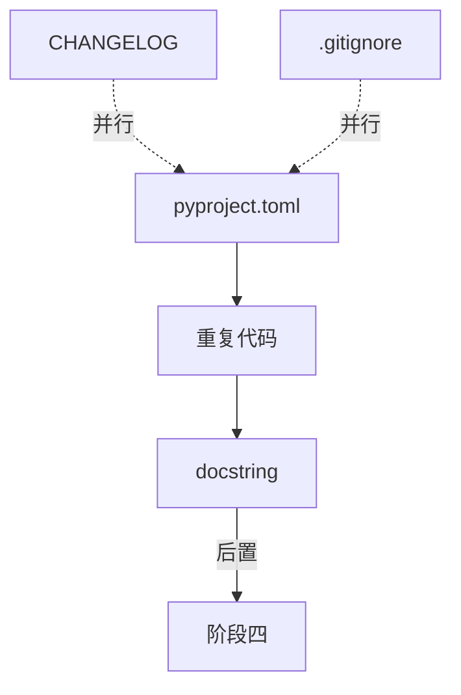

# TASK: 阶段三 - 可维护性提升

## 元信息

| 字段 | 值 |
|------|-----|
| 任务ID | TASK-M1 |
| 所属阶段 | 阶段三（第6-7天） |
| 前置依赖 | 阶段二（测试体系搭建完成） |
| 后置任务 | 阶段四（性能与稳定性） |

---

## 通用执行约束（该阶段所有子任务共享）

| # | 规则 | 说明 |
|---|------|------|
| G1 | **先基线后修改** | 修改任何文件前先 `pytest` 运行基线，确认当前全通过 |
| G2 | **增量提交** | 每个子任务完成后 `git commit`，不合并提交 |
| G3 | **只增不减** | 改造现有文件时只增不减，不删除/不重命名现有函数、类、变量 |
| G4 | **不改接口契约** | 禁止修改已有 API 的输入/输出 JSON 格式、路由路径、HTTP 方法 |
| G5 | **不改数据库** | 禁止执行 DDL、修改表名/列名、新增表 |
| G6 | **不修改 wechat_server.py** | 该文件为云端专用，禁止任何修改 |
| G7 | **不触碰已归档项目** | 优化范围严格限定在 `mobile_api_ai/` 目录 |
| G8 | **打完 tag 再继续** | 本阶段全部验收项完成后打 `git tag v3`，再进入阶段四 |

---

## 子任务清单

### M1.1 pyproject.toml 填充项目元数据

| 属性 | 内容 |
|------|------|
| **描述** | 在阶段一 Q1.3 创建的 `pyproject.toml` 骨架基础上，填充项目元数据（name/version/author/description）和 build-system 配置 |
| **涉及文件** | `pyproject.toml` |
| **前置条件** | 阶段一 Q1.3 已创建 pyproject.toml 工具链骨架（black/isort/flake8/pytest 配置） |
| **验收标准** | 补充：项目名/版本/作者/描述；[build-system]（setuptools）；Python >= 3.8。工具链配置部分保持 Q1.3 不变 |
| **实现约束** | Python requirement >= 3.8；使用 `setuptools` 作为 build 后端；不覆盖 Q1.3 已配置的工具链部分 |
| **禁止操作** | ❌ 覆盖 Q1.3 中已配置的 black/isort/flake8/pytest 工具链配置；❌ 删除 Q1.3 创建的 .flake8 或 .pre-commit-config.yaml |
| **安全验证** | `diff` 对比 Q1.3 提交的 pyproject.toml 版本，确认工具链部分零变更 |

### M1.2 重复代码抽取

| 属性 | 内容 |
|------|------|
| **描述** | 搜索跨文件重复的 DB 查询模式、错误处理模式，抽取到公共函数/基类 |
| **涉及文件** | 全局（基于搜索分析） |
| **前置条件** | understanding of common patterns across files |
| **验收标准** | 至少 2 处重复代码被抽取并复用 |
| **实现约束** | 抽取至 `utils/` 或 `core/` 目录；不改变原有函数签名（新增重载而非修改） |
| **禁止操作** | ❌ 修改被抽取代码的原有函数签名（入参/返回值）；❌ 删除原位置的函数（改为调用新公共函数）；❌ 修改被抽取函数的调用方接口 |
| **安全验证** | 抽取前 `pytest` 基线全部通过；抽取后 `pytest` 零回归 |

### M1.3 关键模块文档注释

| 属性 | 内容 |
|------|------|
| **描述** | 为 `dispatch_center.py` 中添加 Google 风格的 docstring |
| **涉及文件** | `dispatch_center.py` |
| **前置条件** | 理解各业务函数的参数含义 |
| **验收标准** | 关键业务函数（top 50）包含函数级 docstring |
| **实现约束** | Google 风格（Args/Returns/Raises）只对 public 函数添加，private 函数选择性添加 |
| **禁止操作** | ❌ **修改任何代码逻辑**（只添加注释文本）；❌ 修改函数参数名、返回值、函数体；❌ 删除或修改函数装饰器；❌ 修改 route() 路径字符串 |
| **安全验证** | `pytest` 基线全部通过（纯注释不改变运行时行为）；用 `git diff` 审查确认只含注释行变更 |

### M1.4 CHANGELOG.md 建立

| 属性 | 内容 |
|------|------|
| **描述** | 创建 `CHANGELOG.md`，汇总历史变更 |
| **涉及文件** | `CHANGELOG.md` |
| **前置条件** | 无 |
| **验收标准** | 包含所有已知版本的重要变更记录 |
| **实现约束** | 格式遵循 Keep a Changelog 规范 |
| **禁止操作** | ❌ 修改 `CHANGELOG.md` 以外的任何文件；❌ 在 CHANGELOG 中包含未公开的敏感信息 |

### M1.5 .gitignore 审计

| 属性 | 内容 |
|------|------|
| **描述** | 检查 `.gitignore` 是否覆盖所有需忽略文件类型 |
| **涉及文件** | `.gitignore` |
| **前置条件** | 无 |
| **验收标准** | 覆盖：`__pycache__/`, `*.pyc`, `logs/`, `.env`, `dist/`, `*.egg-info/`, `.pytest_cache/`, `.coverage`, `htmlcov/` |
| **实现约束** | 只做补充和修正，不删除现有规则 |
| **禁止操作** | ❌ 删除 `.gitignore` 中已有的忽略规则；❌ 修改 `.gitignore` 以外的任何文件 |

---

## 依赖关系图

## 交付物

- [ ] `pyproject.toml` 完整配置（项目元数据 + 工具配置）
- [ ] 至少 2 处重复代码抽取为公共函数
- [ ] `dispatch_center.py` top 50 函数有 docstring
- [ ] `CHANGELOG.md` 建立
- [ ] `.gitignore` 审计完毕
