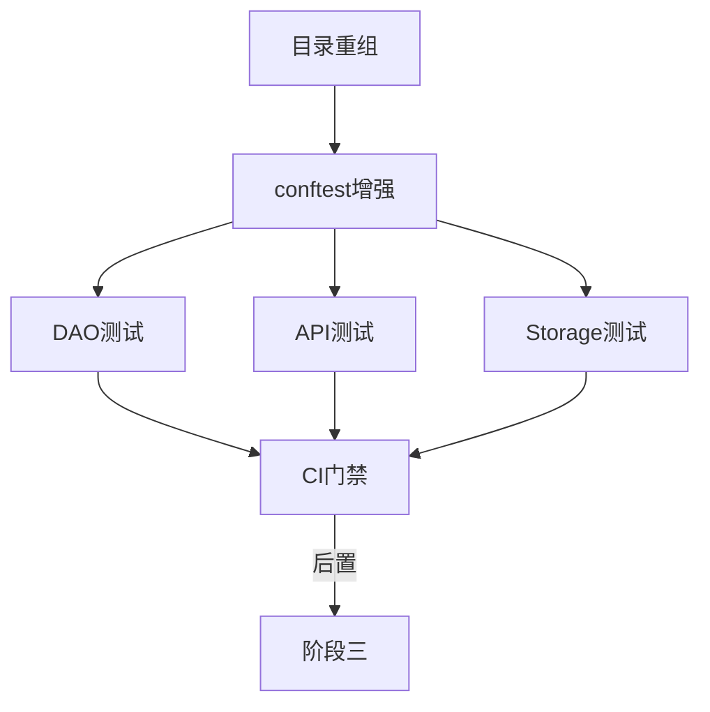

# TASK: 阶段二 - 测试体系搭建

## 元信息

| 字段 | 值 |
|------|-----|
| 任务ID | TASK-T1 |
| 所属阶段 | 阶段二（第4-5天） |
| 前置依赖 | 阶段一（代码质量加固完成） |
| 后置任务 | 阶段三（可维护性提升） |

---

## 通用执行约束（该阶段所有子任务共享）

| # | 规则 | 说明 |
|---|------|------|
| G1 | **禁止修改生产代码** | 本阶段仅操作 `tests/` 目录和 `conftest.py`、`pytest.ini`、`.coveragerc` 等测试配置文件。**禁止修改任何 `api/`、`bots/`、`commands/`、`services/`、`core/` 等目录下的生产代码** |
| G2 | **先基线后移动** | 重组测试目录前先 `pytest --collect-only` 收集当前测试列表，确保移动后无测试丢失 |
| G3 | **增量提交** | 每个子任务完成后 `git commit`，不合并提交 |
| G4 | **不改接口契约** | API 测试中验证输入/输出必须与实际返回一致，不修改 API 路由或返回格式 |
| G5 | **不修改 wechat_server.py** | 禁止修改该文件 |
| G6 | **打完 tag 再继续** | 本阶段全部验收项完成后打 `git tag v2`，再进入阶段三 |

---

## 子任务清单

### T1.1 测试目录结构重组

| 属性 | 内容 |
|------|------|
| **描述** | 将 `tests/` 目录重组为 `unit/`、`integration/`、`fixtures/` 三级结构 |
| **前置条件** | 现有 test 文件列表确认 |
| **验收标准** | `tests/unit/`、`tests/integration/`、`tests/fixtures/` 三个子目录就绪，原有测试文件按类型移入 |
| **实现约束** | 不删除原有测试文件；在 `tests/__init__.py` 中添加 `pytest.ini` 搜索路径配置 |
| **禁止操作** | ❌ 修改 `tests/` 目录以外的任何文件；❌ 删除原有测试文件 |

### T1.2 conftest.py 增强

| 属性 | 内容 |
|------|------|
| **描述** | 添加 Mock DB、Mock API Client、Mock Storage 三个 pytest fixture |
| **涉及文件** | `tests/conftest.py`（增强）, `tests/fixtures/`（新建） |
| **前置条件** | 理解 storage_layer.py 和 database.py 的接口 |
| **验收标准** | conftest.py 包含 mock_db、mock_api_client、mock_storage 三个 fixture |
| **实现约束** | 使用 `unittest.mock.MagicMock`；mock_db 返回模拟的 cursor；mock_storage 模拟 CRUD 行为 |
| **禁止操作** | ❌ 修改生产代码中的接口定义，只 mock 已有接口；❌ 在 conftest.py 中引入非 stdlib 依赖 |

### T1.3 DAO层单元测试

| 属性 | 内容 |
|------|------|
| **描述** | 为 `models/base_dao.py` 和 `storage_layer.py` 的核心 CRUD 方法编写测试 |
| **涉及文件** | `tests/unit/test_dao.py`, `tests/unit/test_storage.py` |
| **前置条件** | conftest.py 中的 mock_storage fixture 就绪 |
| **验收标准** | DAO层测试覆盖 `save/update/delete/get_by_id` 四个核心方法 |
| **实现约束** | 每条用例测试至少 1 个 happy path + 1 个 error case |
| **禁止操作** | ❌ 修改 `models/base_dao.py` 或 `storage_layer.py` 的生产代码；❌ 引入对数据库的真实连接依赖 |

### T1.4 API层集成测试

| 属性 | 内容 |
|------|------|
| **描述** | 为 `api/` 下14个 Blueprint 编写端点测试 |
| **涉及文件** | `tests/integration/test_api_*.py` |
| **前置条件** | conftest.py 中的 mock_db fixture 就绪 |
| **验收标准** | 覆盖 ≥ 7 个 Blueprint（至少50%），每个 ≥ 2 cases（happy + error） |
| **实现约束** | 使用 Flask `test_client()`；测试数据放在 `tests/fixtures/` JSON 文件中 |
| **禁止操作** | ❌ 修改 `api/` 下任何 Blueprint 的路由定义或处理函数；❌ 修改 `app.py` 的 Blueprint 注册方式 |

### T1.5 Storage层测试

| 属性 | 内容 |
|------|------|
| **描述** | 为 `storage_mysql.py` 的 CRUD 操作编写验证测试 |
| **涉及文件** | `tests/unit/test_storage_mysql.py` |
| **前置条件** | 理解 storage_mysql.py 接口 |
| **验收标准** | 各 CRUD 操作至少一个正向用例 |
| **实现约束** | 使用 SQLite 内存数据库模拟 MySQL 行为 |
| **禁止操作** | ❌ 修改 `storage_mysql.py` 的生产代码；❌ 连接真实 MySQL 数据库 |

### T1.6 CI门禁配置

| 属性 | 内容 |
|------|------|
| **描述** | 在 `.github/workflows/ci.yml` 中增加覆盖率阈值和 pytest 强制门禁 |
| **涉及文件** | `.github/workflows/ci.yml` |
| **前置条件** | 测试用例运行稳定 |
| **验收标准** | CI 流水线中增加 coverage ≥ 40% 门槛，pytest 不通过则 CI 失败 |
| **实现约束** | 添加 `--cov-fail-under=40` 参数；仅在 push/main 分支生效 |
| **禁止操作** | ❌ 修改 CI 流水线中的 lint/security/build 等已有 job；❌ 修改 `.github/` 以外的任何文件 |

---

## 依赖关系图

## 交付物

- [ ] `tests/unit/`, `tests/integration/`, `tests/fixtures/` 目录结构就绪
- [ ] `tests/conftest.py` 包含 mock_db/mock_api_client/mock_storage 三个 fixture
- [ ] DAO层测试覆盖 4 个核心 CRUD 方法
- [ ] API层测试覆盖 ≥ 7 个 Blueprint
- [ ] Storage层测试覆盖核心 CRUD
- [ ] CI 流水线包含 coverage ≥ 40% 门禁
- [ ] 总测试用例数 ≥ 50 个
- [ ] `pytest` 全部通过
