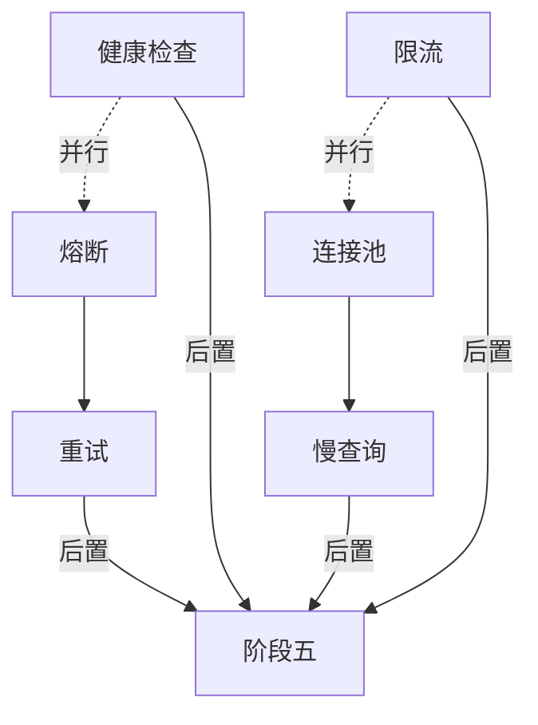

# TASK: 阶段四 - 性能与稳定性

## 元信息

| 字段 | 值 |
|------|-----|
| 任务ID | TASK-P1 |
| 所属阶段 | 阶段四（第8-9天） |
| 前置依赖 | 阶段三（可维护性提升完成） |
| 后置任务 | 阶段五（整体验收与归档） |

---

## 通用执行约束（该阶段所有子任务共享）

| # | 规则 | 说明 |
|---|------|------|
| G1 | **先基线后修改** | 修改任何文件前先 `pytest` 运行基线，确认当前全通过 |
| G2 | **增量提交** | 每个子任务完成后 `git commit`，不合并提交 |
| G3 | **只增不减** | 改造现有文件时只增不减，不删除/不重命名现有函数、类、变量 |
| G4 | **不改接口契约** | 禁止修改已有 API 的输入/输出 JSON 格式、路由路径、HTTP 方法 |
| G5 | **不改数据库** | 禁止执行 DDL、修改表名/列名、新增表 |
| G6 | **不修改 wechat_server.py** | 该文件为云端专用，禁止任何修改 |
| G7 | **低峰期部署** | 连接池修改（P1.3）需在低峰期操作，先测试环境验证30分钟 |
| G8 | **打完 tag 再继续** | 本阶段全部验收项完成后打 `git tag v4`，再进入阶段五 |

---

## 子任务清单

### P1.1 熔断机制接入

| 属性 | 内容 |
|------|------|
| **描述** | 将 `modules/circuit_breaker.py` 接入到 bots/ 和 sync/ 中的易失败外部调用路径 |
| **涉及文件** | `modules/circuit_breaker.py`, `bots/*.py`, `sync/*.py` |
| **前置条件** | 确认 circuit_breaker.py 接口可用 |
| **验收标准** | `bots/` 或 `sync/` 中至少 2 个外部调用路径已包裹熔断装饰器 |
| **实现约束** | 熔断阈值（failure_threshold=5, recovery_timeout=30）；使用 `@circuit_breaker()` 装饰器方式 |
| **禁止操作** | ❌ 修改 core/api 等模块中的核心业务逻辑；❌ 改变外部调用的返回值格式（熔断装饰器不修改返回值）；❌ 在正常路径中加入异常模拟测试 |
| **安全验证** | 接入前后 `pytest` 基线全部通过；`circuit_breaker` 仅对网络异常生效，不阻断正常请求 |

### P1.2 重试+退避策略

| 属性 | 内容 |
|------|------|
| **描述** | 为 `modules/fault_tolerance.py` 接入企业微信 API 调用等易失败场景 |
| **涉及文件** | `modules/fault_tolerance.py`, `bots/wechat_work_bot_v2.py` |
| **前置条件** | 确认 fault_tolerance.py 接口可用 |
| **验收标准** | 企业微信 API 调用实现指数退避重试（max 3次） |
| **实现约束** | 退避公式：`base_delay * (2^attempt)`；max_retries=3；仅针对网络级异常（ConnectionError, Timeout）重试 |
| **禁止操作** | ❌ 对业务异常（如 4xx 响应、数据校验失败）进行重试；❌ 修改 `wechat_work_bot_v2.py` 中的非重试逻辑；❌ 将重试应用于幂等性不保证的写操作 |
| **安全验证** | 正常 API 调用路径不受重试逻辑影响（原封不动通过装饰器）；仅网络异常时触发重试 |

### P1.3 数据库连接池优化

| 属性 | 内容 |
|------|------|
| **描述** | 优化数据库连接池配置：MySQL 连接池（`core/database.py`）增加 pool_recycle 和 pool_pre_ping；HTTP 连接池（`config.py`）的 MAX_CONNECTIONS 从环境变量读取 |
| **涉及文件** | `core/database.py`, `config.py` |
| **前置条件** | 了解当前 MySQL 连接池（core/database.py）和 HTTP 连接池（config.py）的配置 |
| **验收标准** | `core/database.py` 中 MySQL 连接池包含 `POOL_RECYCLE=3600`, `POOL_PRE_PING=True`, `MAX_CONNECTIONS` 从环境变量读取 |
| **实现约束** | MySQL 连接池默认值：MAX_CONNECTIONS=10, POOL_RECYCLE=3600, POOL_PRE_PING=True；HTTP 连接池（config.py 中）的 MAX_CONNECTIONS 保持独立配置；所有值均可通过环境变量覆盖 |
| **禁止操作** | ❌ 修改 `core/database.py` 中非连接池配置（如数据库连接字符串、编码等）；❌ 修改 `config.py` 中非连接池的其他配置项；❌ 在未验证的情况下直接部署到生产环境 |
| **安全验证** | 修改后：① `pytest` 全部通过；② 本地启动服务，执行 3 次数据库查询验证 pool_pre_ping 正常；③ 部署到测试环境观察 30 分钟确认无连接错误；④ 低峰期部署生产 |

### P1.4 慢查询分析

| 属性 | 内容 |
|------|------|
| **描述** | 采集 `dispatch_center.py` 中数据库查询耗时，标记慢查询 |
| **涉及文件** | `dispatch_center.py` |
| **前置条件** | 无 |
| **验收标准** | 输出慢查询分析报告（`docs/全面优化方案/慢查询分析报告.md`），标注 top 5 慢查询 |
| **实现约束** | 使用 `time.perf_counter()` 包裹查询；慢查询阈值 ≥ 500ms |
| **禁止操作** | ❌ **修改 dispatch_center.py 的任何代码逻辑**（慢查询分析是只读操作，临时添加计时代码在分析完成后必须移除）；❌ 将计时代码提交到 git |
| **安全验证** | 分析完成后 `git diff` 确认 dispatch_center.py 零变更 |

### P1.5 健康检查端点

| 属性 | 内容 |
|------|------|
| **描述** | 新建 `/api/health` 端点，返回各组件连通状态 |
| **涉及文件** | `api/` 下新建 `health.py` Blueprint |
| **前置条件** | 无 |
| **验收标准** | `GET /api/health` 返回 `{"status":"ok","components":{"db":"ok","bot":"ok"}}` |
| **实现约束** | 使用 `jsonify`；各组件状态独立检测（一个失败不影响整体返回）；响应时间 ≤ 200ms |
| **禁止操作** | ❌ 修改 `app.py` 中已有 Blueprint 的注册方式；❌ 修改其他 API Blueprint 的路由或处理函数；❌ 在 health 端点中暴露敏感信息（数据库密码、API key 等） |
| **安全验证** | `pytest` 基线全部通过；`GET /api/health` 返回值为 200，格式验证通过 |

### P1.6 请求限流

| 属性 | 内容 |
|------|------|
| **描述** | 为 API 端点添加 flask-limiter 限流配置 |
| **涉及文件** | `app.py`（全局配置），各 `api/*.py` Blueprint |
| **前置条件** | requirements.txt 已包含 flask-limiter |
| **验收标准** | API 端点已有限流配置（默认 60次/分钟） |
| **实现约束** | 使用 `@limiter.limit("60/minute")`；对登录/验证码等敏感端点单独设置更低阈值（10次/分钟） |
| **禁止操作** | ❌ 限流阈值低于默认值（60/分钟），敏感端点不低于 10/分钟；❌ 修改 Blueprint 中除 `@limiter.limit()` 装饰器之外的现有代码；❌ 使用全局共享计数器而非独立限流键 |
| **安全验证** | 限流触发时返回 429 + `retry-after` header，不影响正常 `200` 响应；`pytest` 基线全部通过 |

---

## 依赖关系图

## 交付物

- [ ] `circuit_breaker.py` 在 bots/ 或 sync/ 中至少 2 条路径生效
- [ ] 企业微信 API 调用实现指数退避重试
- [ ] `core/database.py` 和 `config.py` 连接池配置优化
- [ ] 慢查询分析报告（top 5）
- [ ] `/api/health` 端点可用
- [ ] API 端点限流配置就绪
