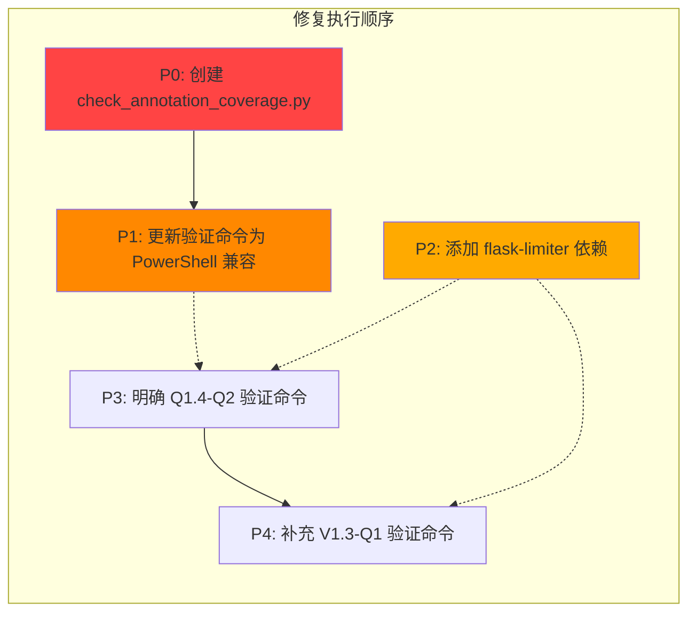

# 全面优化方案 — 量子分化审计修复计划

## 文档信息

| 字段 | 值 |
|------|-----|
| 创建日期 | 2026-05-26 |
| 审计来源 | 审计报告_量子分化方案.md |
| 二次审计来源 | 审计报告_二次(可执行性专项).md |
| 目标文档 | TASK_QUANTUM_全面优化方案.md |
| 审计结论 | 有条件通过 — 5 个可执行性问题需修复 |

---

## 问题总览

| 优先级 | 问题 | 影响范围 | 修复类型 | 预估工时 |
|--------|------|---------|---------|---------|
| 🔴 P0 | check_annotation_coverage.py 脚本缺失 | Q1.2-Q1~Q3（3 量子） | 新建脚本 | ~15min |
| 🟡 P1 | 验证命令 Windows 不兼容 | 14 个量子（跨全部 5 阶段） | 更新 TASK_QUANTUM + 新建封装脚本 | ~30min |
| 🟡 P2 | flask-limiter 依赖未声明 | P1.6-Q1~Q2（2 量子） | 更新 enhanced_requirements.txt | ~1min |
| 🟢 P3 | Q1.4-Q2 验证命令不明确 | Q1.4-Q2（1 量子） | 更新 TASK_QUANTUM | ~2min |
| 🟢 P4 | V1.3-Q1 验证命令缺失 | V1.3-Q1（1 量子） | 更新 TASK_QUANTUM | ~2min |

---

## 问题 1（🔴 P0/CRITICAL）：check_annotation_coverage.py 脚本缺失

### 影响范围
- Q1.2-Q1：dispatch_center.py 类型注解（313 函数）
- Q1.2-Q2：wechat_work_bot_v2.py 类型注解（78 函数）
- Q1.2-Q3：face_checkin/__init__.py 类型注解（60 函数）

### 根因分析
`scripts/check_annotation_coverage.py` 在审计阶段被引用为这三个量子的验证命令，但该脚本从未被创建。scripts 目录虽有 50+ 脚本，但没有类型注解覆盖率统计工具。

### 修复方案
新建 `scripts/check_annotation_coverage.py`，功能要求：
1. 接受文件路径参数，解析 .py 文件
2. 统计函数总数（含类方法）和已类型注解的函数数
3. 输出覆盖率百分比
4. 支持 `--min` 参数设定最低覆盖率阈值，低于阈值时 exit(1)
5. 使用 `ast` 模块静态分析，不依赖 mypy 等外部工具

### 脚本设计
```python
"""Check type annotation coverage for Python source files.

Usage:
    python scripts/check_annotation_coverage.py <filepath> [--min <threshold>]
    
Example:
    python scripts/check_annotation_coverage.py dispatch_center.py --min 50
"""
import ast
import sys
from pathlib import Path


def count_functions_with_annotations(source: str):
    tree = ast.parse(source)
    total = 0
    annotated = 0
    
    for node in ast.walk(tree):
        if isinstance(node, (ast.FunctionDef, ast.AsyncFunctionDef)):
            total += 1
            # Check return annotation
            has_return = node.returns is not None
            # Check parameter annotations (skip self/cls)
            has_params = all(
                arg.annotation is not None
                for arg in node.args.args
                if arg.arg not in ('self', 'cls')
            )
            if has_return and has_params:
                annotated += 1
                
    return total, annotated


def main():
    if len(sys.argv) < 2:
        print("Usage: python check_annotation_coverage.py <filepath> [--min <threshold>]")
        sys.exit(1)
    
    filepath = Path(sys.argv[1])
    if not filepath.exists():
        print(f"Error: file not found: {filepath}")
        sys.exit(1)
    
    min_threshold = None
    if '--min' in sys.argv:
        idx = sys.argv.index('--min')
        if idx + 1 < len(sys.argv):
            min_threshold = float(sys.argv[idx + 1])
    
    source = filepath.read_text(encoding='utf-8')
    total, annotated = count_functions_with_annotations(source)
    coverage = (annotated / total * 100) if total > 0 else 100.0
    
    print(f"Total functions: {total}")
    print(f"Annotated functions: {annotated}")
    print(f"Coverage: {coverage:.1f}%")
    
    if min_threshold is not None and coverage < min_threshold:
        print(f"FAIL: Coverage {coverage:.1f}% < minimum {min_threshold:.1f}%")
        sys.exit(1)
    
    print("PASS")


if __name__ == '__main__':
    main()
```

### 更新 TASK_QUANTUM.md

**Q1.2-Q1 验证命令**：
```
Before: `python scripts/check_annotation_coverage.py dispatch_center.py` → ≥ 50%
After:  `python scripts/check_annotation_coverage.py dispatch_center.py --min 50`
```

**Q1.2-Q2 验证命令**：
```
Before: `python scripts/check_annotation_coverage.py wechat_work_bot_v2.py` → ≥ 50%
After:  `python scripts/check_annotation_coverage.py wechat_work_bot_v2.py --min 50`
```

**Q1.2-Q3 验证命令**：
```
Before: `python scripts/check_annotation_coverage.py face_checkin/__init__.py` → ≥ 50%
After:  `python scripts/check_annotation_coverage.py face_checkin/__init__.py --min 50`
```

### 验证方式
```bash
python scripts/check_annotation_coverage.py scripts/check_annotation_coverage.py --min 0
# 预期输出: 覆盖率 >= 0%，返回 PASS
```

### 前置依赖
- Q1.3-Q1（pyproject.toml 创建）后即可创建此脚本
- 建议在 Q1.2-Q1 执行前创建

---

## 问题 2（🟡 P1/HIGH）：验证命令 Windows 不兼容

### 影响范围
14 个量子，涉及 grep/ls/head/&&/; 等 Unix 命令在 Windows PowerShell 不可用

### 根因分析
TASK_QUANTUM 文档中的验证命令主要针对 Linux/Mac 环境编写（grep/ls/head 等），项目开发环境为 Windows。需要转换为 PowerShell 兼容格式。

### 修复方案

#### 方案 A（推荐）：直接更新验证命令为 PowerShell 兼容格式

| 原 Unix 命令 | Windows PowerShell 替代 |
|-------------|----------------------|
| `grep -n "print(" file.py` | `Select-String -Pattern "print(" -Path file.py` |
| `grep -rn "pattern" --include='*.py' .` | `Get-ChildItem -Recurse -Filter *.py \| Select-String -Pattern "pattern"` |
| `grep -c "pattern" file.py` | `(Select-String -Pattern "pattern" -Path file.py).Count` |
| `ls file1 file2` | `Test-Path file1, file2` 或 `Get-Item file1, file2` |
| `head -5 file` | `Get-Content file -TotalCount 5` |
| `cmd1 && cmd2` | `(cmd1) -and (cmd2)` 或分行执行 |
| `cmd1 ; cmd2` | `cmd1; cmd2`（PowerShell 原生支持分号） |

#### 方案 B：新建 `scripts/run_verify.ps1` 封装脚本
封装常用验证操作，提供统一接口。但此方案增加维护成本，对于一次性验证命令过于复杂。

**推荐采用方案 A**，直接在 TASK_QUANTUM.md 中更新为 PowerShell 兼容命令，简单直接。

### 具体更新内容

#### Q1.1-Q1
```
Before: `grep -n "print(" container_center_v5.py` → 0 匹配
After:  `Select-String -Pattern "print(" -Path container_center_v5.py` → 0 匹配
```

#### Q1.1-Q2
```
Before: `grep -n "print(" cloud_poller.py` → 0 匹配
After:  `Select-String -Pattern "print(" -Path cloud_poller.py` → 0 匹配
```

#### Q1.1-Q3
```
Before: `grep -n "print(" modules/enhanced_backup.py` → 0 匹配
After:  `Select-String -Pattern "print(" -Path modules/enhanced_backup.py` → 0 匹配
```

#### Q1.3-Q2
```
Before: `ls .flake8 .pre-commit-config.yaml`
After:  `Test-Path .flake8, .pre-commit-config.yaml`
```

#### Q1.3-Q3
```
Before: `flake8 . --statistics -q ; black --check --diff .`
After:  `flake8 . --statistics -q; black --check --diff .`
```
（注：分号在 PowerShell 中作为语句分隔符是支持的，原命令其实可用，但更推荐分行或使用 `-and`）

#### Q1.5-Q1
```
Before: `grep -rn "^\s*except:" --include='*.py' . | grep -v "except "` → 0 匹配
After:  `Get-ChildItem -Recurse -Filter *.py | Select-String -Pattern "^\s*except:" | Where-Object { $_.Line -notmatch "except " }` → 0 匹配
```

#### Q1.5-Q2（同上）

#### T1.2-Q1
```
Before: `pytest --fixtures -q | grep mock_db` → 存在
After:  `pytest --fixtures -q | Select-String -Pattern "mock_db"` → 存在
```
（注：管道符 `|` 在 PowerShell 中原生支持，仅替换 grep）

#### T1.2-Q2/Q3（同上）

#### M1.4-Q1
```
Before: `head -5 CHANGELOG.md` → 格式正确
After:  `Get-Content CHANGELOG.md -TotalCount 5` → 格式正确
```

#### P1.3-Q2
```
Before: `grep -c "os.getenv" config.py` → 全部环境变量化
After:  `(Select-String -Pattern "os.getenv" -Path config.py).Count` → 全部环境变量化
```

#### V1.2-Q1
```
Before: `flake8 . && black --check . && isort --check .`
After:  `flake8 .; if ($LASTEXITCODE -eq 0) { black --check . } ; if ($LASTEXITCODE -eq 0) { isort --check . }`
```

---

## 问题 3（🟡 P2/MEDIUM）：flask-limiter 依赖未声明

### 影响范围
- P1.6-Q1：在 app.py 注册限流
- P1.6-Q2：在各 Blueprint 添加 @limiter

### 根因分析
`enhanced_requirements.txt` 和 `requirements.txt` 均未包含 `flask-limiter`，而 P1.6 子任务需要导入 `flask_limiter`。

### 修复方案
在 `enhanced_requirements.txt` 的 P0 依赖块中添加：
```
flask-limiter>=3.0
```

### 更新内容

在 `enhanced_requirements.txt` 第 13 行 `psutil>=5.9.0` 后添加：
```
flask-limiter>=3.0
```

位置示意见：
```txt
# P0 - 核心依赖（必须安装）

# Redis客户端（队列管理、缓存、熔断器）
redis>=4.5.0

# Elasticsearch客户端（审计日志）
elasticsearch>=8.0.0

# 系统监控（健康检查）
psutil>=5.9.0

# API限流（性能与稳定性）
flask-limiter>=3.0              # ← 新增
```

### 验证方式
```bash
pip install flask-limiter
python -c "from flask_limiter import Limiter; print('OK')"
```

---

## 问题 4（🟢 P3/LOW）：Q1.4-Q2 验证命令不明确

### 影响范围
Q1.4-Q2（硬编码抽离后验证）

### 根因分析
验证命令写"运行扫描脚本确认硬编码清零"，未指定具体脚本名或命令。项目中已存在 `scripts/tools/check_hardcode.py` 和 `scripts/tools/check_hardcode_detail.py` 可用于硬编码检查。

### 修复方案
明确化验证命令，利用项目中已有的检查脚本。

### 更新 TASK_QUANTUM.md

**Q1.4-Q2 验证命令**：
```
Before: 运行扫描脚本确认硬编码清零
After:  `python scripts/tools/check_hardcode.py --check` → 全 PASS
```

---

## 问题 5（🟢 P4/LOW）：V1.3-Q1 验证命令缺失

### 影响范围
V1.3-Q1（验收文档生成）

### 根因分析
该量子仅描述了验收文档的内容要求，未定义具体的验证命令。

### 修复方案
补充文件存在性验证 + 内容完整性验证命令。

### 更新 TASK_QUANTUM.md

**V1.3-Q1 验证命令**：
```
Before: （无）
After:  `Test-Path docs/全面优化方案/ACCEPTANCE_全面优化方案.md` → True
```

---

## 执行顺序

建议按依赖关系依次修复：



| 步骤 | 操作 | 涉及文件 | 预估 |
|------|------|---------|------|
| 1 | 创建 check_annotation_coverage.py | 新建 scripts/check_annotation_coverage.py | ~15min |
| 2 | TASK_QUANTUM 中更新 3 个 Q1.2 验证命令 | TASK_QUANTUM_全面优化方案.md | ~1min |
| 3 | TASK_QUANTUM 中更新 14 个量子的验证命令（P1 问题） | TASK_QUANTUM_全面优化方案.md | ~15min |
| 4 | 添加 flask-limiter 到 enhanced_requirements.txt | enhanced_requirements.txt | ~1min |
| 5 | 明确 Q1.4-Q2 验证命令 | TASK_QUANTUM_全面优化方案.md | ~1min |
| 6 | 补充 V1.3-Q1 验证命令 | TASK_QUANTUM_全面优化方案.md | ~1min |

---

## 修复后验收标准

| 检查项 | 预期结果 |
|--------|---------|
| `python scripts/check_annotation_coverage.py scripts/check_annotation_coverage.py --min 0` | PASS（exit 0） |
| TASK_QUANTUM 中所有验证命令不含 grep/ls/head 等 Unix 命令 | ✅ 全部替换为 PowerShell 兼容格式 |
| `Select-String` 出现在 Q1.1/Q1.5/T1.2/P1.3-Q2 的验证命令中 | ✅ 取代 grep |
| `Get-Content -TotalCount` 出现在 M1.4-Q1 的验证命令中 | ✅ 取代 head |
| `Test-Path` 出现在 Q1.3-Q2/V1.3-Q1 的验证命令中 | ✅ 取代 ls |
| `enhanced_requirements.txt` 包含 `flask-limiter>=3.0` | ✅ |
| Q1.4-Q2 验证命令含具体脚本名 | ✅ |
| V1.3-Q1 验证命令非空 | ✅ |

---

## 修复回退方案

| 步骤 | 回退方式 |
|------|---------|
| check_annotation_coverage.py | 直接删除文件 |
| TASK_QUANTUM 验证命令更新 | git checkout 恢复原始版本 |
| enhanced_requirements.txt | git checkout 恢复原始版本 |

---

*修复计划生成日期：2026-05-26*
*基于：审计报告_量子分化方案.md 的 5 个发现*
