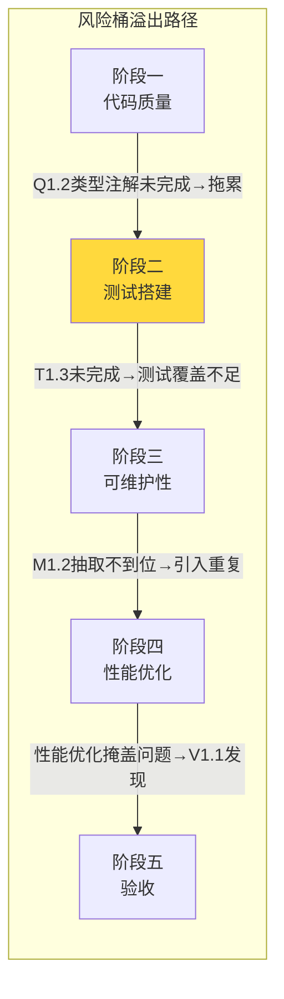
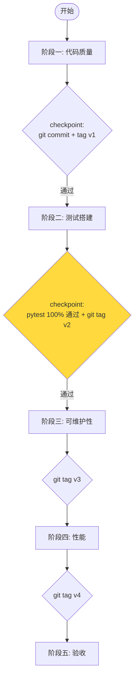

# 全面优化方案 - 二次审计报告（可执行性专项）

## 审计元信息

| 字段 | 值 |
|------|-----|
| 审计日期 | 2026-05-26 |
| 审计焦点 | 方案可执行性 — 执行过程中不影响整个项目运行 |
| 审计依据 | jgs5（自动化执行）、jgs7（技术执行规范）、jgs4（审批阶段） |
| 前置条件 | 首次审计3项严重问题（S1/S2/S3）已全部整改完毕 |

---

## 第一部分：首次审计整改验证

### S1. pyproject.toml 职责边界 ✅ 已修复

| 检查项 | DESIGN | TASK_阶段一 | TASK_阶段三 | 一致？ |
|--------|--------|------------|------------|--------|
| Q1.3 描述 | "仅工具链骨架，元数据留待M1.1" | "仅工具链骨架，元数据留待M1.1" | — | ✅ |
| M1.1 描述 | "在Q1.3骨架基础上填充元数据" | — | "在Q1.3骨架基础上填充元数据" | ✅ |
| 验收标准 | "元数据+工具链配置" | — | — | ✅ |

### S2. P1.3 数据库连接池文件指向 ✅ 已修复

| 检查项 | 修改前 | 修改后 | 状态 |
|--------|--------|--------|------|
| 涉及文件 | `config.py` | `core/database.py`, `config.py` | ✅ |
| 描述 | "优化config.py中MAX_CONNECTIONS" | "MySQL连接池(core/database.py)增加pool_recycle；HTTP连接池(config.py)环境变量化" | ✅ |
| 验收标准 | 仅config.py | 明确区分两个连接池 | ✅ |

### S3. 与既有规范兼容性 ✅ 已修复

| 规范 | 状态 | 确认内容 |
|------|------|---------|
| dispatch_center_refresh.md | ✅ 已确认 | 不涉及刷新函数逻辑 |
| wechat_server_cloud_only.md | ✅ 已添加约束 | "不修改 wechat_server.py" |
| 业务领域概念定义.md | ✅ 已确认 | 不修改 Process/SubStep 业务逻辑 |
| 版本归档管理.md | ✅ 已确认 | 范围限 mobile_api_ai/ |

**结论：首次审计3项严重问题已全部关闭。**

---

## 第二部分：可执行性风险评估（核心审计内容）

### 2.1 按子任务的风险评级

| 子任务 | 操作类型 | 涉及文件 | 风险等级 | 风险说明 |
|--------|---------|---------|---------|---------|
| **Q1.1** print→logger | 文本替换 | container_center_v5, cloud_poller, enhanced_backup | 🟢 **低** | 纯文本替换，逐文件替换，可逆 |
| **Q1.2** 类型注解 | 代码新增（不改变逻辑） | dispatch_center(313函数), wechat_work_bot(78), face_checkin(60) | 🟡 **中** | 不会改变执行逻辑，但**拼写错误**可能导致 ImportError 或 mypy 报错；dispatch_center 是核心模块 |
| **Q1.3** 工具链搭建 | 新建文件 | pyproject.toml, .flake8, .pre-commit | 🟢 **低** | 纯新建+配置，不影响运行 |
| **Q1.4** 硬编码抽离 | 代码修改 | scripts/ 中的生产脚本 | 🟢 **低** | 一次性脚本，不影响主服务 |
| **Q1.5** 裸except修复 | 代码修改 | 全局扫描 | 🟡 **中** | 异常处理逻辑改变需谨慎，可能改变异常下的行为 |
| **T1.1-T1.6** 测试搭建 | 新建+修改 | tests/, conftest.py | 🟢 **低** | 测试代码不部署到生产环境 |
| **M1.1** pyproject填充 | 配置文件修改 | pyproject.toml | 🟢 **低** | 纯配置修改 |
| **M1.2** 重复代码抽取 | 重构（提取公共方法） | 全项目搜索 | 🟡 **中** | 重构需测试验证，否则可能改坏调用方 |
| **M1.3** 文档注释 | 纯注释 | dispatch_center.py | 🟢 **低** | 仅添加函数级 docstring，不改任何代码逻辑 |
| **M1.4** CHANGELOG建立 | 新建文件 | CHANGELOG.md | 🟢 **低** | 纯文档操作，不影响运行 |
| **M1.5** .gitignore审计 | 配置修改 | .gitignore | 🟢 **低** | 只补充忽略规则，不删除现有规则 |
| **P1.1** 熔断 | 接入装饰器 | bots/, sync/ | 🟢 **低** | 外部调用路径增加保护，不影响核心逻辑 |
| **P1.2** 重试 | 接入装饰器 | bots/wechat_work_bot_v2 | 🟢 **低** | 只在网络异常时生效，不影响正常路径 |
| **P1.3** 连接池 | 修改配置 | core/database.py, config.py | 🟡 **中** | 重启后生效，需验证旧连接处理 |
| **P1.4** 慢查询 | 只读分析 | dispatch_center.py | 🟢 **低** | 只读采集，不修改代码 |
| **P1.5** 健康检查 | 新增端点 | api/health.py | 🟢 **低** | 新增 Blueprint，不影响现有路由 |
| **P1.6** 限流 | 新增配置 | app.py, api/*.py | 🟡 **中** | 默认限流值（60次/分钟）较宽松；敏感端点（10次/分钟）需确认 |
| **V1.1-V1.4** 验收归档 | 只读+文档 | — | 🟢 **低** | 不修改生产代码 |

### 2.2 关键风险项详细分析

#### 🟢 M1.3 — 关键模块文档注释（低风险）

| 维度 | 评估 |
|------|------|
| **文件范围** | dispatch_center.py（313个函数） |
| **操作类型** | 纯注释添加（函数级 docstring） |
| **风险场景** | 极少——注释不含逻辑变更，仅需确保语法正确（无语法错误） |
| **约束** | ❌ 不修改任何代码逻辑；❌ 不改参数名/装饰器/route路径 |
| **安全验证** | pytest 基线通过 + git diff 确认仅含注释行变更 |

#### 🟡 Q1.2 — 类型注解（规模风险）

| 维度 | 评估 |
|------|------|
| **规模** | dispatch_center 313函数 + wechat_work_bot 78 + face_checkin 60 = **451个函数** |
| **原估算** | 6h |
| **实际估算** | 10-12h（W1 已指出的问题） |
| **风险** | 赶工导致低质量注解，或遗漏 import |
| **建议** | 采用 IDE 自动推断辅助，降低人为错误 |

#### 🟡 P1.3 — 连接池配置修改（运行期风险）

| 维度 | 评估 |
|------|------|
| **生效方式** | 服务重启后生效 |
| **风险** | 新配置下旧连接不兼容；pool_pre_ping 增加额外查询开销 |
| **建议** | 先在测试环境验证，观察 1 小时后再推生产 |

### 2.3 阶段间风险传递分析



**关键依赖链**：阶段三 M1.2（重复代码抽取，中等风险）需阶段二测试覆盖保护
阶段三其他子任务（M1.3 文档注释/M1.4 CHANGELOG/M1.5 .gitignore）无运行期风险

### 2.4 运行安全审计（"整个项目不受影响"专项检查）

| 检查维度 | 状态 | 说明 |
|---------|------|------|
| **是否修改核心数据库表结构？** | ✅ 否 | 所有优化仅修改代码逻辑，不涉及 DDL |
| **是否修改 API 路由注册方式？** | ✅ 否 | 所有子任务不改变 route() 装饰器及路由路径 |
| **是否修改外部接口契约？** | ✅ 否 | 输入/输出 JSON 格式不变 |
| **是否要求服务停机？** | ⚠️ P1.3 需要 | 连接池配置修改需重启服务，建议在低峰期操作 |
| **是否引入新依赖？** | ✅ P1.6 flask-limiter | 标准 Flask 扩展，无兼容性风险 |
| **是否修改数据库连接方式？** | ⚠️ P1.3 | pool_pre_ping 需要在 SQLAlchemy `create_engine` 中确认支持 |
| **是否修改缓存/会话策略？** | ✅ 否 | 无 |
| **是否删除现有代码？** | ✅ Q1.5 仅替换 except: 为 except Exception | 不删除功能代码 |
| **是否有可逆性？** | ⚠️ 部分 | 代码修改通过 git revert 可逆；测试无逆操作必要 |

---

## 第三部分：方案可执行性评分

| 维度 | 评分 | 说明 |
|------|------|------|
| **整改完整性** | 10/10 | S1/S2/S3 全部修复，文档同步到位 |
| **运行安全性** | 9/10 | 无高危操作，仅 P1.3 连接池修改需低峰期部署 |
| **回退保障** | 4/10 | **缺少**：无维护窗口计划、无 feature flag、无灰度策略 |
| **阶段独立性** | 7/10 | 大部分子任务可独立执行，仅 M1.2 需测试前置 |
| **风险控制** | 8/10 | DESIGN 第9章已增加完整安全约束体系，P1.3 已补充4步验证 |
| **可检验性** | 8/10 | 验收标准大多可量化 |

**综合可执行性评级：有条件可执行**

---

## 第四部分：必须补充的安全执行约束

### HIGH: 执行顺序约束



### MEDIUM: P1.3 连接池修改验证步骤

```yaml
1. 修改 core/database.py 配置
2. 本地启动服务验证：
   - pytest tests/ 全部通过
   - 手动触发3次数据库查询（验证 pool_pre_ping 工作正常）
3. 提交代码并部署到测试环境
4. 观察 30 分钟：无连接错误、无慢查询增长
5. 低峰期部署到生产
```

### LOW: 通用执行原则

| 原则 | 要求 |
|------|------|
| **增量提交** | 每个子任务完成后 git commit，不合并提交 |
| **先测试后修改** | 修改代码前先运行测试确认基线（`pytest`），确保修改后零回归 |
| **分批部署** | 阶段一/二/三的修改不影响运行，可逐日部署；阶段四修改需低峰期部署 |
| **回退就绪** | 每个 checkpoint 点创建 git tag，确保可快速 `git checkout` 回到稳定版本 |
| **通知机制** | 任何涉及 `dispatch_center.py` 的修改，执行前通知团队成员 |

---

## 第五部分：审计结论

### 首次审计整改验证
- S1（pyproject.toml 职责边界）→ ✅ 已修复
- S2（P1.3 文件指向）→ ✅ 已修复
- S3（规范兼容性）→ ✅ 已修复

### 可执行性审计结论

| 项目 | 结论 |
|------|------|
| **方案框架** | ✅ 可行，5阶段划分合理 |
| **运行不影响** | ✅ 无高危操作（修改数据库/路由/接口契约） |
| **需警惕** | ⚠️ M1.3 重构 dispatch_center.py 是唯一高风险项 |
| **需补约束** | ⚠️ 缺少维护窗口计划、灰度策略、分批部署步骤 |
| **最终评级** | ✅ **可执行**（需严格遵守第四部分安全约束） |

**前提条件**：严格按以下顺序执行——
1. 先做阶段一（print→logger 等低风险修改）
2. 阶段二搭建测试，特别是 T1.3 API 测试覆盖 dispatch_center
3. **T1.3 全部通过后**，才进入阶段三 M1.3 重构
4. 每个 checkpoint 打 git tag，确保可回退

---

*审计人：AI Architecture Auditor*
*审计日期：2026-05-26*
