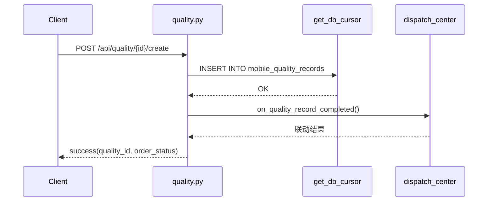
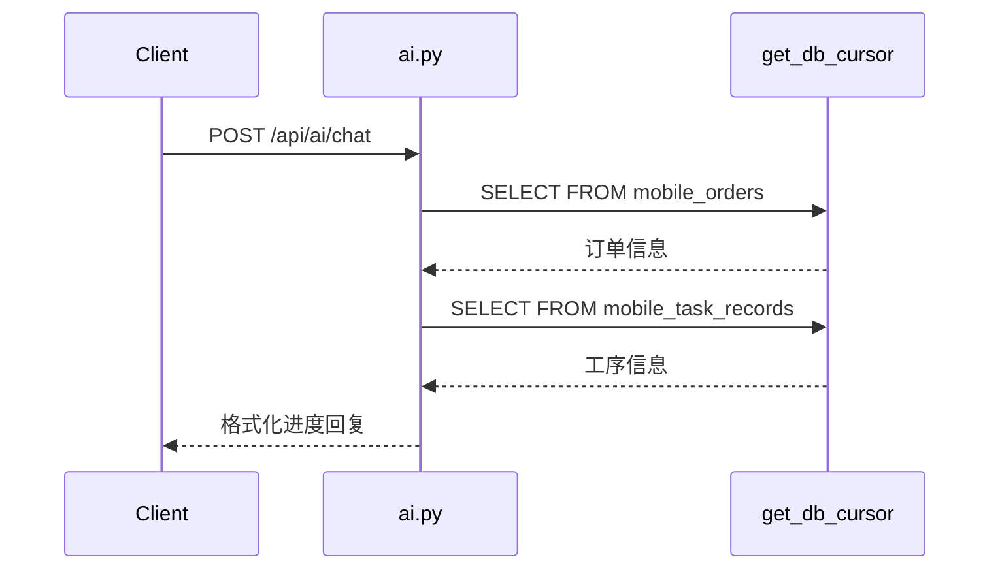

# DESIGN - 内存数据持久化治理

## 整体架构

```mermaid
graph TD
    subgraph 当前状态
        Client --> quality_in_mem[quality.py<br/>QUALITY_RECORDS(内存)]
        Client --> approval_in_mem[approval.py<br/>APPROVALS(内存)]
        Client --> message_in_mem[message.py<br/>MESSAGES(内存)]
        Client --> ai_in_mem[ai.py<br/>ORDERS/PROCESS_RECORDS(内存)]
    end

    subgraph 目标状态
        Client2 --> quality_db[quality.py<br/>mobile_quality_records(DB)]
        Client2 --> approval_db[approval.py<br/>mobile_approvals(DB)]
        Client2 --> message_db[message.py<br/>mobile_messages(DB)]
        Client2 --> ai_db[ai.py<br/>→ 查 mobile_orders/task_records(DB)]
        quality_db --> get_db_cursor[(get_db_cursor)]
        approval_db --> get_db_cursor
        message_db --> get_db_cursor
        ai_db --> get_db_cursor
        get_db_cursor --> SQLite[SQLite / MySQL]
    end
```

## 分层设计

```
┌──────────────────────────────────────────────────┐
│                  Flask Blueprint                  │
│  quality.py / approval.py / message.py / ai.py    │
│  (路由 + 参数校验 + 响应格式化)                     │
├──────────────────────────────────────────────────┤
│              core.database.get_db_cursor          │
│  (连接管理 + SafeCursor自动建表)                    │
├──────────────────────────────────────────────────┤
│           SQLite / MySQL 双后端                    │
│  (由 USE_SQLITE 环境变量切换)                      │
└──────────────────────────────────────────────────┘
```

遵循与 `api/process.py` 完全一致的分层模式，不引入额外抽象层。

## 数据表设计

### 1. mobile_quality_records

| 列名 | 类型(SQLite) | 类型(MySQL) | 说明 |
|------|-------------|-------------|------|
| `id` | INTEGER PRIMARY KEY AUTOINCREMENT | INT PRIMARY KEY AUTO_INCREMENT | 自增ID |
| `order_no` | TEXT | VARCHAR(255) | 订单号 |
| `order_id` | INTEGER | INT | 订单ID（对应 order_id 参数） |
| `result` | TEXT | VARCHAR(50) | 质检结果：合格/不合格/待复检 |
| `inspection_type` | TEXT | VARCHAR(50) | 质检类型：来料检验/首检/巡检/终检 |
| `inspector` | TEXT | VARCHAR(100) | 质检员 |
| `process_id` | TEXT | VARCHAR(100) | 关联流程ID |
| `record_date` | TEXT | VARCHAR(50) | 质检日期 |

### 2. mobile_task_records（已有表，新增列）

| 列名 | 类型(SQLite) | 类型(MySQL) | 说明 |
|------|-------------|-------------|------|
| `id` | INTEGER PRIMARY KEY AUTOINCREMENT | INT PRIMARY KEY AUTO_INCREMENT | 自增ID |
| `production_id` | INTEGER | INT | 生产批号ID（外部来源） |
| `order_id` | INTEGER | INT | 关联 mobile_orders.id |
| `order_no` | TEXT | VARCHAR(255) | 工单号，格式 `WO{production_id:06d}` |
| `process_name` | TEXT | VARCHAR(255) | 工序名称 |
| `process_seq` | INTEGER | INT | 工序序号 |
| `status` | TEXT | VARCHAR(50) | 状态 |
| `completed_qty` | REAL | DECIMAL | 已完成数量 |
| `worker` | TEXT | VARCHAR(100) | 操作人 |
| `device_remark` | TEXT | VARCHAR(255) | 设备备注 |
| `created_at` | TEXT | VARCHAR(50) | 创建时间 |
| `updated_at` | TEXT | VARCHAR(50) | 更新时间 |

> 已有数据回填逻辑：`order_no = 'WO' + LPAD(production_id, 6, '0')`
> 在 `process.py _ensure_tables()` 中自动执行。

### 4. mobile_approvals

| 列名 | 类型(SQLite) | 类型(MySQL) | 说明 |
|------|-------------|-------------|------|
| `id` | INTEGER PRIMARY KEY AUTOINCREMENT | INT PRIMARY KEY AUTO_INCREMENT | 自增ID |
| `type` | TEXT | VARCHAR(100) | 审批类型：生产异常/交期变更等 |
| `order_no` | TEXT | VARCHAR(255) | 关联订单号 |
| `reason` | TEXT | TEXT | 申请原因 |
| `requester` | TEXT | VARCHAR(100) | 申请人 |
| `request_time` | TEXT | VARCHAR(50) | 申请时间 |
| `status` | TEXT | VARCHAR(50) | 状态：待审批/已通过/已拒绝 |
| `approver` | TEXT | VARCHAR(100) | 审批人 |
| `approve_time` | TEXT | VARCHAR(50) | 通过时间 |
| `reject_reason` | TEXT | TEXT | 拒绝原因 |
| `reject_time` | TEXT | VARCHAR(50) | 拒绝时间 |

### 5. mobile_messages

| 列名 | 类型(SQLite) | 类型(MySQL) | 说明 |
|------|-------------|-------------|------|
| `id` | INTEGER PRIMARY KEY AUTOINCREMENT | INT PRIMARY KEY AUTO_INCREMENT | 自增ID |
| `receiver_id` | TEXT | VARCHAR(100) | 接收人ID |
| `title` | TEXT | VARCHAR(255) | 消息标题 |
| `content` | TEXT | TEXT | 消息内容 |
| `type` | TEXT | VARCHAR(50) | 消息类型 |
| `is_read` | INTEGER | TINYINT(1) | 是否已读：0/1 |
| `create_time` | TEXT | VARCHAR(50) | 创建时间 |

### 6. mobile_chat_history

| 列名 | 类型(SQLite) | 类型(MySQL) | 说明 |
|------|-------------|-------------|------|
| `id` | INTEGER PRIMARY KEY AUTOINCREMENT | INT PRIMARY KEY AUTO_INCREMENT | 自增ID |
| `user_id` | TEXT | VARCHAR(100) | 用户ID |
| `role` | TEXT | VARCHAR(20) | 角色：user/ai |
| `content` | TEXT | TEXT | 对话内容 |
| `create_time` | TEXT | VARCHAR(50) | 对话时间 |

## 模块变化对照

### quality.py

```python
# 删除
QUALITY_RECORDS = [...]
_next_id = 3

# 新增
def _ensure_tables(state):
    with get_db_cursor() as (cursor, conn):
        cursor.execute("CREATE TABLE IF NOT EXISTS mobile_quality_records (...)")
bp.record_once(_ensure_tables)

# GET /api/quality/list
# 替换: return success(data={'records': QUALITY_RECORDS, ...})
# 替换为: with get_db_cursor() as (cursor, conn): cursor.execute("SELECT ...")

# POST /api/quality/<order_id>/create
# 替换: QUALITY_RECORDS.insert(0, record) → INSERT INTO mobile_quality_records
```

### approval.py

```python
# 删除
APPROVALS = [...]

# 新增
def _ensure_tables(state)  → 建 mobile_approvals 表

# 所有端点改为 DB 操作
# approve/reject 改为 UPDATE SET status=...
# history 改为 SELECT 已审批/已拒绝的记录
```

### message.py

```python
# 删除
MESSAGES = [...]

# 新增
def _ensure_tables(state)  → 建 mobile_messages 表

# /list → SELECT ... WHERE receiver_id=?
# /unread-count → SELECT COUNT(*) ... WHERE receiver_id=? AND is_read=0
# /<id>/read → UPDATE SET is_read=1 WHERE id=?
```

### ai.py

```python
# 删除
ORDES = [...]
PROCESS_RECORDS = [...]

# /chat 中的订单进度查询改为从 DB 查询:
#   SELECT ... FROM mobile_orders WHERE order_no=?
#   SELECT ... FROM mobile_task_records WHERE order_id=?

# 新增 chat_history 表存储对话记录
# /chat/history → SELECT ... FROM mobile_chat_history WHERE user_id=?
```

## 数据流向

**质检记录创建**：


**AI对话查询订单进度**：


## 异常处理策略

所有 DB 操作按以下模板处理：

```python
try:
    with get_db_cursor() as (cursor, conn):
        cursor.execute(sql, params)
        rows = cursor.fetchall()
        # 处理结果
except Exception:
    logger.exception("操作描述失败")
    return fail(message="操作描述失败")
```

## 依赖关系

```
ai.py 依赖: mobile_orders 表（process.py 管理）
            mobile_task_records 表（process.py 管理）
quality.py 依赖: dispatch_center.on_quality_record_completed（无改动，仅复用）

各模块独立，无交叉依赖
```
