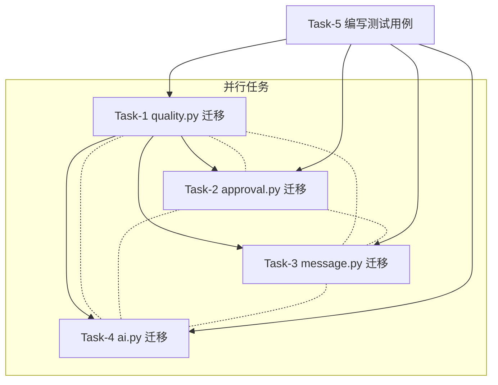

# TASK - 内存数据持久化治理

## 任务依赖关系图



四个模块**互无数据依赖**，可并行执行。T5 测试可随各模块同步编写。

## Task-1：quality.py 内存数据迁移

### 输入契约
- **前置依赖**: 无（仅依赖 `core.database.get_db_cursor`，已存在）
- **输入数据**: `QUALITY_RECORDS` 内存列表（含硬编码示例 3 条）
- **环境依赖**: Flask 应用上下文

### 实现步骤

1. **建表**: 添加 `_ensure_tables()` 函数，创建 `mobile_quality_records` 表
2. **GET /api/quality/list**: 从 `SELECT * FROM mobile_quality_records ORDER BY id DESC` 查询
3. **POST /api/quality/<order_id>/create**: 改为 `INSERT INTO mobile_quality_records`
   - 保持 `dispatch_center.on_quality_record_completed()` 联动调用不变
   - 返回刚插入的 `id`（通过 `cursor.lastrowid`）
4. **GET /api/quality/types**: 保持静态返回不变（不涉及数据存储）
5. **初始数据种子**: 将内存 `QUALITY_RECORDS` 中的示例数据写入 DB（仅在表为空时写入）
6. **清理**: 删除 `QUALITY_RECORDS` 和 `_next_id` 全局变量
7. **import 修复**: 将 `from .auth import success, fail` 改为 `from .decorators import success, fail`（保持与 process.py 一致）

### 输出契约
- **交付物**: 修改后的 `api/quality.py`
- **验收标准**:
  - 列表端点返回 DB 中最新记录
  - 创建端点写入 DB 并返回正确 id
  - 联动调度中心逻辑不变
  - 服务重启后数据保持

## Task-2：approval.py 内存数据迁移

### 输入契约
- **前置依赖**: 无
- **输入数据**: `APPROVALS` 内存列表（含硬编码示例 2 条审批、1 条已拒绝）

### 实现步骤

1. **建表**: 添加 `_ensure_tables()`，创建 `mobile_approvals` 表
2. **GET /api/approval/pending**: `SELECT * FROM mobile_approvals WHERE status='待审批'`
3. **POST /api/approval/<id>/approve**: `UPDATE mobile_approvals SET status='已通过', approver=?, approve_time=? WHERE id=?`
4. **POST /api/approval/<id>/reject**: `UPDATE mobile_approvals SET status='已拒绝', reject_reason=?, reject_time=? WHERE id=?`
5. **GET /api/approval/history**: `SELECT * FROM mobile_approvals WHERE status!='待审批'`
6. **初始数据种子**: 将内存 `APPROVALS` 中的示例数据写入 DB（仅在表为空时写入）
7. **清理**: 删除 `APPROVALS` 全局变量

### 输出契约
- **交付物**: 修改后的 `api/approval.py`
- **验收标准**:
  - 待审批列表返回 status=待审批 的记录
  - 审批通过/拒绝后状态更新
  - 历史列表返回已处理记录
  - 服务重启后数据保持

## Task-3：message.py 内存数据迁移

### 输入契约
- **前置依赖**: 无
- **输入数据**: `MESSAGES` 内存列表（含硬编码示例 3 条）

### 实现步骤

1. **建表**: 添加 `_ensure_tables()`，创建 `mobile_messages` 表
2. **GET /api/message/list**: `SELECT * FROM mobile_messages WHERE receiver_id=? ORDER BY id DESC`
3. **GET /api/message/unread-count**: `SELECT COUNT(*) FROM mobile_messages WHERE receiver_id=? AND is_read=0`
4. **POST /api/message/<id>/read**: `UPDATE mobile_messages SET is_read=1 WHERE id=?`
5. **初始数据种子**: 将内存 `MESSAGES` 中的示例数据写入 DB（仅在表为空时写入）
6. **清理**: 删除 `MESSAGES` 全局变量

### 输出契约
- **交付物**: 修改后的 `api/message.py`
- **验收标准**:
  - 消息列表按接收人过滤正确
  - 未读计数准确
  - 标记已读后 unread-count 减 1
  - 服务重启后数据保持

## Task-4：ai.py 内存数据迁移

### 输入契约
- **前置依赖**: `mobile_orders` 表（由 process.py 管理）、`mobile_task_records` 表（由 process.py 管理，已含 `order_no` 列）
- **输入数据**: `ORDERS`（订单数据）、`PROCESS_RECORDS`（流程数据）

### 实现步骤

1. **确认列已存在**: `mobile_task_records` 表已有 `order_no` 列，每次启动时 process.py 会自动回填已有数据（格式 `WO{production_id:06d}`）
2. **POST /api/ai/chat**:
   - 将查询订单进度改为从 DB 查询：

     **方式一：通过 order_no 直查 task_records**（推荐，与用户输入工单号匹配）
     ```sql
     SELECT o.*, t.id AS task_id, t.process_name, t.process_seq,
            t.status AS task_status, t.completed_qty, t.worker
     FROM mobile_orders o
     LEFT JOIN mobile_task_records t ON t.order_id = o.id
     WHERE o.order_no = ?
     ORDER BY t.process_seq ASC
     ```

     **方式二：分步查询（备用）**
     ```sql
     -- 第1步：根据工单号查订单
     SELECT * FROM mobile_orders WHERE order_no = ?
     -- 第2步：根据订单ID查工序
     SELECT * FROM mobile_task_records WHERE order_id = ? ORDER BY process_seq ASC
     ```
   - AI 组装回复时用真实数据替代内存数据
   - 记录用户提问和 AI 回复到 `mobile_chat_history`
3. **初始数据种子**: 将内存 `ORDERS` 和 `PROCESS_RECORDS` 中的示例数据写入 DB（仅在表为空时写入），保证迁移后 ai_chat 能立即正常回复
4. **GET /api/ai/chat/history**: `SELECT * FROM mobile_chat_history WHERE user_id=? ORDER BY id DESC LIMIT 50`
5. **清理**: 删除 `ORDERS` 和 `PROCESS_RECORDS` 全局变量

### 注意
- 修改 `/chat` 的 AI 回复组装逻辑时，**保持回复格式与之前一致**
- `speech-to-report` 和 `image-analysis` 端点不涉及数据存储，不做改动

### 输出契约
- **交付物**: 修改后的 `api/ai.py`
- **验收标准**:
  - 对话查询订单进度从真实 DB 读取
  - DB 为空时返回合理提示（如"未找到相关订单信息"）
  - 对话历史持久化存储
  - 语音和图像端点行为不变

## Task-5：编写测试用例

### 输入契约
- **前置依赖**: Task-1~4 完成
- **环境依赖**: 可用的测试数据库（SQLite 内存模式）

### 实现步骤

1. 创建 `tests/test_quality.py`
2. 创建 `tests/test_approval.py`
3. 创建 `tests/test_message.py`
4. 创建 `tests/test_ai.py`

每个测试文件需覆盖：
- 正常 CRUD 流程
- 空列表/空结果情况
- 异常参数情况
- 服务重启数据持久性验证

### 输出契约
- **交付物**: 4 个测试文件
- **验收标准**: 所有测试通过，覆盖主流程和边界情况
