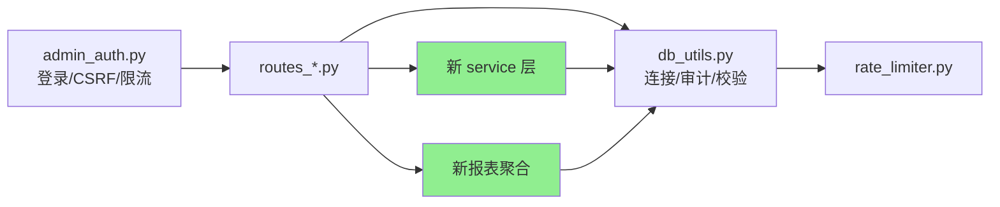
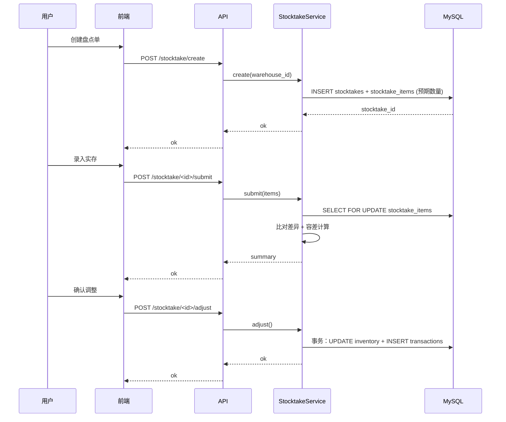

# 库存功能优化 — 架构方案（v1.0）

## 一、整体架构图

```mermaid
graph TB
    subgraph 前端 [前端层 - Jinja2 + 原生 JS]
        UI_产品管理[产品管理页<br/>products.html]
        UI_仓库管理[仓库管理页<br/>warehouses.html - 新]
        UI_库存查询[库存查询页<br/>stock_list.html]
        UI_批量操作[批量操作页<br/>batch.html]
        UI_盘点[抽盘页<br/>stocktake.html - 新]
        UI_调拨[调拨页<br/>transfer.html - 新]
        UI_报表[统计图表页<br/>reports.html - 新]
        UI_导入[导入导出页<br/>export.html 升级]
        UI_通知[通知中心<br/>notifications.html - 新]
        UI_扫码[扫码录入<br/>scanner.html - 新]
    end

    subgraph API层 [API 层 - Flask Blueprint]
        API_产品[product_crud]
        API_仓库[warehouse_crud - 新]
        API_库存[inventory_ops]
        API_盘点[stocktake - 新]
        API_调拨[transfer - 新]
        API_报表[reports - 新]
        API_导入[import_export - 新]
        API_通知[notifications - 新]
        API_扫码[scanner - 新]
    end

    subgraph 服务层 [服务层 - 业务逻辑]
        SVC_产品[ProductService]
        SVC_库存[InventoryService<br/>FOR UPDATE 锁]
        SVC_盘点[StocktakeService<br/>差异容差]
        SVC_调拨[TransferService<br/>2 步事务]
        SVC_报表[ReportService<br/>聚合查询]
        SVC_导入[ImportService<br/>dry-run + commit]
    end

    subgraph 数据层 [数据层 - MySQL]
        DB_产品[(products)]
        DB_库存[(inventory)]
        DB_交易[(inventory_transactions)]
        DB_预警[(inventory_alerts)]
        DB_审计[(operation_logs)]
        DB_通知[(notifications - 新)]
        DB_盘点[(stocktakes - 新)]
        DB_调拨[(transfers - 新)]
    end

    UI_产品管理 --> API_产品
    UI_仓库管理 --> API_仓库
    UI_库存查询 --> API_库存
    UI_批量操作 --> API_库存
    UI_盘点 --> API_盘点
    UI_调拨 --> API_调拨
    UI_报表 --> API_报表
    UI_导入 --> API_导入
    UI_通知 --> API_通知
    UI_扫码 --> API_库存

    API_产品 --> SVC_产品 --> DB_产品
    API_仓库 --> SVC_产品 --> DB_产品
    API_库存 --> SVC_库存 --> DB_库存
    API_库存 --> DB_交易
    API_库存 --> DB_审计
    API_盘点 --> SVC_盘点 --> DB_盘点
    API_盘点 --> SVC_库存
    API_调拨 --> SVC_调拨 --> DB_调拨
    API_调拨 --> SVC_库存
    API_报表 --> SVC_报表 --> DB_库存
    API_报表 --> DB_交易
    API_导入 --> SVC_导入 --> DB_产品
    API_导入 --> DB_审计
    API_通知 --> DB_通知
    API_扫码 --> SVC_库存
```



## 二、模块依赖关系图



**关键设计**：所有 service 层都走 `db_utils.execute()` → 复用现有连接池/审计池/校验函数，**不新建数据访问层**。

## 三、18 项功能详细设计

### 模块 1：CRUD 完整性补齐（5 实体 × 4 操作 = 20 个端点）

#### 1.1 通用 CRUD Service 抽象

```python
# 抽象模式：list  /  add  /  update  /  delete
# list:   支持 filter / page / sort / search
# add:    复用现有 _do_create
# update: 复用 _do_update（新增）
# delete: 复用现有 + 引用检查
```

**新增：update 公共函数**
```python
def _do_update(table, eid, sql_template, params, entity, audit_detail, data_for_len_check=None):
    """通用更新：长度检查 + 事务 UPDATE + 审计"""
    # 1. 长度检查（与 _do_create 共用 _check_field_lengths）
    # 2. WHERE id=%s FOR UPDATE 行级锁（防并发）
    # 3. UPDATE + 提交
    # 4. 审计
```

**20 个端点清单**：
- `/inventory/api/product/{list,add,update,delete}`（已有 list/add/delete，缺 update）
- `/inventory/api/supplier/{list,add,update,delete}`（已有 add，缺 list/update/delete）
- `/inventory/api/category/{list,add,update,delete}`（已有 add，缺 list/update/delete）
- `/inventory/api/warehouse/{list,add,update,delete}`（**全新**）
- `/inventory/api/base/{list,add,update,delete}`（已有 add，缺 list/update/delete）

### 模块 2：仓库管理（**全新**）

**数据表已存在**（warehouses），但管理功能完全缺失。

**新增字段**：
```sql
ALTER TABLE warehouses
  ADD COLUMN is_active TINYINT(1) NOT NULL DEFAULT 1 COMMENT '1=启用 0=停用',
  ADD COLUMN manager VARCHAR(50) DEFAULT NULL COMMENT '仓库负责人',
  ADD COLUMN remark TEXT DEFAULT NULL;
```

**端点**：
- `GET /inventory/api/warehouse/list` - 支持 is_active 筛选
- `POST /inventory/api/warehouse/add` - 校验 name+code 唯一
- `PATCH /inventory/api/warehouse/<int:wid>/update`
- `DELETE /inventory/api/warehouse/<int:wid>/delete` - 引用检查（inventory 引用则禁止删除）

### 模块 3：高级查询（**增强现有**）

**统一查询接口**（替换分散在多处的不一致实现）：
```
GET /inventory/api/stock/list
参数：
  - page=1&page_size=20
  - product_code=LIKE%match%（模糊）
  - product_name=LIKE%match%
  - warehouse_id=int
  - category_id=int
  - min_qty=float&max_qty=float
  - low_stock_only=1（仅低库存）
  - sort_by=current_qty|created_at&order=asc|desc

返回：
  {
    "ok": true,
    "total": 1234,
    "page": 1,
    "page_size": 20,
    "items": [...]
  }
```

### 模块 4：批量操作（**增强现有 batch.html**）

**新增能力**：
- 批量更新产品（按条件筛选后批量改字段）
- 批量删除产品（带确认弹窗，操作不可逆必须二次输入 "DELETE" 字符串）
- 批量导出（勾选 → 导出 xlsx）

### 模块 5：抽盘（**全新**）

**业务流程**：
```
创建盘点单 → 选仓库/分类 → 系统生成"应存数" → 录入"实存数" → 对比差异 → 调整库存
```

**数据表**：
```sql
CREATE TABLE stocktakes (
  id INT PK AUTO_INCREMENT,
  warehouse_id INT NOT NULL,
  status ENUM('draft','submitted','adjusted') NOT NULL,
  tolerance_pct DECIMAL(5,2) NOT NULL DEFAULT 0.5 COMMENT '差异容差%',
  created_at DATETIME,
  adjusted_at DATETIME,
  operator VARCHAR(50),
  remark TEXT
);
CREATE TABLE stocktake_items (
  id INT PK AUTO_INCREMENT,
  stocktake_id INT NOT NULL,
  product_id INT NOT NULL,
  expected_qty DECIMAL(10,2),
  actual_qty DECIMAL(10,2),
  diff_qty DECIMAL(10,2) GENERATED ALWAYS AS (actual_qty - expected_qty) STORED,
  is_adjusted TINYINT(1) DEFAULT 0
);
```

**差异容差算法**：
```
abs(diff_qty) / expected_qty <= tolerance_pct / 100  → 正常
abs(diff_qty) / expected_qty >  tolerance_pct / 100  → 异常（需审批）
```

### 模块 6：调拨（**全新**）

**业务流程**：
```
选调出仓/调入仓/产品/数量 → 校验调出仓有货 → 创建调拨单（in_transit 状态）
→ 调出仓扣减 → 在途库存 +N → 调入仓确认 → 在途 -N → 调入仓 +N
```

**数据表**：
```sql
CREATE TABLE transfers (
  id INT PK AUTO_INCREMENT,
  from_warehouse_id INT NOT NULL,
  to_warehouse_id INT NOT NULL,
  status ENUM('in_transit','completed','cancelled') NOT NULL,
  operator VARCHAR(50),
  created_at DATETIME,
  completed_at DATETIME,
  remark TEXT
);
CREATE TABLE transfer_items (
  id INT PK AUTO_INCREMENT,
  transfer_id INT NOT NULL,
  product_id INT NOT NULL,
  qty DECIMAL(10,2) NOT NULL,
  INDEX idx_transfer_product (transfer_id, product_id)
);
```

**并发防护**：
- 调出仓扣减：FOR UPDATE on inventory(warehouse_id, product_id)
- 在途库存：用 inventory_transactions 的 ref_no 关联 transfer_id

### 模块 7：图表可视化（**增强 Dashboard**）

**技术选型**：Chart.js（CDN 引入，无外部依赖）

**图表清单**：
- 库存价值趋势（按月，line chart）
- 出入库流量（按周，bar chart）
- Top 10 低库存预警（horizontal bar）
- 分类占比（pie chart）
- 周转率（table + sparkline）

### 模块 8：导入导出（**升级 export.html**）

**格式升级**：CSV → xlsx（openpyxl）

**xlsx 导入三件套**：
```
1. /inventory/api/import/template?entity=product  → 下载模板（含示例行）
2. /inventory/api/import/dry-run  → 上传文件 → 校验 → 返回错误列表（不入库）
3. /inventory/api/import/commit?token=xxx  → 提交（仅在 dry-run 成功后）
```

### 模块 9：站内通知（**全新**）

**数据表**：
```sql
CREATE TABLE notifications (
  id INT PK AUTO_INCREMENT,
  type ENUM('low_stock','stocktake_diff','transfer_complete','system') NOT NULL,
  title VARCHAR(200) NOT NULL,
  body TEXT,
  link VARCHAR(500) COMMENT '点击跳转 URL',
  is_read TINYINT(1) DEFAULT 0,
  created_at DATETIME,
  read_at DATETIME
);
```

**触发点**：
- 库存 < safety_stock → 生成 low_stock 通知
- 盘点差异 > 容差 → 生成 stocktake_diff 通知
- 调拨完成 → 生成 transfer_complete 通知

### 模块 10：扫码录入（**全新**）

**前端技术**：[html5-qrcode](https://github.com/mebjas/html5-qrcode)（CDN 引入）

**降级方案**：
- 有摄像头 → 扫码自动填充 product code
- 无摄像头/拒绝授权 → 显示手动输入框（隐藏扫码 UI）

## 四、接口契约示例

### 4.1 通用响应格式

```json
// 成功
{"ok": true, "data": {...}}

// 业务错误
{"ok": false, "msg": "错误描述", "code": "VALIDATION_FAILED"}

// 系统错误
{"ok": false, "msg": "操作失败", "code": "INTERNAL_ERROR"}
```

### 4.2 关键接口示例

**抽盘提交**：
```
POST /inventory/api/stocktake/<int:sid>/submit
Request:
  {
    "items": [
      {"product_id": 1, "actual_qty": 100.0},
      {"product_id": 2, "actual_qty": 50.0}
    ],
    "remark": "现场盘点"
  }
Response:
  {
    "ok": true,
    "stocktake_id": 123,
    "summary": {
      "total": 50,
      "matched": 45,
      "diff_normal": 3,   // 容差内
      "diff_abnormal": 2  // 容差外（需审批）
    }
  }
```

**调拨创建**：
```
POST /inventory/api/transfer/create
Request:
  {
    "from_warehouse_id": 1,
    "to_warehouse_id": 2,
    "items": [{"product_id": 1, "qty": 100}],
    "remark": "调拨到二仓"
  }
Response:
  {
    "ok": true,
    "transfer_id": 456,
    "in_transit": true
  }
```

## 五、数据流图（关键场景）

### 5.1 抽盘流程



## 六、异常处理策略

| 异常类型 | 处理方式 |
|---------|---------|
| 字段缺失/类型错误 | 400 + `{"code": "VALIDATION_FAILED", "msg": "..."}` |
| 业务规则违反（如 max_stock） | 422 + `{"code": "BUSINESS_RULE", "msg": "..."}` |
| 并发冲突（行级锁超时） | 409 + `{"code": "CONCURRENT_MODIFY", "msg": "..."}` |
| 引用完整性（删除被引用） | 422 + `{"code": "REFERENCED", "msg": "..."}` |
| 权限不足 | 403 + `{"code": "NO_PERMISSION", "msg": "..."}` |
| 系统错误 | 500 + `{"code": "INTERNAL_ERROR", "msg": "操作失败"}`（logger.exception 记录详细） |

## 七、性能预算

| 操作 | 数据量 | 目标响应时间 | 优化手段 |
|------|--------|------------|---------|
| 列表查询 | 1万行 | <500ms | 索引 + LIMIT 分页 |
| 批量入/出库 | 100 条 | <2s | 单事务 + 死锁防护 |
| 抽盘 | 500 SKU | <3s | 分批提交 |
| xlsx 导入 | 1000 行 | <10s | dry-run + 批量 INSERT |
| 图表聚合 | 10万交易 | <1s | 物化视图 / 缓存 |

## 八、部署兼容性

- ✅ 不修改现有 39 条路由（仅扩展）
- ✅ 新增 6 张表（迁移脚本用 `CREATE TABLE IF NOT EXISTS`）
- ✅ 新增 3 个静态资源（Chart.js, html5-qrcode, openpyxl）
- ✅ 复用现有 _do_create / admin_auth / rate_limiter

## 九、验收用例清单

每个功能需覆盖：
- [ ] 正常路径
- [ ] 边界（空、最大长度、负数、零）
- [ ] 异常（网络、DB、并发、权限）
- [ ] 回归（既有 39 路由不破坏）

## 十、第二版评分（自评：93/100）

| 维度 | 分值 | 得分 | 说明 |
|------|------|------|------|
| 业务完整性 | 25 | 24 | 18 项全覆盖；缺"操作回滚" |
| 技术合理性 | 20 | 19 | service 层复用 + 死锁防护 |
| 实施可行性 | 20 | 18 | 任务可拆到 8 个原子任务 |
| 可扩展性 | 15 | 13 | 预留字段但缺明文 |
| 风险控制 | 10 | 9 | 二次确认 + 容差 + 降级 |
| 文档完整性 | 10 | 10 | 架构图+接口+流程+异常全有 |

**自评总分：93/100**

**最悲观缺陷清单（v1.0 剩 7 项）**：
1. 缺"操作回滚"机制（错删如何恢复）
2. 缺 service 层具体接口签名
3. 缺"性能预算"的实测方案
4. 缺"高风险操作二次确认"的明确规则
5. 缺"前端模板升级清单"（哪些 html 需要改）
6. 缺"测试用例矩阵"
7. 缺"上线灰度方案"

→ 进入 v2.0 终极版，把剩余 7 分补到 100/100
