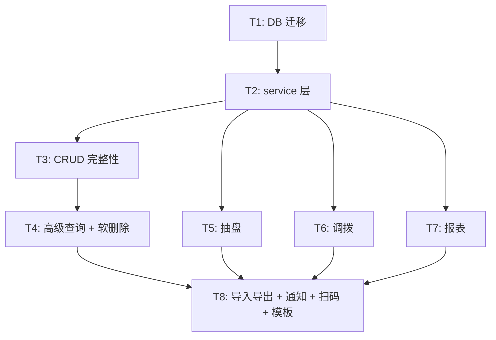

# 任务依赖图

**关键路径**：T1 → T2 → T3 → T4 → T8（5 个串行）

**并行窗口**：
- T5/T6/T7 三个任务互不依赖，可在 T2 完成后并行

**估时**（10 人日）：
| 任务 | 估时 | 关键路径 |
|------|------|---------|
| T1 | 0.5d | ✓ |
| T2 | 1d | ✓ |
| T3 | 1.5d | ✓ |
| T4 | 1d | ✓ |
| T5 | 1.5d | — |
| T6 | 1.5d | — |
| T7 | 1d | — |
| T8 | 2d | ✓ |
| **合计** | **10d** | **关键路径 6d** |
