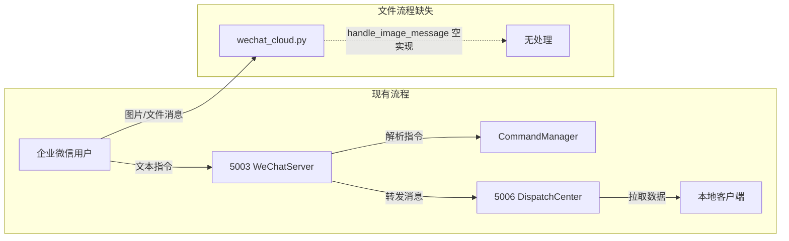

# ALIGNMENT_微信文件保存.md

## 项目名称
微信文件/图片保存功能

---

## 一、项目上下文分析

### 1.1 现有项目结构

| 模块 | 说明 |
|------|------|
| `wechat_server.py` (端口5003) | 企业微信应用机器人Flask服务器，处理消息收发、指令解析、回调路由 |
| `wechat_cloud.py` (云端服务器) | 云端独立服务，接收微信回调、维护消息队列、下载微信媒体文件 |
| `wechat_server_handlers.py` | 云端轮询消息处理器，分派处理各类型消息 |
| `wechat_app_bot.py` | 企业微信机器人SDK，已有 `get_media(media_id)` 下载媒体文件方法 |
| `dispatch_center.py` (端口5006) | 调度中心，任务派发、消息路由到本地客户端 |
| `container_center_v5.py` | 容器中心（任务池），持久化任务数据，`save_package`/`get_package` |
| `storage_layer.py` | 存储层接口定义，支持多种存储实现 |
| `cloud_matching.py` | 云端指令匹配引擎，按前缀匹配指令类型 |
| `commands/manager.py` | 指令管理器，注册和路由所有文本指令 |
| `commands/base.py` | 指令基类，CommandType枚举、ParsedCommand、CommandResult |

### 1.2 文件管理现状

| 项目 | 现状 |
|------|------|
| 媒体下载 | `wechat_app_bot.py` 已有 `get_media(media_id)` 方法，可下载语音/图片 |
| 图片消息处理 | `wechat_server_handlers.py` 中 `handle_image_message` 为空实现 |
| 文件存储 | 无统一文件存储机制，无文件与工单/物料的关联管理 |
| 附件查询 | 无附件查询、检索能力 |
| 文件持久化 | 无，`cloud_backup.py` 仅备份消息文本，不含文件二进制 |

### 1.3 技术栈

| 组件 | 技术 |
|------|------|
| 后端框架 | Flask |
| 企业微信API | 企微应用机器人 API（`get_media` 下载媒体） |
| 文件存储 | 云端服务器本地文件系统（按日期/工单组织目录） |
| 存储层 | ContainerCenter（`storage_layer`）存储文件索引记录 |
| 消息格式 | 文本指令 + 图片/文件消息 |
| 数据库 | SQLite（cloud_backup 备份消息记录） |

### 1.4 现有数据流分析



---

## 二、需求描述

### 2.1 用户场景

**场景一：发送文件到工单**
```
用户：保存文件 WO202605001
系统：请发送需保存的文件或图片
用户：[发送图片]
系统：图片已保存到工单 WO202605001
```

**场景二：发送文件到材料**
```
用户：保存材料 不锈钢丝 2.0mm
系统：请发送需保存的文件或图片
用户：[发送PDF文件]
系统：文件已保存到材料 不锈钢丝/2.0mm
```

**场景三：自定义备注保存**
```
用户：保存备注 设备维修记录20260501
系统：请发送需保存的文件或图片
用户：[发送图片]
系统：文件已保存，备注：设备维修记录20260501
```

### 2.2 功能清单

| 编号 | 功能 | 说明 |
|------|------|------|
| F1 | 保存指令识别 | 识别"保存 工单号"、"保存 材料名"、"保存 备注"指令 |
| F2 | 文件接收 | 接收微信端发送的图片和文件消息 |
| F3 | 文件下载 | 通过企业微信API下载媒体文件到云端服务器 |
| F4 | 文件存储 | 按关联对象组织目录结构，存储文件到文件系统 |
| F5 | 索引记录 | 在ContainerCenter中记录文件索引（关联对象、路径、上传人、时间） |
| F6 | 文件查询 | 查询工单/材料下的所有关联文件 |
| F7 | 文件转发 | 将文件索引记录转发到5006，本地端可拉取文件信息 |

### 2.3 关联数据类型

| 关联类型 | 标识字段 | 示例 | 验证方式 |
|----------|----------|------|----------|
| 工单 | `order_no` | WO202605001 | 格式校验 WO-\d{10} |
| 订单 | `order_no` | ORD202605010001 | 格式校验 ORD-\d{12} |
| 材料 | `material_name` + `spec` | 不锈钢丝/2.0mm | 文本匹配 |
| 自定义备注 | `remark` | 设备维修记录 | 自由文本 |

### 2.4 验收标准

| 编号 | 标准 | 验证方式 |
|------|------|----------|
| A1 | 用户输入"保存 工单号"后，系统回复上传提示 | 指令测试 |
| A2 | 用户发送图片后，系统完成下载并保存到工单目录 | 文件系统检查 |
| A3 | 文件保存后，ContainerCenter中有对应的索引记录 | 数据库查询 |
| A4 | 文件索引记录可转发到5006，本地端可拉取 | 数据流验证 |
| A5 | 查询工单关联文件可返回文件列表 | API测试 |
| A6 | 图片下载和解码总耗时 ≤5秒 | 性能测试 |
| A7 | 文件类型支持：jpg/png/pdf/docx等常见格式 | 类型测试 |

---

## 三、项目边界

### 3.1 包含范围

- 微信端"保存"指令识别和会话管理
- 图片/文件消息的接收和下载
- 文件在云端服务器的存储和组织
- 文件索引在ContainerCenter的记录
- 文件关联工单/材料/备注的多模式绑定
- 文件索引转发到5006
- 文件列表查询接口

### 3.2 不包含范围

- ❌ 文件在线预览（不实现在微信内预览PDF等）
- ❌ 文件版本管理（同一关联对象多次上传为独立文件）
- ❌ 文件删除/修改功能（仅做保存和查询）
- ❌ 本地端文件同步下载（5006仅转发文件索引信息）
- ❌ 大文件分片上传（企业微信文件大小限制内）
- ❌ OCR文字识别（仅保存，不识别文件内容）

### 3.3 约束条件

| 约束 | 说明 |
|------|------|
| 企业微信文件限制 | 图片 ≤2MB，文件 ≤20MB |
| 存储位置 | 云端服务器本地磁盘 |
| 存储周期 | 永久保存（由运维管理磁盘空间） |
| 文件命名 | `{时间戳}_{原始文件名}` 避免冲突 |
| 并发处理 | 云端deque队列天然支持顺序消费，无并发冲突 |

---

## 四、关键决策点

### 4.1 决策清单

| 决策项 | 选择 | 理由 |
|--------|------|------|
| 文件存储位置 | 云端服务器（wechat_cloud.py侧） | 媒体下载需企业微信API token，云端已有完整网络访问能力 |
| 下载方式 | 复用 wechat_app_bot.get_media() | 已有成熟实现，无需重复开发 |
| 文件索引记录 | ContainerCenter storage_layer | 复用现有跨模块数据交换渠道 |
| 会话管理 | 状态机（类似扫码报工） | "先发指令→后发文件"的两步交互需状态跟踪 |
| 文件目录结构 | `files/{关联类型}/{关联标识}/{文件名}` | 按业务维度组织，便于管理和查询 |
| 文件元数据格式 | JSON记录含路径/大小/类型/上传人/时间 | 满足查询和展示需求 |

### 4.2 用户交互流程

```
步骤1: 用户发送 "保存 WO202605001"
  → 5003识别指令，启动保存会话
  → 回复 "请发送需保存的文件或图片"

步骤2: 用户发送图片/文件
  → 云端 wechat_cloud.py 收到图片/文件消息
  → 通过 get_media(media_id) 下载文件
  → 保存到 files/work_order/WO202605001/ 目录

步骤3: 系统处理
  → 创建文件索引记录
  → 存入 ContainerCenter
  → 回复 "文件已保存到工单 WO202605001"
  → 将文件索引转发到5006

步骤4 （并行）: 查询关联文件
  用户发送 "查看 WO202605001 文件"
  → 系统查询ContainerCenter
  → 返回文件列表
```

### 4.3 异常处理

| 场景 | 处理方式 |
|------|----------|
| 下载失败 | 回复"文件下载失败，请重新发送" |
| 文件过大 | 回复"文件大小超过限制，请压缩后重试" |
| 工单号格式错误 | 回复"工单号格式错误，示例：WO202605001" |
| 超时未发送文件 | 30分钟后自动结束会话 |
| 磁盘空间不足 | 回复"文件保存失败，请联系管理员" |
| 重复指令 | 直接更新会话目标，不创建新会话 |

---

## 五、非功能需求

### 5.1 性能要求

| 指标 | 要求 |
|------|------|
| 文件下载+保存时间 | ≤5秒（含企业微信API下载耗时） |
| 并发支持 | 云端deque队列顺序处理，无需额外并发控制 |
| 单文件大小 | ≤20MB（企业微信上限） |

### 5.2 安全要求

| 要求 | 说明 |
|------|------|
| 访问控制 | 文件按关联对象隔离，仅有关联对象访问权限的用户可查看文件索引 |
| 文件路径 | 不使用原始文件名直接存储，使用 `{timestamp}_{filename}` 防止冲突 |
| 文件类型 | 不做主动限制，企业微信端已有文件类型校验 |
| API密钥 | `.env` 文件管理，不硬编码 |

---

## 六、疑问澄清

| 问题 | 解答 |
|------|------|
| 文件存储目录是否需要统一配置路径？ | 是，统一在配置文件中定义 `FILE_STORAGE_BASE_DIR` |
| 是否需要支持文件夹/多级目录上传？ | 否，企业微信上传只能是单个文件 |
| 5006侧需要拉取文件内容还是仅索引？ | 仅索引信息（文件路径、关联对象、上传人），本地端按路径读取 |
| 是否需要对图片做缩略图？ | 第一版不做，后续迭代根据需求决定 |
| 文件保存后是否需要通知相关人？ | 第一版不做，仅保存+记录 |
| 是否需要前端展示文件列表？ | 仅需微信文本回复列表，后续迭代可加Web界面 |
