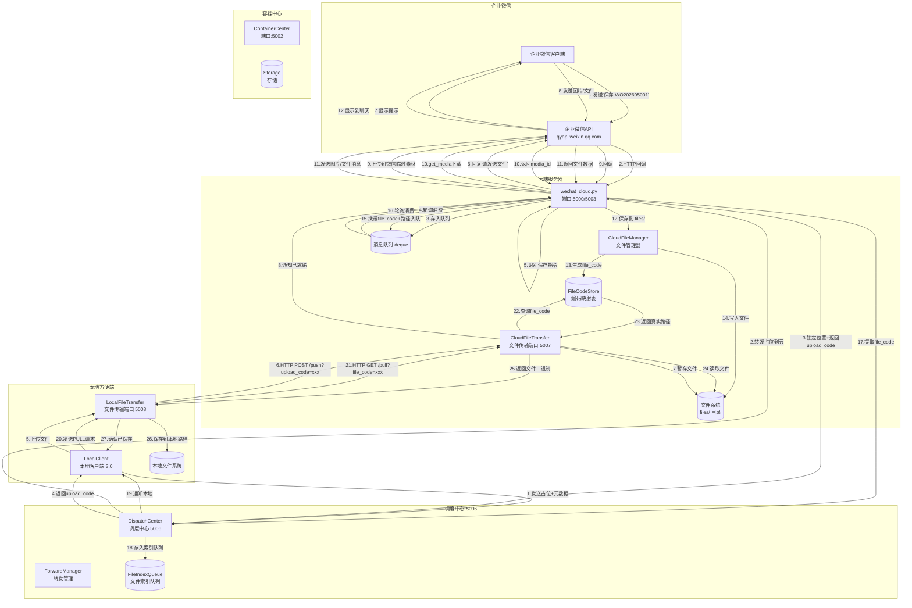
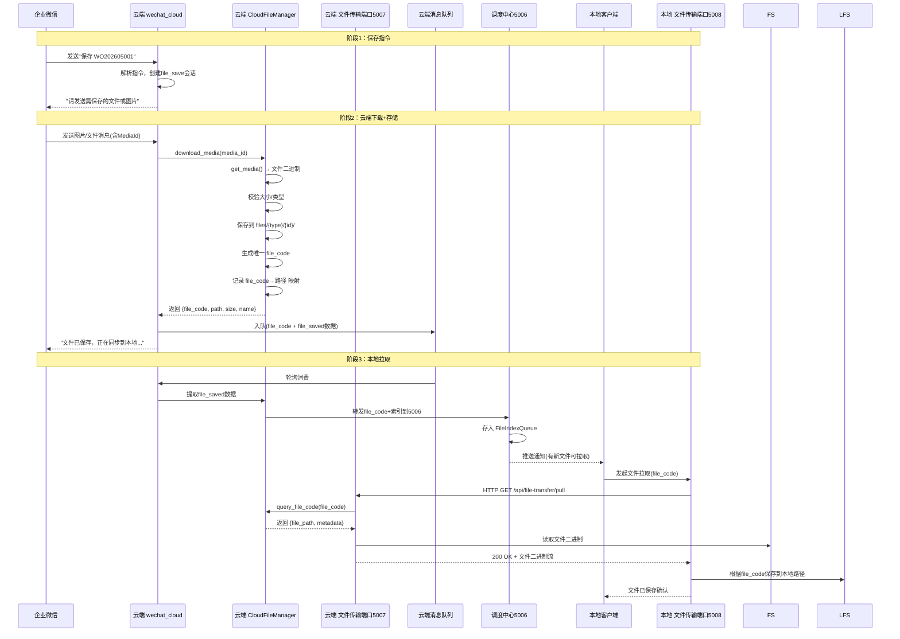
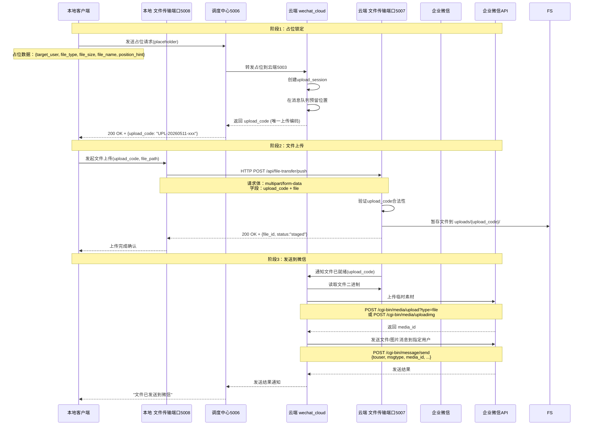
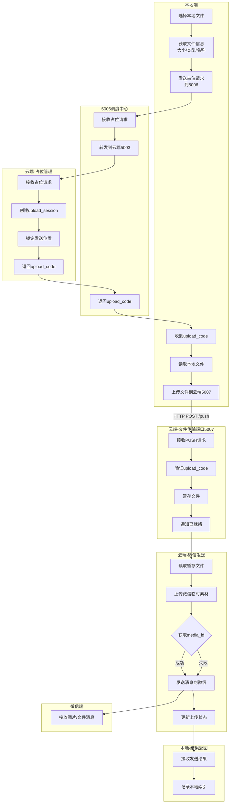

# DESIGN_微信文件保存.md

## 项目名称
微信文件/图片传输与保存功能

---

## 一、整体架构

### 1.1 架构图



### 1.2 架构端口总览

| 服务 | 端口 | 说明 |
|------|------|------|
| wechat_cloud (云端) | 5000/5003 | 微信回调接收、消息轮询、指令处理 |
| ContainerCenter | 5002 | 容器中心（跨模块数据交换） |
| WeChatServer (5003) | 5003 | 微信业务服务（已存在） |
| DispatchCenter | 5006 | 调度中心（转发到本地端） |
| **CloudFileTransfer (新增)** | **5007** | **云端文件传输专用端口** |
| **LocalFileTransfer (新增)** | **5008** | **本地端文件传输专用端口** |
| WeChatCallbackAPI (本地) | 5001 | 本地端微信回调接收（已存在） |

---

## 二、核心流程（2大主流程）

### 2.1 流A：微信 → 云端 → 本地（文件保存）



### 2.2 流B：本地 → 云端 → 微信（发送文件/图片）



---

## 三、分层设计

### 3.1 新增模块目录结构

```
=== 云端侧（不锈钢网带跟单3.0/mobile_api_ai/）===

cloud_file_manager.py              # [新增] 云文件管理器：下载/存储/编码映射
cloud_file_transfer_server.py       # [新增] 云端文件传输端口(5007)：拉取/上传

wechat_cloud.py                     # [改造] 新增：图片/文件消息分支
                                    #        新增：local→wechat占位+发送流程

=== 本地端侧（不锈钢网带跟单系统3.01/）===

services/
├── local_file_transfer_server.py   # [新增] 本地文件传输端口(5008)：拉取/上传
├── file_save_service.py            # [新增] 文件保存服务：文件保存到本地逻辑
├── file_send_service.py            # [新增] 文件发送服务：向微信发送文件逻辑
└── file_index_manager.py           # [新增] 文件索引管理器

api/
└── wechat_callback.py              # [改造] 新增文件相关的API路由

core/
├── config.py                       # [改造] 新增文件传输配置项
└── app.py                          # [改造] 启动时初始化文件传输端口
```

### 3.2 各层职责

| 部署位置 | 模块 | 职责 |
|----------|------|------|
| **云端** | `cloud_file_manager.py` | 文件下载(get_media)、校验、存储、file_code生成/查询、路径映射 |
| **云端** | `cloud_file_transfer_server.py` | **文件传输端口5007**：接收本地PULL/PUSH请求，传输文件二进制 |
| **云端** | `wechat_cloud.py` | 微信回调处理、指令解析、占位管理、消息队列、微信API调用 |
| **本地** | `local_file_transfer_server.py` | **文件传输端口5008**：管理本地拉取/上传、与云端5007通信 |
| **本地** | `file_save_service.py` | 文件保存到本地目录、按关联类型组织目录结构 |
| **本地** | `file_send_service.py` | 占位创建、上传触发、发送结果处理 |
| **本地** | `file_index_manager.py` | 文件索引管理、本地文件记录查询、与5006同步 |
| **5006** | `dispatch_center.py` | 转发file_code、占位消息、通知本地有新文件 |

### 3.3 文件编码系统（FileCode）

核心设计：每次文件操作生成唯一编码，作为文件的安全引用标识。

```python
# file_code 格式
file_code = "FC-{timestamp}-{random_hex}-{sequence}"

# 示例
file_code = "FC-20260511235959-a3f8c2-001"

# 编码映射表（CloudFileManager 维护）
file_code_map = {
    "FC-20260511235959-a3f8c2-001": {
        "file_path": "files/work_order/WO202605001/1712345678_photo.jpg",
        "absolute_path": "/data/wechat/files/work_order/WO202605001/1712345678_photo.jpg",
        "file_name": "1712345678_photo.jpg",
        "original_name": "photo.jpg",
        "file_size": 102456,
        "file_type": "jpg",
        "msg_type": "image",
        "association": {
            "type": "work_order",
            "identifier": "WO202605001",
            "display": "工单 WO202605001"
        },
        "uploader": "YuanGangBiao",
        "upload_time": "2026-05-11T23:59:59",
        "status": "active"  # active | staged | pulled | expired
    }
}
```

---

## 四、核心组件设计

### 4.1 云端：CloudFileManager（文件管理器）

```python
class CloudFileManager:
    """
    云端文件管理器（运行在云端服务器）

    职责：
    - 通过企业微信 media_id 下载图片/文件
    - 校验文件大小和类型
    - 按关联对象组织目录结构，存储文件到文件系统
    - 生成/管理 file_code 编码
    - 提供文件查询（通过file_code或关联对象）
    - 清理临时文件和过期编码
    """

    # 文件存储根目录（从环境变量读取）
    FILE_STORAGE_BASE_DIR = 'files'

    # 临时上传目录
    UPLOAD_TEMP_DIR = 'uploads_temp'

    # 文件大小限制
    MAX_IMAGE_SIZE = 2 * 1024 * 1024       # 图片 ≤2MB
    MAX_FILE_SIZE = 20 * 1024 * 1024       # 文件 ≤20MB

    def __init__(self, app_bot):
        self.app_bot = app_bot
        self.file_code_map = {}   # file_code → metadata（内存 + JSON持久化）
        self._load_code_map()

    def download_and_save(self, media_id: str, msg_type: str,
                          association: dict) -> dict:
        """
        下载媒体文件、保存文件系统、生成file_code（完整流程）

        Args:
            media_id: 企业微信媒体文件ID
            msg_type: 消息类型（image/file）
            association: 关联信息 {type, identifier, display}

        Returns:
            dict: {
                success: bool,
                file_code: str,       # 唯一文件编码（新增）
                file_path: str,        # 相对路径
                file_name: str,
                file_size: int,
                file_type: str,
                error: str
            }
        """

    def generate_file_code(self) -> str:
        """生成唯一 file_code（时间戳+随机数+序列号）"""

    def query_file_code(self, file_code: str) -> Optional[dict]:
        """通过file_code查询文件元数据"""

    def get_file_by_code(self, file_code: str) -> tuple:
        """
        通过file_code获取文件二进制数据

        Returns:
            (bytes, dict): (文件二进制, 文件元数据) 或 (None, None)
        """

    def download_media(self, media_id: str) -> tuple:
        """下载企业微信媒体文件"""

    def validate_file(self, file_data: bytes, msg_type: str) -> tuple:
        """校验文件大小和类型"""

    def save_to_filesystem(self, file_data: bytes, original_name: str,
                           association_type: str, identifier: str) -> dict:
        """保存到文件系统，返回文件信息"""

    def create_upload_session(self, placeholder: dict) -> str:
        """
        创建上传会话（本地→微信流程）

        Args:
            placeholder: {target_user, file_type, file_size, file_name}

        Returns:
            str: upload_code
        """

    def stage_uploaded_file(self, upload_code: str, file_data: bytes,
                            original_name: str) -> dict:
        """
        暂存本地端上传的文件（等待发送到微信）

        Returns:
            dict: {success, file_path, file_size, file_type}
        """

    def cleanup_expired(self):
        """清理过期file_code和临时文件"""
```

### 4.2 云端：CloudFileTransferServer（文件传输端口5007）

```python
class CloudFileTransferServer:
    """
    云端文件传输端口（HTTP服务器，端口5007）

    职责：
    - 接收本地端的文件拉取请求（PULL）
    - 接收本地端的文件上传请求（PUSH）
    - 验证请求合法性（upload_code/file_code校验）
    - 返回文件二进制流

    接口：
    - GET  /api/file-transfer/pull?file_code=xxx  → 本地拉取文件
    - POST /api/file-transfer/push                → 本地上传文件
    - GET  /api/file-transfer/status?code=xxx     → 查询传输状态
    """

    def __init__(self, host='0.0.0.0', port=5007, file_manager=None):
        self.host = host
        self.port = port
        self.file_manager = file_manager
        self.app = Flask(__name__)
        self._register_routes()
        self.server_thread = None
        self.running = False

    def _register_routes(self):
        @self.app.route('/api/file-transfer/pull', methods=['GET'])
        def handle_pull():
            """
            本地端拉取文件

            请求参数:
                file_code: str - 文件编码
                api_key: str - API密钥验证

            响应:
                成功: 200 + 文件二进制流 + 元数据Header
                失败: 4xx + {error: str}
            """

        @self.app.route('/api/file-transfer/push', methods=['POST'])
        def handle_push():
            """
            本地端上传文件（用于发送到微信）

            请求体: multipart/form-data
                upload_code: str - 上传会话编码（占位阶段获取）
                file: 文件数据

            响应:
                成功: 200 + {success, file_id, staged_path}
                失败: 4xx + {error: str}
            """

        @self.app.route('/api/file-transfer/status', methods=['GET'])
        def handle_status():
            """
            查询传输状态
            请求参数: code (file_code 或 upload_code)
            """

    def start(self):
        """启动文件传输端口"""

    def stop(self):
        """停止文件传输端口"""
```

### 4.3 本地端：LocalFileTransferServer（文件传输端口5008）

```python
class LocalFileTransferServer:
    """
    本地端文件传输端口（HTTP服务器，端口5008）

    职责：
    - 接收本地客户端的文件拉取请求，作为代理向云端PULL
    - 接收本地客户端的文件上传请求，作为代理向云端PUSH
    - 管理本地文件传输队列
    - 文件传输进度反馈

    接口：
    - POST /api/local-file-transfer/pull    → 本地端发起拉取
    - POST /api/local-file-transfer/push    → 本地端发起上传
    - GET  /api/local-file-transfer/status  → 传输状态查询
    - GET  /api/local-file-transfer/list    → 本地已保存文件列表
    """

    def __init__(self, host='127.0.0.1', port=5008):
        self.host = host
        self.port = port
        self.cloud_transfer_url = ''  # 云端文件传输端口地址
        self.app = Flask(__name__)
        self._register_routes()
        self.server_thread = None
        self.running = False

    def _register_routes(self):
        @self.app.route('/api/local-file-transfer/pull', methods=['POST'])
        def handle_pull():
            """
            发起文件拉取

            请求体:
                file_code: str - 要拉取的文件编码
                save_path: str - 本地保存路径（可选，默认使用file_save_service自动决定）

            流程:
                1. 接收本地客户端请求
                2. 向云端5007发送 GET /api/file-transfer/pull?file_code=xxx
                3. 接收文件二进制流
                4. 调用 FileSaveService 保存到本地
                5. 返回保存结果
            """

        @self.app.route('/api/local-file-transfer/push', methods=['POST'])
        def handle_push():
            """
            发起文件上传

            请求体: multipart/form-data
                local_file_path: str - 本地文件路径
                target_user: str    - 目标微信用户
                file_type: str      - 文件类型（image/file）

            流程:
                1. 先向5006发送占位请求，获取upload_code
                2. 再向云端5007上传文件
                3. 返回上传结果
            """

    def start(self):
        """启动本地文件传输端口"""

    def stop(self):
        """停止本地文件传输端口"""
```

### 4.4 本地端：FileSaveService（文件保存服务）

```python
class FileSaveService:
    """
    本地文件保存服务

    职责：
    - 根据关联类型（工单/材料/备注）决定本地保存路径
    - 将拉取到的文件保存到本地文件系统
    - 维护本地文件索引（数据库）
    - 提供本地文件查询
    """

    # 本地文件存储根目录
    LOCAL_FILE_BASE_DIR = 'wechat_files'

    @classmethod
    def save_pulled_file(cls, file_data: bytes, file_metadata: dict) -> dict:
        """
        保存从云端拉取的文件

        Args:
            file_data: 文件二进制数据
            file_metadata: {
                file_code, file_name, original_name, file_size,
                file_type, association: {type, identifier, display}
            }

        Returns:
            dict: {
                success: bool,
                local_path: str,
                file_code: str,
                message: str
            }

        目录结构:
            {LOCAL_FILE_BASE_DIR}/
            ├── work_order/
            │   └── WO202605001/
            │       └── 1712345678_photo.jpg
            ├── material/
            │   └── 不锈钢丝_2.0mm/
            │       └── 材质证明.pdf
            └── remark/
                └── 设备维修记录/
                    └── 现场照片.jpg
        """

    @classmethod
    def get_local_file_list(cls, association_type: str = None,
                            identifier: str = None) -> list:
        """查询本地已保存的文件列表"""

    @classmethod
    def get_local_file_path(cls, file_code: str) -> Optional[str]:
        """根据file_code获取本地文件路径"""
```

### 4.5 本地端：FileSendService（文件发送服务）

```python
class FileSendService:
    """
    本地文件发送服务（向微信发送图片/文件）

    职责：
    - 向5006发送占位请求，获取upload_code
    - 通过LocalFileTransfer上传文件
    - 查询发送结果
    """

    @classmethod
    def send_file_to_wechat(cls, local_file_path: str,
                            target_user: str,
                            file_type: str = 'file') -> dict:
        """
        向微信发送文件（占位+上传完整流程）

        Args:
            local_file_path: 本地文件路径
            target_user: 目标微信用户ID
            file_type: 文件类型（image/file）

        Returns:
            dict: {
                success: bool,
                upload_code: str,
                message: str,
                wechat_result: dict
            }

        流程:
            1. 获取文件信息（大小、类型、文件名）
            2. 向5006发送占位请求 POST /api/placeholder
               {target_user, file_type, file_size, file_name}
            3. 5006返回 upload_code
            4. 通过LocalFileTransfer上传文件到云端5007
            5. 云端上传到微信临时素材并发送消息
            6. 返回发送结果
        """

    @classmethod
    def send_placeholder(cls, file_info: dict) -> Optional[str]:
        """发送占位请求，返回upload_code"""

    @classmethod
    def query_send_status(cls, upload_code: str) -> dict:
        """查询发送状态"""
```

### 4.6 本地端：FileIndexManager（文件索引管理器）

```python
class FileIndexManager:
    """
    文件索引管理器

    职责：
    - 管理本地文件的索引记录（存储到本地数据库）
    - 与5006同步文件索引状态
    - 提供文件查询、统计功能
    - 管理文件状态流转
    """

    @classmethod
    def record_file(cls, file_code: str, local_path: str,
                    association: dict, metadata: dict) -> bool:
        """记录文件索引到数据库"""

    @classmethod
    def mark_pulled(cls, file_code: str) -> bool:
        """标记文件已被拉取"""

    @classmethod
    def mark_sent(cls, upload_code: str, wechat_result: dict) -> bool:
        """标记文件已发送到微信"""

    @classmethod
    def get_files_by_association(cls, association_type: str,
                                  identifier: str) -> list:
        """按关联对象查询文件列表"""

    @classmethod
    def get_file_by_code(cls, file_code: str) -> Optional[dict]:
        """通过file_code查询本地文件索引"""

    @classmethod
    def sync_from_cloud(cls, file_index_list: list) -> int:
        """从云端同步文件索引到本地"""
```

### 4.7 云端：wechat_cloud.py 改造

```python
# 新增：媒体消息处理分支
def wechat_callback():
    """微信回调处理（改造：新增图片/文件消息分支）"""
    result = bot.process_callback(xml_data, ...)

    msg_type = result.get('MsgType', '')

    if msg_type in ('image', 'file'):
        parsed = _handle_media_message(result, bot, msg_type)
        message_queue.append(parsed)
        return "success", 200

    # ... 原有文本消息处理 ...

def _handle_media_message(parsed_message, bot, msg_type):
    """
    处理媒体消息：下载并保存到文件系统

    流程：
    1. 提取 MediaId
    2. 调用 CloudFileManager 下载并保存（临时存储）
    3. 生成 file_code
    4. 将 file_code 和文件信息写入消息队列
    """
    from_user = parsed_message.get('FromUserName', '')
    media_id = parsed_message.get('MediaId', '')

    if not media_id:
        parsed_message['file_saved'] = {
            'success': False, 'error': '缺少MediaId'
        }
        return parsed_message

    # 下载并保存（临时存储，关联信息由5003会话决定）
    file_manager = CloudFileManager(bot)
    result = file_manager.download_and_save(
        media_id=media_id,
        msg_type=msg_type,
        association=None  # 临时存储，关联信息后续补充
    )

    if result['success']:
        parsed_message['file_saved'] = {
            'success': True,
            'file_code': result['file_code'],    # 新增：文件编码
            'file_path': result['file_path'],
            'file_name': result['file_name'],
            'original_name': result['original_name'],
            'file_size': result['file_size'],
            'file_type': result['file_type'],
            'msg_type': msg_type,
            'media_id': media_id,
            'temp_storage': True  # 标记为临时存储
        }
    else:
        parsed_message['file_saved'] = {
            'success': False,
            'error': result.get('error', '下载保存失败'),
            'msg_type': msg_type
        }

    return parsed_message
```

### 4.8 5006：DispatchCenter 改造

```python
# 新增路由：处理 file_code 转发
@dispatch_center_bp.route('/api/file-index/forward', methods=['POST'])
def forward_file_index():
    """
    接收5003转发的文件索引（含file_code）
    → 存储到 FileIndexQueue
    → 通知本地端有新文件
    """

# 新增路由：本地端拉取文件索引列表
@dispatch_center_bp.route('/api/file-index/pending', methods=['GET'])
def get_pending_files():
    """本地端轮询获取待拉取的文件列表"""
    # 返回所有 status=pending 的 file_code 列表
    # 每个文件包含：file_code, association, file_name, file_size, upload_time

# 新增路由：处理占位请求
@dispatch_center_bp.route('/api/placeholder', methods=['POST'])
def handle_placeholder():
    """
    接收本地端的占位请求
    → 转发到云端5003
    → 云端创建upload_session
    → 返回upload_code
    """

# 新增路由：标记文件已拉取
@dispatch_center_bp.route('/api/file-index/ack', methods=['POST'])
def ack_file_pulled():
    """本地端确认文件已拉取，更新状态"""
```

---

## 五、接口契约

### 5.1 新增端口接口

#### 云端文件传输端口 5007

| 方法 | 路径 | 说明 |
|------|------|------|
| GET | `/api/file-transfer/pull?file_code=xxx&api_key=xxx` | 本地拉取文件 |
| POST | `/api/file-transfer/push` | 本地上传文件 |
| GET | `/api/file-transfer/status?code=xxx` | 查询传输状态 |
| GET | `/api/file-transfer/health` | 健康检查 |

#### 本地文件传输端口 5008

| 方法 | 路径 | 说明 |
|------|------|------|
| POST | `/api/local-file-transfer/pull` | 发起文件拉取 |
| POST | `/api/local-file-transfer/push` | 发起文件上传 |
| GET | `/api/local-file-transfer/status` | 查询传输状态 |
| GET | `/api/local-file-transfer/list` | 本地已保存文件列表 |
| GET | `/api/local-file-transfer/health` | 健康检查 |

#### 5006 新增路由

| 方法 | 路径 | 说明 |
|------|------|------|
| POST | `/api/file-index/forward` | 接收文件索引转发 |
| GET | `/api/file-index/pending` | 待拉取文件列表 |
| POST | `/api/file-index/ack` | 确认文件已拉取 |
| POST | `/api/placeholder` | 占位请求（本地→微信） |

### 5.2 接口格式

#### 云端 5007 → 本地 PULL 请求

**请求**:
```
GET /api/file-transfer/pull?file_code=FC-20260511235959-a3f8c2-001&api_key=xxxx
```

**成功响应**:
```
HTTP/1.1 200 OK
Content-Type: application/octet-stream
X-File-Code: FC-20260511235959-a3f8c2-001
X-File-Name: photo.jpg
X-Original-Name: photo.jpg
X-File-Size: 102456
X-File-Type: jpg
X-Msg-Type: image
X-Association-Type: work_order
X-Association-Identifier: WO202605001
X-Association-Display: 工单 WO202605001

[文件二进制数据]
```

**失败响应**:
```json
HTTP/1.1 404 Not Found
{
    "success": false,
    "error": "file_code不存在或已过期",
    "file_code": "FC-20260511235959-a3f8c2-001"
}
```

#### 本地 5008 → 云端 5007 PUSH 请求

**请求**:
```
POST /api/file-transfer/push
Content-Type: multipart/form-data

upload_code: UPL-20260511-xxxx
api_key: xxxx
file: [文件二进制]
```

**成功响应**:
```json
{
    "success": true,
    "upload_code": "UPL-20260511-xxxx",
    "file_id": "file_xxxx",
    "staged_path": "uploads_temp/UPL-20260511-xxxx/photo.jpg",
    "file_size": 102456,
    "status": "staged"
}
```

#### 占位请求（本地 → 5006 → 云）

**请求**:
```json
POST /api/placeholder
{
    "target_user": "YuanGangBiao",
    "file_type": "image",
    "file_size": 102456,
    "file_name": "现场照片.jpg",
    "position_hint": "",
    "source": "local_client",
    "timestamp": "2026-05-11T23:59:59"
}
```

**成功响应**:
```json
{
    "success": true,
    "upload_code": "UPL-20260511-a3f8c2b1",
    "expires_at": "2026-05-12T00:29:59",
    "message": "占位成功，请在30分钟内完成上传"
}
```

#### 占位数据流格式（5006内部）

```json
{
    "type": "placeholder",
    "placeholder_id": "PL-20260511-xxxx",
    "upload_code": "UPL-20260511-xxxx",
    "status": "pending",        // pending → uploading → staged → sending → sent
    "target_user": "YuanGangBiao",
    "file_type": "image",
    "file_name": "现场照片.jpg",
    "file_size": 102456,
    "created_at": "2026-05-11T23:59:59",
    "expires_at": "2026-05-12T00:29:59"
}
```

### 5.3 文件索引数据格式（容器中心 + 后端数据库）

#### 云端（ContainerCenter）

```json
{
    "package_type": "file_index",
    "package_id": "FC-20260511235959-a3f8c2-001",
    "user_id": "YuanGangBiao",
    "data": {
        "file_code": "FC-20260511235959-a3f8c2-001",
        "association": {
            "type": "work_order",
            "identifier": "WO202605001",
            "display": "工单 WO202605001"
        },
        "file": {
            "file_path": "files/work_order/WO202605001/1712345678_photo.jpg",
            "file_name": "1712345678_photo.jpg",
            "original_name": "photo.jpg",
            "file_size": 102456,
            "file_type": "jpg",
            "msg_type": "image"
        },
        "uploader": "YuanGangBiao",
        "upload_time": "2026-05-11T23:59:59"
    },
    "status": "active"  // active → pulled → expired
}
```

#### 本地端（数据库）

```sql
CREATE TABLE IF NOT EXISTS file_index (
    id INT PRIMARY KEY AUTO_INCREMENT,
    file_code VARCHAR(64) UNIQUE NOT NULL,        -- 文件编码
    local_path VARCHAR(512) NOT NULL,              -- 本地存储路径
    file_name VARCHAR(255) NOT NULL,               -- 文件名
    original_name VARCHAR(255),                    -- 原始文件名
    file_size BIGINT DEFAULT 0,                    -- 文件大小
    file_type VARCHAR(20),                         -- 文件类型(扩展名)
    msg_type VARCHAR(10),                          -- 消息类型(image/file)
    association_type VARCHAR(20),                  -- 关联类型(work_order/material/remark)
    association_identifier VARCHAR(255),           -- 关联标识
    association_display VARCHAR(255),              -- 关联显示文本
    uploader VARCHAR(64),                          -- 上传者
    upload_time DATETIME,                          -- 上传时间
    pulled_at DATETIME,                            -- 拉取到本地时间
    status VARCHAR(20) DEFAULT 'pending',          -- pending/pulled/expired
    created_at DATETIME DEFAULT NOW(),
    updated_at DATETIME DEFAULT NOW()
);

CREATE INDEX idx_file_code ON file_index(file_code);
CREATE INDEX idx_association ON file_index(association_type, association_identifier);
CREATE INDEX idx_status ON file_index(status);
```

---

## 六、完整数据流

### 6.1 流A：微信→本地（文件保存）数据流

```mermaid
flowchart TD
    subgraph 微信端
        A[用户输入"保存 WO202605001"]
        F[用户发送图片/文件]
    end

    subgraph 云端-消息处理
        A2[接收回调入队]
        A3[解析保存指令]
        A4[创建file_save会话]
        A5[回复"请发送文件"]
        F2[接收图片/文件回调]
        F3[提取MediaId]
    end

    subgraph 云端-文件管理
        F4[get_media下载]
        F5{校验文件}
        F6[保存到文件系统<br/>files/{type}/{id}/]
        F7[生成file_code]
        F8[注册file_code映射]
        F9[写入file_saved入队]
    end

    subgraph 5006调度中心
        B[接收file_code+索引]
        B2[存入FileIndexQueue]
        B3[通知本地端]
    end

    subgraph 本地端
        C[收到通知]
        C2[查询待拉取列表]
        C3[发起PULL请求]
        C4[文件传输端口5008]
    end

    subgraph 云端-文件传输端口5007
        D[接收PULL请求]
        D2[验证file_code]
        D3[查询文件路径]
        D4[读取文件]
        D5[返回文件二进制]
    end

    subgraph 本地-文件保存
        E[接收文件二进制]
        E2[决定保存路径]
        E3[写入本地文件系统]
        E4[记录文件索引]
        E5[确认已拉取]
    end

    A --> A2 --> A3 --> A4 --> A5
    F --> F2 --> F3 --> F4 --> F5
    F5 -->|通过| F6 --> F7 --> F8 --> F9 --> B
    F5 -->|不通过| F9
    B --> B2 --> B3 --> C --> C2 --> C3 --> C4
    C4 -->|HTTP GET /pull| D --> D2 --> D3 --> D4 --> D5
    D5 -->|文件二进制| E --> E2 --> E3 --> E4 --> E5
    E5 -->|POST ack| B2
```

### 6.2 流B：本地→微信（发送文件）数据流



---

## 七、异常处理策略

### 7.1 异常场景处理

| 异常场景 | 位置 | 处理方式 | 用户反馈 |
|----------|------|----------|----------|
| 文件PULL时file_code无效 | 云端5007 | 返回404，本地提示重新同步 | "文件编码无效，请重新同步文件列表" |
| 文件PULL时云端文件丢失 | 云端5007 | 返回404，标记file_code为expired | "云端文件已丢失，请联系管理员" |
| 文件PUSH时upload_code过期 | 云端5007 | 返回410，需重新占位 | "上传已超时(30分钟)，请重新发起" |
| 文件PUSH时upload_code无效 | 云端5007 | 返回404 | "上传编码无效，请重新发起占位" |
| 云端5007服务不可用 | 本地5008 | 本地重试3次，间隔递增 | "文件传输服务暂不可用，请稍后重试" |
| 本地5008服务不可用 | 本地客户端 | 提示检查服务状态 | "本地文件传输服务未启动" |
| 文件下载网络中断 | 本地5008 | 断点续传（分片传输） | "下载中断，已自动续传" |
| 本地磁盘空间不足 | 本地5008 | 停止拉取，告警 | "本地磁盘空间不足，请清理后重试" |
| 微信API上传失败 | 云端 | 重试3次，失败告知 | "文件已保存但发送到微信失败，重试中..." |
| 占位超时未上传 | 云端 | 自动释放占位 | "占位已超时释放" |
| 文件大小超限 | 云端 | 拒绝保存 | "文件大小超过限制(20MB)" |
| 不支持的文件类型 | 云端 | 拒绝保存 | "不支持的文件类型" |

### 7.2 降级策略

| 场景 | 降级方案 |
|------|----------|
| 云端5007端口未启动 | 文件仅保存在云端，本地暂不同步，5007恢复后自动同步 |
| 本地5008端口未启动 | 云端正常保存，本地端后续手动拉取 |
| 5006不可用 | 文件索引暂存ContainerCenter，5006恢复后自动同步 |
| 微信API临时素材接口限频 | 队列排队发送，避免触发频率限制 |
| 网络断开（本地↔云端） | 本地缓存待发送队列，网络恢复后自动续传 |

---

## 八、新增端口配置

### 8.1 云端新增配置

```python
# config.py 新增
# ===== 文件传输配置 =====
FILE_TRANSFER_HOST = os.getenv('FILE_TRANSFER_HOST', '0.0.0.0')
FILE_TRANSFER_PORT = int(os.getenv('FILE_TRANSFER_PORT', '5007'))
FILE_STORAGE_BASE_DIR = os.getenv('FILE_STORAGE_BASE_DIR', '/data/wechat/files')
FILE_UPLOAD_TEMP_DIR = os.getenv('FILE_UPLOAD_TEMP_DIR', '/data/wechat/uploads_temp')
FILE_CODE_EXPIRE_HOURS = int(os.getenv('FILE_CODE_EXPIRE_HOURS', '72'))  # file_code有效期
FILE_TRANSFER_API_KEY = os.getenv('FILE_TRANSFER_API_KEY', '')
```

### 8.2 本地端新增配置

```python
# .env 新增
# ===== 文件传输配置 =====
LOCAL_FILE_TRANSFER_PORT=5008
CLOUD_FILE_TRANSFER_URL=http://124.223.57.82:5007
LOCAL_FILE_BASE_DIR=./wechat_files
FILE_TRANSFER_API_KEY=your_api_key_here

# 云端地址
CLOUD_HOST=http://124.223.57.82:5006
```

### 8.3 本地端启动改造

```python
# main.py 改造：启动时初始化文件传输端口
def _start_file_transfer_server():
    """启动本地文件传输端口5008"""
    try:
        from services.local_file_transfer_server import LocalFileTransferServer
        server = LocalFileTransferServer(
            host='127.0.0.1',
            port=int(os.getenv('LOCAL_FILE_TRANSFER_PORT', '5008'))
        )
        server.start()
        logger.info(f"[文件传输] 本地文件传输端口已启动: 5008")
        return server
    except Exception as e:
        logger.error(f"[文件传输] 启动失败: {e}")
        return None
```

---

## 九、新增依赖

| 依赖 | 端 | 说明 |
|------|----|------|
| Flask | 云端+本地 | 已有依赖，无需新增 |
| requests | 云端+本地 | 已有依赖，无需新增 |
| **无新增依赖** | - | 全部使用已有标准库和框架 |

---

## 十、安全设计

### 10.1 文件传输安全

1. **API密钥验证**: 所有文件传输请求必须携带 `api_key` 参数，与云端配置的 `FILE_TRANSFER_API_KEY` 比对
2. **file_code防猜测**: 编码包含时间戳+随机16进制数+序列号，不可枚举
3. **路径穿越防护**: `_sanitize_path_component()` 清洗所有路径组件，过滤 `../`、`..\\`、`/`、`\` 等字符
4. **文件类型白名单**: 仅允许预设的文件扩展名
5. **文件大小限制**: 图片≤2MB，文件≤20MB

### 10.2 传输加密

- 建议在生产环境使用 HTTPS（通过 Nginx 反向代理）
- file_code 和 upload_code 在传输过程中不暴露文件路径
- API密钥通过环境变量管理，不硬编码

---

## 十一、与现有系统的集成

### 11.1 文件传输端口启动流程

```
云端启动顺序:
1. wechat_cloud.py → 启动消息队列、微信回调
2. cloud_file_transfer_server.py → 启动文件传输端口5007
3. 5003/5006 正常启动

本地端启动顺序:
1. main.py → 数据库连接、主界面
2. WeChatCallbackAPI → 5001端口启动
3. LocalFileTransferServer → 5008端口启动
```

### 11.2 文件流转生命周期

```
流A: 微信→本地
  微信发送图片/文件
  → 云端下载保存 (active)
  → 生成file_code (active)
  → 转发到5006 (pending)
  → 本地PULL拉取 (pulling)
  → 本地保存完成 (pulled)
  → 自动清理过期 (expired)

流B: 本地→微信
  本地选择文件
  → 发送占位 (pending)
  → 上传文件到云端 (uploading)
  → 云端暂存 (staged)
  → 上传微信临时素材 (sending)
  → 微信消息发送成功 (sent)
  → 自动清理临时文件 (cleaned)
```

---

## 十二、配置项汇总

| 配置项 | 说明 | 默认值 | 端 |
|--------|------|--------|----|
| `FILE_TRANSFER_PORT` | 云端文件传输端口 | 5007 | 云 |
| `FILE_TRANSFER_HOST` | 云端文件传输绑定地址 | 0.0.0.0 | 云 |
| `FILE_STORAGE_BASE_DIR` | 云端文件存储根目录 | /data/wechat/files | 云 |
| `FILE_UPLOAD_TEMP_DIR` | 云端上传暂存目录 | /data/wechat/uploads_temp | 云 |
| `FILE_CODE_EXPIRE_HOURS` | file_code有效期 | 72 | 云 |
| `FILE_TRANSFER_API_KEY` | 文件传输API密钥 | (必需配置) | 云+本地 |
| `LOCAL_FILE_TRANSFER_PORT` | 本地文件传输端口 | 5008 | 本地 |
| `CLOUD_FILE_TRANSFER_URL` | 云端文件传输地址 | http://host:5007 | 本地 |
| `LOCAL_FILE_BASE_DIR` | 本地文件存储根目录 | ./wechat_files | 本地 |
| `FILE_SAVE_SESSION_TIMEOUT` | 文件保存会话超时(秒) | 1800 | 云 |
| `FILE_MAX_SIZE_IMAGE` | 图片最大字节数 | 2MB | 云 |
| `FILE_MAX_SIZE_FILE` | 文件最大字节数 | 20MB | 云 |
| `FILE_PULL_RETRY_COUNT` | 拉取重试次数 | 3 | 本地 |
| `FILE_PUSH_TIMEOUT` | 上传超时(秒) | 120 | 本地 |
