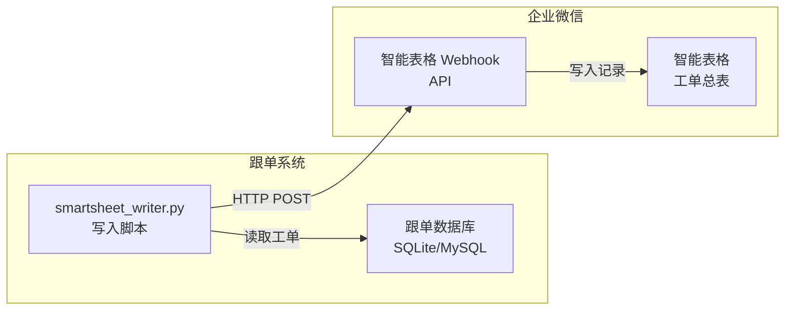

# 企业微信智能表格接入方案

> 本文档描述工单数据写入企业微信智能表格的实现方案。
> 最后更新: 2026-05-17

---

## 一、概述

通过企业微信智能表格 Webhook API，将跟单系统中的工单数据自动写入智能表格，实现工单数据的可视化管理和多方共享。

### 当前状态

| 项目 | 状态 |
|------|------|
| Webhook 写入 | ✅ 已验证通过 |
| 字段映射 | ✅ 已配置 |
| 写入后改写 | ❌ 暂不支持（Webhook 仅支持追加） |
| 自动同步 | ❌ 待开发 |

---

## 二、架构图



### 数据流向

```
跟单数据库 → smartsheet_writer.py → Webhook API → 企业微信智能表格
```

---

## 三、字段映射

### 字段 ID → 列名映射

| 字段 ID | 列名 | 示例值 | 说明 |
|---------|------|--------|------|
| `fabcde` | 分类 | 生产工单 | 数据类型标识 |
| `f3TVj5` | 工单号 | WO-202605006 | 唯一工单编号 |
| `f4lY4B` | 客户名称 | 山东济南食品 | 下单客户 |
| `fexnsG` | 产品类型 | 平板型网带 | 产品分类 |
| `flrEhY` | 材质 | 304不锈钢 | 原材料材质 |
| `fbAHzS` | 状态 | 已创建 | 工单生命周期状态 |
| `fALAF6` | 创建日期 | 2026-05-17 | 工单创建时间 |
| `fj7LI3` | 订单数量 | 50 | 生产数量 |
| `f7jOiq` | 单位 | 件 | 数量单位 |
| `f0kcf1` | 订单号 | ORD-202604290001 | 关联销售订单 |
| `fvy2Zd` | 当前工序 | 原材料准备 | 当前执行工序 |
| `fS7rCo` | 数据来源 | 跟单系统 | 数据来源标识 |
| `fIjGmz` | 工序总数 | 11 | 工单总工序数 |
| `fceF0M` | 备注 | 跟单系统自动写入 | 补充说明 |

### 注意事项

- 字段 ID（`fabcde` 等）是智能表格内部标识，**不能修改**
- 列名（schema）是显示名称，可根据需要调整
- 字段 ID 和列名必须在 `schema` 中同时声明

---

## 四、API 说明

### 请求方式

**POST** `https://qyapi.weixin.qq.com/cgi-bin/wedoc/smartsheet/webhook?key={WEBHOOK_KEY}`

### 请求格式

```json
{
    "schema": {
        "fabcde": "分类",
        "f3TVj5": "工单号",
        ...
    },
    "add_records": [
        {
            "values": {
                "fabcde": "生产工单",
                "f3TVj5": "WO-202605006",
                ...
            }
        }
    ]
}
```

### 重要限制

1. **仅支持追加写入**，不支持修改/删除已有记录
2. 请求 IP 需要在智能表格 IP 白名单中
3. 每次最多写入 100 条记录
4. 字段值统一使用字符串格式

---

## 五、脚本说明

### 工具文件

**路径**: `scripts/tools/smartsheet_writer.py`

### 使用方法

```bash
# 写入演示工单 WO-202605006
python scripts/tools/smartsheet_writer.py

# 从数据库读取指定工单写入
python scripts/tools/smartsheet_writer.py --wo WO-202605006
```

### 主要函数

| 函数 | 说明 |
|------|------|
| `write_demo()` | 写入预设的演示数据 |
| `write_order(...)` | 写入一条工单（需传入所有字段） |
| `write_from_db(order_no)` | 从 SQLite 数据库读取工单并写入 |
| `query_order_from_db(order_no)` | 从 SQLite 查询工单原始数据 |
| `send(payload)` | 发送请求到 Webhook API |
| `print_result(result)` | 打印 API 响应结果 |

### 输出示例（成功）

```json
{
  "errcode": 0,
  "errmsg": "ok",
  "add_records": [
    {
      "record_id": "7ZO2tK",
      "values": {
        "f3TVj5": [{"text": "WO-202605006", "type": "text"}],
        "f4lY4B": [{"text": "山东济南食品", "type": "text"}],
        ...
      }
    }
  ]
}
```

### 输出示例（失败）

```json
{
  "errcode": 840002,
  "errmsg": "not allow to access from your ip"
}
```

---

## 六、配置清单

### 企业微信端

- [x] 创建智能表格
- [x] 开启「接收外部数据」（Webhook）
- [x] 添加 IP `27.207.193.97` 到白名单
- [x] 记录字段 ID（`fabcde` 等）
- [ ] 调整列名为业务含义（当前 schema 已定义）

### 代码端

- [x] `scripts/tools/smartsheet_writer.py` — 写入工具
- [x] `scripts/test_smartsheet_webhook.py` — 测试入口
- [ ] 后续集成到跟单系统自动触发流程

---

## 七、扩展方案：实现记录更新

### 当前限制

Webhook 接口仅支持追加写入。如需更新已有记录（如工单状态变更时同步更新表格），需要使用企业微信智能表格**正式 API**。

### 升级路径

需要准备以下信息：

| 信息 | 获取位置 |
|------|---------|
| 企业 ID（corpid） | 企业微信管理后台 → 我的企业 → 企业信息 |
| 应用 Secret（corpsecret） | 企业微信管理后台 → 应用管理 → 自建应用 |
| 文档 ID（docid） | 智能表格 URL 中提取 |
| 工作表 ID（sheet_id） | 智能表格 URL 中提取（tab= 参数） |

### 实现步骤

1. 在企业微信管理后台创建自建应用
2. 配置应用的企业可信 IP（同上 `27.207.193.97`）
3. 在智能表格权限中配置应用为「可调用的应用」
4. 通过 `gettoken` 接口获取 `access_token`
5. 调用 `update_records` 接口更新记录

### API 示例（获取 token）

```
GET https://qyapi.weixin.qq.com/cgi-bin/gettoken?corpid=ID&corpsecret=SECRET
```

### API 示例（更新记录）

```
POST https://qyapi.weixin.qq.com/cgi-bin/wedoc/smartsheet/update_records?access_token=TOKEN
```

```json
{
    "docid": "xxx",
    "sheet_id": "xxx",
    "key_type": 2,
    "records": [
        {
            "record_id": "7ZO2tK",
            "fields": {
                "fbAHzS": "生产中",
                "fvy2Zd": "激光切割"
            }
        }
    ]
}
```

---

## 八、验证记录

| 时间 | 操作 | 结果 | 记录 ID |
|------|------|------|---------|
| 首次 | 写入测试文本 | ✅ 成功 | `mkGTC7` |
| 带 schema | 写入工单演示数据 | ✅ 成功 | `gCJShF` |
| 无 schema | 写入工单演示数据 | ✅ 成功 | `KPyD0a` |
| 带 schema | 写入工单演示数据 | ✅ 成功 | `Qro5N3` |
