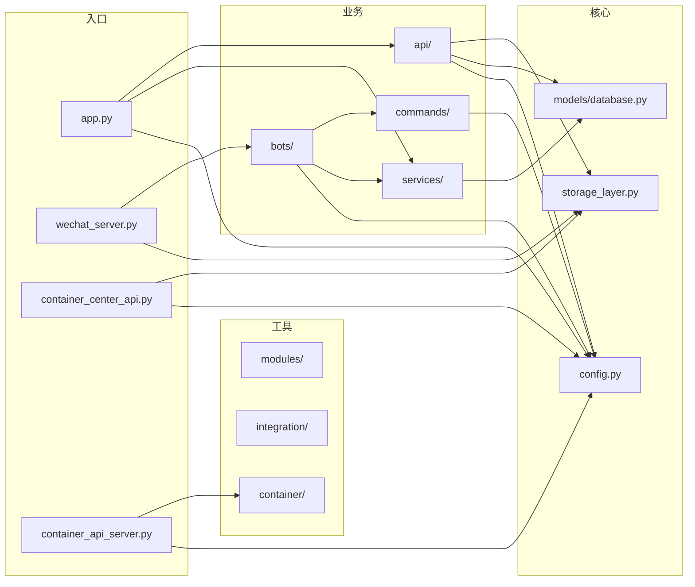

# 移动报工系统 — 项目说明文档

> 项目根目录: `mobile_api_ai/`
> 最后更新: 2026-05-07

---

## 一、项目概述

AI增强版移动报工系统，用于不锈钢网带生产流程中的报工、质检、领料、审批等环节的数字化管理，集成企业微信机器人实现移动端操作。

### 核心能力

- 移动报工：工人通过企业微信扫码完成报工
- 流程管理：来料→裁剪→编织→定型→质检→包装→终检
- 容器中心：任务分发、调度、超时提醒
- AI增强：语音识别（已实现）、图像分析（⏸️ **暂缓开发**）、智能问答（⏸️ **暂缓开发**）
- 企业微信集成：消息推送、机器人交互、审批通知

### 技术栈

| 层 | 技术 |
|---|------|
| 后端框架 | Flask 2.3+ |
| 数据库 | MySQL + SQLite（本地缓存） |
| 缓存 | Redis（可选） |
| AI服务 | 阿里云语音（已实现）, DashScope/通义千问（⏸️ **暂缓**）, 阿里云视觉（⏸️ **暂缓**） |
| 消息推送 | 企业微信机器人 + 应用消息 |
| 部署 | Windows Server / 腾讯云 |

---

## 二、项目规划

### 2.1 部署架构图

```mermaid
graph TB
    subgraph 用户端
        WX[企业微信]
        WEB[Web管理端]
        QR[扫码枪/手机]
    end

    subgraph ☁️ 云服务器 - 公网入口层
        APP[app.py:5000<br>REST API 转发]
        WS[wechat_server.py:5001<br>企业微信回调入口]
        WB[wechat_work_bot_v2.py:5003<br>扫码任务分发]
        CAS[container_api_server.py:5002<br>容器节点状态查询]
    end

    subgraph ☁️ 云数据库
        CLOUD_DB1[(DAT/wechat_bot.db<br>数据包中转)]
        CLOUD_DB2[(DAT/operation_logs.db<br>操作日志)]
        CLOUD_DB3[(wechat_container.db<br>扫码任务存储)]
    end

    subgraph ─── 内网穿透 / 局域网 ───
        LINK[HTTP API 调用]
    end

    subgraph 🏭 车间桌面端 - 业务计算层
        CC[container_center.py<br>容器中心 - 数据收集/分发/分析]
        SCHED[schedule_flow.py<br>排产引擎 - 7状态流转]
        TTE[task_trigger_engine.py<br>公式引擎 - AST条件求值]
        DP[container/task_pool.py<br>任务池管理]
        DI[container/dispatcher.py<br>分发策略]
        INTG[integration/<br>指令处理/通知/超时]
    end

    subgraph 🏭 本地数据库
        LOCAL_DB1[(task_pool.db<br>任务池)]
        LOCAL_DB2[(container_data.db<br>中转数据)]
        LOCAL_DB3[(container_center.db<br>释放管理)]
        LOCAL_DB4[(container_storage.db<br>默认存储)]
    end

    WX -->|企业微信回调| WS
    WEB -->|REST API| APP
    QR -->|扫码请求| WB

    WS -->|HTTP中继| LINK
    WS -->|日志写入| CLOUD_DB2
    WB -->|查询任务| CLOUD_DB3
    WB -->|状态回传| LINK
    APP -->|数据查询| CLOUD_DB1
    CAS -->|节点状态| LINK

    LINK -->|API调用| CC
    CC --> SCHED
    CC --> TTE
    CC --> DP
    CC --> DI
    CC --> INTG
    CC --> LOCAL_DB1
    CC --> LOCAL_DB2
    CC --> LOCAL_DB3
    CC --> LOCAL_DB4
```

### 2.2 模块依赖关系



---

## 三、模块说明

### 3.1 入口服务

| 服务 | 文件 | 端口 | 部署位置 | 说明 |
|------|------|:----:|:--------:|------|
| 主API | `app.py` | 5000 | ☁️ **云服务器** | REST API，提供报工/查询/审批等接口 |
| 微信服务 | `wechat_server.py` | 动态 | ☁️ **云服务器** | 企业微信回调入口（需公网），接收消息后HTTP中继到本地；**同时承担云上操作日志写入** |
| 微信机器人 | `wechat_work_bot_v2.py` | 5003 | ☁️ **云服务器** | 企业微信应用机器人，扫码取任务与状态回传 |
| 微信机器人v1 | `wechat_work_bot.py` | 5001 | ☁️ **云服务器** | 旧版机器人（兼容） |
| 容器中心API | `container_center_api.py` | 5002 | 🏭 **本地桌面端** | 容器任务管理API（业务计算层） |
| 容器服务 | `container_api_server.py` | 5002 | ☁️ **云服务器** | 容器节点状态查询转发 |
| 容器中心v5 | `container_center_v5.py` | - | 🏭 **本地桌面端** | 核心数据枢纽：收集→存储→分发→分析→回写 |
| 诊断服务 | `network_diagnose.py` | 5003 | 🏭 **本地桌面端** | 网络连接诊断 |
| HTTP测试 | `http_server.py` | 9999 | 🏭 **本地桌面端** | HTTP接口测试 |

### 3.2 业务模块

| 模块 | 目录 | 核心文件 | 职责 |
|------|------|---------|------|
| API路由 | `api/` | auth.py, scan.py, process.py, quality.py, message.py, approval.py, stats.py, ai.py | REST接口实现 |
| 机器人 | `bots/` | app_bot.py, group_bot.py, message_hub.py, factory.py, base.py | 微信消息分发与处理 |
| 命令 | `commands/` | query_cmd.py, report_cmd.py, task_cmd.py, manager.py, help_cmd.py, base.py | 机器人指令处理 |
| 服务 | `services/` | session.py, notifier.py, speech_recognition.py<br>chat_assistant.py（⏸️ **暂缓**）, image_analysis.py（⏸️ **暂缓**） | 业务逻辑封装 |
| 容器 | `container/` | task_pool.py, dispatcher.py | 任务池与调度 |
| 集成 | `integration/` | wechat_notifier.py, instruction_handler.py, timeout_reminder.py, desktop_callback.py | 外部系统集成 |
| 工具 | `modules/` | enhanced_backup.py, queue_manager.py, circuit_breaker.py, health_checker.py, api_signature.py | 通用工具 |

### 3.3 数据模型

| 模型 | 文件 | 说明 |
|------|------|------|
| Database | `models/database.py` | MySQL数据库连接与ORM |
| StorageLayer | `storage_layer.py` | 多后端存储抽象层（SQLite/Redis/Memory）|
| ContainerConfig | `container_config.py` | 容器配置（操作员、工序、数据类型）|
| 配置管理 | `config.py` | 全局配置（端口、阈值、密钥、颜色）|

---

## 四、开发指南

### 4.1 环境准备

```bash
# 1. 克隆项目
cd mobile_api_ai

# 2. 安装依赖
pip install -r requirements.txt

# 3. 配置环境变量
cp .env.example .env
# 编辑 .env，填写企业微信凭证、阿里云API Key等

# 4. 初始化数据库
python models/database.py
```

### 4.2 本地启动

```bash
# 启动主API服务
python app.py

# 启动微信机器人（单独窗口）
python wechat_work_bot_v2.py

# 启动容器中心（单独窗口）
python container_center_api.py

# 或用一键启动
python start_all.py
```

### 4.3 代码规范

详见 [代码审查报告/问题上下文记录.md](../代码审查报告/问题上下文记录.md)，关键规范：

- **异常处理**：禁止裸 `except:`，必须使用 `except Exception as e: logger.error(...)`
- **日志**：禁止 `print()`，使用 `logger.info/warning/error/debug`
- **配置**：端口、阈值、颜色统一在 `config.py` 管理，支持环境变量覆盖
- **路径**：统一使用 `from config import BASE_DIR`，禁止 `sys.path.insert` 分散在各模块

### 4.4 测试

```bash
# 运行集成测试
python test_integration.py

# 运行综合测试
python comprehensive_test.py
```

---

## 五、部署指南

### 5.1 部署方式

采用 **云服务器（公网入口） + 车间桌面端（业务计算）** 分离部署架构。

#### ☁️ 云服务器部署（腾讯云/Windows Server）

```powershell
# 云服务器运行的服务（轻量转发层）
python app.py                          # REST API:5000
python wechat_server.py                 # 企业微信回调入口
python wechat_work_bot_v2.py            # 扫码任务分发:5003
python container_api_server.py          # 容器状态查询转发:5002
```

**云服务器仅依赖**：`app.py`, `wechat_server.py`, `wechat_work_bot_v2.py`, `container_api_server.py`, `operation_log.py`, `api/`, `bots/`, `commands/`
**云数据库**：`DAT/wechat_bot.db`, `DAT/operation_logs.db`, `wechat_container.db`
**云上日志保存**：`wechat_server.py` 通过 `operation_log.py` 将所有上下游指令操作日志写入 `DAT/operation_logs.db`，日志数据**全程保留在云服务器**，不传输到本地

#### 🏭 车间桌面端部署（本地电脑）

```powershell
# 本地桌面端运行的服务（业务计算层）
python container_center_v5.py           # 容器中心核心
python container_center_api.py          # 容器任务管理API:5002
```

**本地桌面端依赖**：`container_center_v5.py`, `container_center.py`, `container/task_pool.py`, `schedule_flow.py`, `task_trigger_engine.py`, `integration/`, `storage_layer.py`
**本地数据库**：`task_pool.db`, `container_data.db`, `container_center.db`, `container_storage.db`

#### 网络连接方式

- 云服务器 ↔ 本地桌面端：通过 **内网穿透（如 frp/natapp）** 或 **固定公网IP + 端口映射**
- `wechat_server.py` 收到企业微信消息后，通过 HTTP API 调用本地容器中心执行业务逻辑
- 本地容器中心处理完成后，将结果回写到云数据库或通过云服务器推送到企业微信

详见 [README_deploy.md](../README_deploy.md) 和 [部署指南_腾讯云Windows服务器.md](../部署指南_腾讯云Windows服务器.md)

### 5.2 端口对照

| 服务 | 端口 | 环境变量 |
|------|------|---------|
| 主API | 5000 | `PORT` |
| 微信机器人 | 5003 | `WECHAT_BOT_PORT` |
| 容器中心 | 5002 | `CONTAINER_CENTER_PORT` |
| HTTP测试 | 9999 | `HTTP_TEST_PORT` |

### 5.3 生产环境检查清单

- [ ] `debug=False`（已全局修复）
- [ ] JWT密钥已设置：`JWT_SECRET_KEY`
- [ ] MySQL连接配置正确
- [ ] 企业微信凭证已配置
- [ ] 阿里云API Key已配置
- [ ] .env文件已配置且不提交Git
- [ ] **操作日志备份**：云服务器定期备份 `DAT/operation_logs.db`（日志仅存云端，本地无副本）

---

## 六、进度记录

### 2026-05-07 — 功能范围确认：暂缓图像分析与智能问答

| 决策项 | 状态 | 说明 |
|--------|:----:|------|
| `services/image_analysis.py` | ⏸️ **暂缓开发** | 阿里云视觉AI集成，后续需要时再开发 |
| `services/chat_assistant.py` | ⏸️ **暂缓开发** | DashScope(通义千问)对话，后续需要时再开发 |
| `api/ai.py → /api/ai/image-analysis` | ⏸️ **暂缓** | 图像分析接口，对应服务文件暂缓 |
| `api/ai.py → /api/ai/chat` | ⏸️ **暂缓** | AI对话接口，对应服务文件暂缓 |
| `container_api_server.py → /api/ai/chat` | ⏸️ **暂缓** | 容器端AI对话接口 |
| `api/ai.py → /api/ai/speech-to-report` | ✅ **保留** | 语音报工解析功能正常开发 |
| `services/speech_recognition.py` | ✅ **保留** | 阿里云ASR语音识别正常开发 |

> 说明：暂缓模块的代码保留不动（默认mock模式），移动端不调用对应端点即等效关闭功能。后续需要时直接开发对应服务文件即可。

### 2026-05-07 — 代码规范性整改完成

| 任务 | 状态 | 说明 |
|------|------|------|
| P0: `debug=True` 修复 | ✅ 完成 | 4处改为 `debug=False` |
| P0: 裸 `except:` 修复 | ✅ 完成 | 42处改为 `except Exception as e:` |
| P1: 端口统一配置 | ✅ 完成 | 7处端口集中到 `config.py` |
| P1: 阈值统一配置 | ✅ 完成 | 3处阈值集中到 `config.py` |
| P1: `print()` → `logger` | ✅ 完成 | 29处替换为 logger |
| P1: `sys.path` 集中管理 | ✅ 完成 | 3处模块删除分散的 `sys.path.insert` |
| P2: `deploy_prepared/` 清理 | ✅ 完成 | 约50个文件删除，替代为 README_deploy.md |
| P2: 统一颜色管理 | ✅ 完成 | 6种颜色集中到 `config.py`，支持环境变量 |
| 问题整改方案 | ✅ 完成 | 详见 [问题整改方案.md](../代码审查报告/问题整改方案.md) |
| 问题上下文记录 | ✅ 完成 | 详见 [问题上下文记录.md](../代码审查报告/问题上下文记录.md) |

### 2026-05-07 — 遗留问题修复完成

| 任务 | 状态 | 说明 |
|------|------|------|
| `wechat_work_bot_v2.py` `print()` → `logger` | ✅ 完成 | 19处 print 替换为 logger；保留 `if __name__ == '__main__'` 启动横幅 25 处 print |
| `setup_wechat_app_bot.py` 端口硬编码修复 | ✅ 完成 | `FLASK_PORT=5003` 改为引用 `config.Config.WECHAT_BOT_PORT` |
| 冗余部署文档清理 | ✅ 完成 | 4份旧文档移入 `docs/archive/`（deploy_windows_server.md, DEPLOY_WINDOWS.md, 完整部署指南.md, 部署总结.md） |

### 2026-05-07 — 语音识别服务改造完成

| 任务 | 状态 | 说明 |
|------|------|------|
| 移除 `aliyun-speech-sdk` 依赖 | ✅ 完成 | 已从 requirements.txt 删除 |
| `wechat_app_bot.py` 新增 `get_media()` | ✅ 完成 | 调用企业微信 `GET /media/get` 接口下载语音文件 |
| `services/speech_recognition.py` 重写 | ✅ 完成 | `recognize(media_id, bot)` 接口，通过企业微信下载语音；`AI_MODE=mock` 时走模拟模式 |
| `handle_voice_message` 改造 | ✅ 完成 | 调用 `speech_service.recognize(media_id, bot=wechat_app_bot)` 进行真实识别 |
| requirements.txt 更新 | ✅ 完成 | `aliyun-speech-sdk` 已删除 |

> **启用真实语音识别**：在 `.env` 中配置 `ASR_API_URL` 和 `ASR_API_KEY`，并将 `AI_MODE` 设为非 mock 值。ASR 接口采用标准 HTTP multipart/form-data 上传音频文件。

### 2026-05-08 — 单用户部署方案落地

| 任务 | 状态 | 说明 |
|------|:----:|------|
| 服务梳理：明确当前服务的职责和去留 | ✅ 完成 | 确认 wechat_server.py 做主服务，wechat_work_bot_v2.py 等暂不启动 |
| `docs/单用户部署指南.md` | ✅ 创建 | 完整的云端-本地分离部署指南，含架构图、配置说明、验证流程、排错指南 |
| `start_single_user.bat` | ✅ 创建 | 本地车间一键启动脚本，含环境检查、端口检测、服务启停 |

### 2026-05-08 — 云端转发服务修复 + 微信通知全链路打通

| 任务 | 状态 | 说明 |
|------|:----:|------|
| 修复 `send_text()` → `send_text_to_user()` | ✅ 完成 | 云端 wechat_cloud.py 调用的方法名错误，已修复 |
| 打包 EXE 无依赖部署 | ✅ 完成 | PyInstaller 打包 `wechat_cloud_server.exe` (17.5MB)，无需Python环境 |
| 云端服务 RDP 部署 | ✅ 完成 | EXE 已部署到云服务器 `124.223.57.82:5003`，云端IP在白名单 |
| 微信通知全链路验证 | ✅ 完成 | 应用消息 ✅ 群机器人 ✅ 3/3 测试通过 |
| `build_cloud_exe.py` 打包脚本 | ✅ 创建 | 一键打包云端EXE，修改代码后双击 `一键打包_云端服务.bat` 即可 |
| `cloud_send_test.py` 云端测试脚本 | ✅ 创建 | 本地运行验证云端服务状态和微信发送 |

**验证结果 (2026-05-08 17:41):**
- 应用消息 → 企业微信 ✅ `result: True`
- 群机器人 → 微信群 ✅ `errcode: 0`

> **架构**: 本地所有微信API调用 → POST `http://124.223.57.82:5003/api/wechat/send` → 云端服务器（IP在白名单）→ 微信服务器

### 【待办】

暂无待办任务。

---

### 2026-05-13 — 架构重构 P0-P1 收官

| 任务 | 状态 | 说明 |
|------|:----:|------|
| P0: `dispatch_center.py` `_send_wechat_via_cloud` 改造为 REST API 调用 | ✅ 完成 | 通过 `_get_client().post(...)` 替代旧的 `requests.post` + token 缓存 |
| P0: `wechat_server.py` 移除 `_send_cloud_wechat` 死代码 | ✅ 完成 | 已删除无效的云消息推送回退逻辑 |
| P0: `dispatch_center.py` 集成 AlertEngine | ✅ 完成 | 初始化时创建 AlertEngine 实例，`dispatch` 时调用 `check_and_alert` |
| P0: Flask 2.3.3 `bp.view_functions` bug 修复 | ✅ 完成 | `container/center/api/__init__.py` 改用 `copy()` 避免迭代时修改字典 |
| T1.x: 容器中心 SDK 架构 | ✅ 完成 | 文档桶存储层 + HTTP API + SDK 客户端 + 调度中心引用替换 |
| T2.1: AlertEngine 告警引擎 | ✅ 完成 | 集成到 dispatch_center.py，支持超时告警、外协提醒、重复抑制、去重 |
| T2.2: 告警规则配置 API | ✅ 完成 | Flask proxy 路由到容器中心，支持 GET/PUT 告警规则 |
| T2.3: 调度中心 P1 引用替换 | ✅ 完成 | `container_center` → `container_center_v5.get_container_center()` 统一入口 |
| T3.1: 清理直引 + 删除冗余代码 | ✅ 完成 | `integration/timeout_reminder.py` 已删除，`__init__.py` 清理 |
| T3.3: 前端告警规则配置页面 | ✅ 完成 | 标签页界面：告警规则配置 + 系统状态查看，通过 proxy API 对接后端 |
| 单元测试 (AlertEngine 23项) | ✅ 完成 | 5个测试类覆盖：初始化、数据展平、重复检测、超时告警、外协提醒、生命周期 |
| 编译检查 (9文件) | ✅ 通过 | 所有修改文件 `py_compile` 验证 + IDE 诊断 0 error |

**最终验证 (2026-05-13):**
- 23/23 单元测试通过 ✅ `0.48s`
- 9个修改文件编译检查通过 ✅
- 告警规则配置页面可访问 ✅ (通过 `/container/alert-rules` 路由)
- wechat_server.py 旧 `_container_center` 依赖已评估，核心替换完成，初始化代码保留以支持外部导入兼容

### 2026-05-17 — 企业微信智能表格写入功能完成

| 任务 | 状态 | 说明 |
|------|:----:|------|
| Webhook 连接验证 | ✅ 完成 | 成功写入测试数据，IP 白名单已配置 |
| 字段映射配置 | ✅ 完成 | 14个字段 ID → 业务列名映射 |
| 演示工单写入 | ✅ 完成 | WO-202605006 数据成功写入智能表格（record_id: Qro5N3） |
| 工具脚本封装 | ✅ 创建 | `scripts/tools/smartsheet_writer.py`，支持命令行调用 |
| 接入方案文档 | ✅ 创建 | `docs/智能表格接入方案.md` |

**功能限制**: Webhook 仅支持追加写入，不支持更新/删除（需走 access_token API）
**文档**: 详见 [智能表格接入方案.md](智能表格接入方案.md)

### 2026-05-19 — 扫脸管理集成到调度中心操作员管理界面

| 任务 | 状态 | 说明 |
|------|:----:|------|
| 操作员列表增加人脸状态列 | ✅ 完成 | 显示「已注册/未注册」徽标，可点击打开管理弹窗 |
| 人脸管理弹窗（上传照片/删除人脸） | ✅ 完成 | 弹窗显示当前照片、上传新照片、删除人脸注册记录 |
| 人脸签到配置面板 | ✅ 完成 | 在操作员标签页底部显示统计、导出调度、存储路径配置 |
| 照片查找 API `/face/api/enrollments/photo` | ✅ 新增 | 按姓名查找最新照片，返回照片 URL |
| 切换标签时自动加载人脸配置 | ✅ 完成 | 切换到操作员标签页时自动调用 `refreshFaceConfig()` |

**变更文件**:
- `static/js/dispatch_center.js` — 新增人脸管理函数 + 操作员列表增强
- `templates/dispatch_center.html` — 新增管理弹窗 + 配置面板
- `face_checkin/__init__.py` — 新增 `/api/enrollments/photo` 端点

---

## 附：日志系统说明

### 日日志系统（2026-05-08 上线）

**设计目标**: 所有服务统一使用每日轮转日志，按日期分文件存储，支持自动清理。

**核心文件**: `logging_setup.py`

**目录结构**:
```
logs/
  wechat_server/          # 微信服务日志
    2026-05-08.log
    2026-05-07.log
  container_api/          # 容器中心日志
    2026-05-08.log
  wechat_cloud/           # 云端服务日志
    2026-05-08.log
```

**已集成的服务**:
| 服务 | 文件 | 日志目录 |
|------|------|---------|
| 微信服务 | `wechat_server.py` | `logs/wechat_server/` |
| 容器中心API | `container_api_server.py` | `logs/container_api/` |
| 云端服务 | `wechat_cloud.py` | `logs/wechat_cloud/` |
| 云端轮询 | `cloud_poller.py` | `logs/cloud_poller/` |

**配置项** (在 `config.py` 中管理):
| 环境变量 | 默认值 | 说明 |
|---------|--------|------|
| `LOG_DIR` | `项目根目录/logs` | 日志根目录 |
| `LOG_LEVEL` | `INFO` | 日志级别 |
| `LOG_RETENTION_DAYS` | `30` | 日志保留天数 |
| `LOG_MAX_BYTES` | `100MB` | 单文件大小上限 |

**API 工具函数**:
```python
from logging_setup import (
    setup_daily_logger,    # 初始化每日日志
    get_today_log_path,    # 获取今日日志路径
    get_log_files,         # 列出所有日志文件
    read_log,              # 读取日志（支持按日期/级别/行数过滤）
    cleanup_old_logs,      # 清理过期日志
)
```

**手动管理**:
```bash
# 查看今日日志
python -c "from logging_setup import read_log; print(read_log('wechat_server', tail_lines=50))"

# 查看指定日期日志
python -c "from logging_setup import read_log; print(read_log('wechat_server', date_str='2026-05-07'))"

# 查看今日错误日志
python -c "from logging_setup import read_log; print(read_log('wechat_server', level='ERROR'))"

# 清理过期日志
python -c "from logging_setup import cleanup_old_logs; n=cleanup_old_logs(); print(f'已清理{n}个文件')"
```

---

## 七、变更管理

### 7.1 分支策略
- 主分支为生产代码，修改前先在副本/分支测试
- 配置文件变更需通知相关人员更新 `.env`

### 7.2 更新流程
1. 修改代码
2. 运行 `python -m py_compile 修改的文件.py` 检查语法
3. IDE诊断检查（0 error）
4. 运行集成测试
5. 更新本文档进度记录
6. 部署

### 7.3 回滚方案
- 代码回滚：从Git历史恢复
- 配置回滚：保留 `.env.bak` 备份
- 数据库回滚：使用 `data_boundary.py` 进行数据恢复
