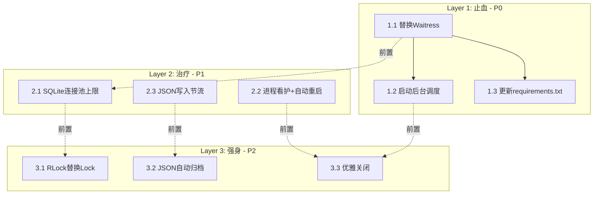

# 调度中心服务器稳定性加固方案

## 一、问题综述

### 1.1 已识别问题清单

| 编号 | 问题 | 严重等级 | 影响范围 | 根因 |
|------|------|:--------:|----------|------|
| P0-1 | Flask 开发服务器 | **致命** | standalone_dispatch_server.py | `app.run()` 单线程、无进程管理、内存泄漏 |
| P0-2 | 后台调度未启动 | **致命** | dispatch_center.py:3964 | `start_background_scheduler()` 未被调用 |
| P1-1 | SQLite 连接泄漏 | **严重** | container_center/storage/router.py | `_connections` 字典无限累积，无上限 + 无清理 |
| P1-2 | 无进程看护 | **严重** | server_launcher.py | 进程退出仅记日志，无重启机制 |
| P1-3 | JSON 频繁 I/O | **严重** | dispatch_center.py:665-687 | 每次 `update_data()` 创建新线程写文件 |
| P2-1 | 嵌套锁死锁风险 | **一般** | dispatch_center.py:73-77 | 多锁无序获取 |
| P2-2 | 守护线程数据安全 | **一般** | dispatch_center.py | `daemon=True` 线程被强制终止时可能损坏数据 |
| P2-3 | JSON 文件无限增长 | **一般** | dispatch_center_data.json | 告警/流程记录从不清理 |

---

## 二、整体架构方案

### 2.1 三层渐进加固策略

不搞大重构，采用 **"止血 → 治疗 → 强身"** 三层渐进式方案，每层独立可验收：

```
Layer 1: 止血（P0）→ 让服务器不停机
Layer 2: 治疗（P1）→ 让服务器不崩溃
Layer 3: 强身（P2）→ 让服务器可运维
```

### 2.2 变更范围界定

```
受影响文件:
├── standalone_dispatch_server.py   ← 核心改造（WSGI + 调度启动 + 看护）
├── dispatch_center.py              ← 追加 start_background_scheduler 调用入口
├── server_launcher.py              ← 彻底重写（进程管理 + 看护 + 自动重启）
├── container_center/storage/router.py ← 追加连接池上限 + 清理方法
├── config.py                       ← 追加新配置项
├── requirements.txt                ← 追加 waitress

新增文件:
├── scripts/tools/dispatch_health_check.py ← 健康检查脚本（供看护线程调用）
├── data/                          ← 确保目录存在

不受影响:
├── app.py, wechat_server.py, container_center_api.py  ← 其他服务不修改
├── 前端 JS/HTML  ← 无变化
├── MySQL 数据库 ← 无变化
```

---

## 三、Layer 1: 止血（P0 问题）— 最高优先级

### 3.1 替换为 Waitress 生产级 WSGI 服务器

**目标**: 消除 Flask 开发服务器的单线程瓶颈和内存泄漏问题

**方案选择理由**:
- Waitress 是 **纯 Python** 实现，Windows 原生兼容，无需 C 编译器
- 支持多线程 worker，自动连接池管理
- 有优雅关闭机制（`close_timeout`）
- 相比 Gunicorn（Windows 需 WSL），部署零额外依赖

**具体变更**:

```python
# standalone_dispatch_server.py
# 在 __main__ 中替换 app.run()

if __name__ == '__main__':
    from waitress import serve
    
    host = os.getenv('DISPATCH_HOST', '0.0.0.0')
    port = int(os.getenv('DISPATCH_PORT', '5003'))
    
    # 启动后台调度
    from dispatch_center import start_background_scheduler
    start_background_scheduler()
    
    serve(
        app,
        host=host,
        port=port,
        threads=int(os.getenv('DISPATCH_WORKERS', '8')),   # 默认8个工作线程
        connection_limit=int(os.getenv('DISPATCH_CONN_LIMIT', '100')),
        close_timeout=int(os.getenv('DISPATCH_CLOSE_TIMEOUT', '30')),
        channel_timeout=int(os.getenv('DISPATCH_CHANNEL_TIMEOUT', '120')),
    )
```

**配置项**（追加到 `.env`）：

```env
# === 调度中心 Waitress 配置 ===
DISPATCH_HOST=0.0.0.0
DISPATCH_PORT=5003
DISPATCH_WORKERS=8
DISPATCH_CONN_LIMIT=100
DISPATCH_CLOSE_TIMEOUT=30
DISPATCH_CHANNEL_TIMEOUT=120
DISPATCH_DATA_TTL=30
```

**配置项**（追加到 `config.py`）：

```python
# ========== Waitress 服务器配置 ==========
DISPATCH_HOST = os.getenv('DISPATCH_HOST', '0.0.0.0')
DISPATCH_PORT = int(os.getenv('DISPATCH_PORT', '5003'))
DISPATCH_WORKERS = int(os.getenv('DISPATCH_WORKERS', '8'))
DISPATCH_CONN_LIMIT = int(os.getenv('DISPATCH_CONN_LIMIT', '100'))
DISPATCH_CLOSE_TIMEOUT = int(os.getenv('DISPATCH_CLOSE_TIMEOUT', '30'))
DISPATCH_CHANNEL_TIMEOUT = int(os.getenv('DISPATCH_CHANNEL_TIMEOUT', '120'))
```

**依赖安装**:

```bash
pip install waitress
# 追加到 requirements.txt
```

### 3.2 启动后台调度线程

**目标**: 在服务器启动时自动启动 `AlertEngine` 和 `CostChecker`

**变更**:
- 在 `create_app()` 或 `__main__` 中调用 `start_background_scheduler()`
- 添加重复启动防护

```python
# standalone_dispatch_server.py create_app() 末尾
def create_app():
    app = Flask(...)
    # ... 注册 blueprint, 路由等 ...
    
    # 启动后台调度（幂等，重复调用不会重复启动）
    _ensure_background_scheduler()
    
    return app

def _ensure_background_scheduler():
    """确保后台调度线程已启动（原子操作）"""
    from dispatch_center import start_background_scheduler, _alert_engine
    if _alert_engine is None:
        start_background_scheduler()
        logger.info('[启动] 后台调度引擎已启动')
    else:
        logger.info('[启动] 后台调度引擎已在运行')
```

**效果**: 启动后自动执行：
- 每 60 秒检查超时任务并发送企业微信提醒
- 每小时检查成本告警
- 外协任务超时提醒

---

## 四、Layer 2: 治疗（P1 问题）

### 4.1 SQLite 连接池上限 + 定期清理

**目标**: 防止 `_connections` 字典无限增长导致文件句柄耗尽

**问题分析**:
- `DatabaseRouter` 共管理约 14 个数据库文件（orders.db, production.db 等）
- `get_connection()` 按需创建连接后**永不关闭**
- `start_background_scheduler()` 的 `AlertEngine` 每 60 秒创建新查询
- 长期运行后 `_connections` 累积 14+ 个连接，Windows 限制每个进程约 16000 个句柄

**变更**（仅修改 `router.py`，向后兼容）：

```python
class DatabaseRouter:
    _MAX_CONNECTIONS = int(os.getenv('CC_MAX_CONNECTIONS', '20'))
    _CONNECTION_TTL = int(os.getenv('CC_CONNECTION_TTL', '3600'))  # 1小时
    
    def __init__(self, data_dir=None):
        self.data_dir = data_dir or DATA_DIR
        os.makedirs(self.data_dir, exist_ok=True)
        self._connections: Dict[str, sqlite3.Connection] = {}
        self._locks: Dict[str, Lock] = {}
        self._conn_times: Dict[str, float] = {}  # 跟踪连接创建时间
    
    def get_connection(self, doc_type: str):
        db_path = self.resolve_db_path(doc_type)
        self._evict_stale_connections()  # 定期清理过期连接
        if db_path not in self._connections:
            if len(self._connections) >= self._MAX_CONNECTIONS:
                # 超过上限，关闭最旧的连接
                self._evict_one()
            conn = sqlite3.connect(db_path, check_same_thread=False)
            conn.row_factory = sqlite3.Row
            conn.execute("PRAGMA journal_mode=WAL")
            conn.execute("PRAGMA foreign_keys=ON")
            self._connections[db_path] = conn
            self._locks[db_path] = Lock()
            self._conn_times[db_path] = time.time()
        return self._connections[db_path]
    
    def _evict_stale_connections(self):
        """关闭超过 TTL 且不在使用中的连接"""
        now = time.time()
        stale = [path for path, t in self._conn_times.items() 
                 if now - t > self._CONNECTION_TTL]
        for path in stale:
            if path in self._connections:
                try:
                    self._connections[path].close()
                except Exception:
                    pass
                del self._connections[path]
                del self._locks[path]
                del self._conn_times[path]
    
    def _evict_one(self):
        """关闭最早创建的连接"""
        if not self._conn_times:
            return
        oldest_path = min(self._conn_times, key=self._conn_times.get)
        try:
            self._connections[oldest_path].close()
        except Exception:
            pass
        del self._connections[oldest_path]
        del self._locks[oldest_path]
        del self._conn_times[oldest_path]
    
    def close_all(self):
        for conn in self._connections.values():
            try:
                conn.close()
            except Exception:
                pass
        self._connections.clear()
        self._locks.clear()
        self._conn_times.clear()
    
    @property
    def active_connections(self) -> int:
        return len(self._connections)
```

**配置项**：

```env
# === 容器中心 SQLite 连接池 ===
CC_MAX_CONNECTIONS=20
CC_CONNECTION_TTL=3600
```

### 4.2 进程看护 + 自动重启

**目标**: 进程意外退出后自动重启，无需人工介入

**方案**: 新建 `scripts/tools/dispatch_health_check.py`，对 `server_launcher.py` 进行最小侵入改造

#### 4.2.1 新建健康检查脚本

```python
# scripts/tools/dispatch_health_check.py
"""
调度中心健康检查 + 自动重启
由 server_launcher.py 的看护线程调用
"""
import requests
import subprocess
import sys
import os
import time
import logging

logger = logging.getLogger('health_check')

HEALTH_URL = os.getenv('DISPATCH_HEALTH_URL', 'http://127.0.0.1:5003/health')
MAX_RETRIES = int(os.getenv('DISPATCH_HEALTH_RETRIES', '3'))
CHECK_INTERVAL = int(os.getenv('DISPATCH_HEALTH_INTERVAL', '30'))
RESTART_SCRIPT = os.getenv('DISPATCH_RESTART_SCRIPT', '')

def check_health() -> bool:
    """返回 True 表示健康"""
    for i in range(MAX_RETRIES):
        try:
            resp = requests.get(HEALTH_URL, timeout=5)
            if resp.status_code == 200:
                return True
        except requests.RequestException as e:
            logger.warning(f'健康检查失败(第{i+1}次): {e}')
        time.sleep(1)
    return False

def restart_server(server_name: str) -> bool:
    """重启调度中心服务器"""
    try:
        if RESTART_SCRIPT:
            subprocess.Popen(
                [sys.executable, RESTART_SCRIPT],
                cwd=os.path.dirname(RESTART_SCRIPT),
                stdout=subprocess.DEVNULL,
                stderr=subprocess.DEVNULL,
            )
            logger.info(f'[{server_name}] 已触发重启')
            return True
        else:
            logger.warning(f'[{server_name}] 未配置重启脚本，无法自动重启')
            return False
    except Exception as e:
        logger.error(f'[{server_name}] 重启失败: {e}')
        return False
```

#### 4.2.2 改造 server_launcher.py

在现有 `server_launcher.py` 中追加看护功能（不删除现有逻辑）：

```python
# 在 monitor_log 函数中追加自动重启逻辑
def monitor_log(proc, server_name, health_url='http://127.0.0.1:5003/health'):
    restart_count = 0
    max_restarts = int(os.getenv('DISPATCH_MAX_RESTARTS', '5'))
    restart_window = int(os.getenv('DISPATCH_RESTART_WINDOW', '3600'))  # 1小时内最多重试次数
    restart_times = []
    
    try:
        while proc.poll() is None:
            line = proc.stdout.readline()
            if line:
                self.log(line.strip())
        
        # 进程退出 → 尝试重启
        now = time.time()
        restart_times = [t for t in restart_times if now - t < restart_window]
        
        if len(restart_times) >= max_restarts:
            self.log(f'[{server_name}] 短时间内已重启{max_restarts}次，停止自动重启')
            return
        
        restart_times.append(now)
        self.log(f'[{server_name}] 进程已退出，准备重启(第{len(restart_times)}次)...')
        
        # 重新启动进程
        new_proc = start_server(server_name)  # 需要封装的启动函数
        if new_proc:
            self.processes[server_name] = new_proc
            self.log(f'[{server_name}] 自动重启成功, PID={new_proc.pid}')
            # 重新启动监控
            threading.Thread(target=monitor_log, args=(new_proc, server_name), daemon=True).start()
        else:
            self.log(f'[{server_name}] 自动重启失败')
    except Exception as e:
        self.log(f'[{server_name}] 监控异常: {e}')
```

### 4.3 JSON 写入优化 - 批量合并 + 节流

**目标**: 解决高频 `update_data()` 导致的 I/O 风暴

**方案**: 在 `DispatchDataCache` 中引入写入节流（throttle）

```python
class DispatchDataCache:
    def __init__(self, data_file: str, ttl: int = 30):
        self.data_file = data_file
        self.ttl = ttl
        self._cache = None
        self._cache_time = 0
        self._lock = threading.RLock()
        self._write_lock = threading.Lock()
        self._pending_write = False       # 是否有待写入
        self._last_write_time = 0
        self._min_write_interval = float(os.getenv('DISPATCH_MIN_WRITE_INTERVAL', '2'))  # 最小写入间隔2秒
    
    def update_data(self, updater):
        with self._lock:
            data = self.get_data(force_refresh=False)
            updater(data)
            self._cache = data
            self._cache_time = time.time()
        # 节流：合并高频写入
        if not self._pending_write:
            self._pending_write = True
            threading.Thread(target=self._throttled_persist, daemon=True).start()
    
    def _throttled_persist(self):
        """节流写入：等待最小间隔后，一次性写入最新数据"""
        now = time.time()
        wait = max(0, self._min_write_interval - (now - self._last_write_time))
        if wait > 0:
            time.sleep(wait)
        
        with self._lock:
            data = self._cache  # 取最新数据
        self._save_to_file(data)
        self._last_write_time = time.time()
        self._pending_write = False
```

**效果**: 即使 1 秒内触发 100 次 `update_data()`，实际也只会写入 1-2 次。

---

## 五、Layer 3: 强身（P2 问题）

### 5.1 锁顺序规范化

**目标**: 消除多个 `Lock()` 之间的死锁风险

**方案**: `DispatchContext` 中的所有锁改用 `RLock`（可重入锁），并规定全局锁获取顺序。

```python
class DispatchContext:
    def __init__(self):
        # 所有锁改为 RLock，支持同一线程重入
        self.cc_client_lock = threading.RLock()
        self.cache_lock = threading.RLock()
        self.cache_loading_lock = threading.RLock()
        self.operator_cache_lock = threading.RLock()
        self.container_center_lock = threading.RLock()
        self.v5_client_lock = threading.RLock()
```

### 5.2 JSON 数据文件自动归档

**目标**: 控制 `dispatch_center_data.json` 文件大小，避免无限增长

**方案**: 在 `DispatchDataCache` 中添加自动数据清理

```python
MAX_ALERTS = int(os.getenv('DISPATCH_MAX_ALERTS', '500'))       # 最多保留500条告警
MAX_PROCESSES = int(os.getenv('DISPATCH_MAX_PROCESSES', '2000')) # 最多保留2000条流程
ALERT_RETENTION_DAYS = int(os.getenv('DISPATCH_ALERT_RETENTION_DAYS', '30'))  # 告警保留天数

class DispatchDataCache:
    def _auto_cleanup(self, data: Dict) -> Dict:
        """自动清理过期数据"""
        now = datetime.now()
        
        # 1. 清理过期告警
        alerts = data.get('alerts', [])
        alerts = [a for a in alerts if 
                  not a.get('dismissed', False) or  # 未忽略的保留
                  (now - datetime.fromisoformat(a.get('created_at', now.isoformat()))).days < ALERT_RETENTION_DAYS]
        # 限制告警数量
        data['alerts'] = alerts[-MAX_ALERTS:]
        
        # 2. 清理已完成流程
        processes = data.get('processes', [])
        active = [p for p in processes if p.get('status') != 'completed']
        completed = [p for p in processes if p.get('status') == 'completed']
        # 只保留最近 N 条已完成流程
        completed = completed[-MAX_PROCESSES//2:]
        data['processes'] = active + completed
        
        return data
    
    def _save_to_file(self, data: Dict) -> bool:
        with self._write_lock:
            try:
                data = self._auto_cleanup(data)  # 写入前自动清理
                temp_file = self.data_file + '.tmp'
                with open(temp_file, 'w', encoding='utf-8') as f:
                    json.dump(data, f, ensure_ascii=False, indent=2, default=str)
                os.replace(temp_file, self.data_file)
                return True
            except IOError as e:
                logger.error(f'保存调度数据失败: {e}')
                return False
```

### 5.3 守护线程改前台线程 + 优雅关闭

**目标**: 防止守护线程被强制终止导致数据损坏

**变更**:
- `start_background_scheduler()` 中 `AlertEngine` 和 `CostChecker` 线程从 `daemon=True` 改为在 `shutdown` 钩子中手动停止
- 注册 `atexit` 处理器，确保退出时等待线程完成

```python
import atexit

_alert_engine = None
_cost_checker_running = False

def start_background_scheduler(interval_seconds: int = None):
    # ... 现有代码 ...
    _alert_engine.start(interval_seconds)  # AlertEngine 内部 daemon=False
    
    start_cost_checker()
    
    # 注册退出清理
    atexit.register(_shutdown_scheduler)
    
    return _alert_engine

def _shutdown_scheduler():
    """优雅关闭后台调度"""
    global _alert_engine, _cost_checker_running
    logger.info('[DispatchCenter] 正在关闭后台调度...')
    if _alert_engine:
        _alert_engine.stop()  # 需要 AlertEngine 实现 stop() 方法
        _alert_engine = None
    _cost_checker_running = False
    logger.info('[DispatchCenter] 后台调度已关闭')
```

---

## 六、实现计划

### 6.1 任务依赖图



### 6.2 原子任务

| 任务ID | 名称 | 工作量 | 依赖 | 验收标准 |
|--------|------|:------:|------|----------|
| T1 | 替换为 Waitress WSGI 服务器 | 小 | 无 | `standalone_dispatch_server.py` 启动后使用 `waitress.serve()`，日志显示"waitress serving on ..." |
| T2 | 启动后台调度线程 | 小 | 无 | 服务器启动后 `_alert_engine` 不为 None，日志显示"后台调度引擎已启动" |
| T3 | SQLite 连接池上限+清理 | 中 | 无 | `router.py` 中 `_connections` 不超过 `CC_MAX_CONNECTIONS` 配置值 |
| T4 | 进程看护+自动重启 | 中 | T1 | 调度中心进程被 kill 后 30 秒内自动重启 |
| T5 | JSON 写入节流 | 小 | 无 | 高频 `update_data()` 触发时，实际写入次数大幅减少 |
| T6 | RLock 替换 | 小 | 无 | `DispatchContext` 中锁全部改为 `RLock` |
| T7 | JSON 自动归档 | 小 | T5 | `dispatch_center_data.json` 中告警数不超过 `DISPATCH_MAX_ALERTS` |
| T8 | 优雅关闭 | 小 | T2 | Ctrl+C 退出时日志显示"后台调度已关闭" |
| T9 | 配置项同步 | 小 | 无 | `.env.example` 和 `config.py` 新增配置项 |

### 6.3 建议执行顺序

```
Phase 1: T1 + T2（一起改，解决最核心问题）
Phase 2: T3 + T4（加固基础设施）
Phase 3: T5 + T6 + T7（性能优化）
Phase 4: T8 + T9（收尾）
```

---

## 七、风险评估

| 风险 | 概率 | 影响 | 应对措施 |
|------|:----:|:----:|----------|
| Waitress 与现有 Flask 扩展不兼容 | 低 | 中 | 先在测试端口运行验证，确认所有路由正常 |
| `_connections` 清理误关闭正在使用的连接 | 低 | 高 | `close_all()` 只由管理接口调用；`_evict_one()` 只在新增连接时触发 |
| 自动重启导致请求丢失 | 中 | 低 | 看护线程重启间隔配置化，确保业务可接受 |
| JSON 节流导致重启后数据丢失 | 低 | 中 | 节流只延迟写入，不丢弃数据；重启前强制 flush |

---

## 八、验收标准

### Layer 1 验收
- [x] 调度中心使用 `waitress.serve()` 启动，多线程并发处理
- [x] 后台 `AlertEngine` 自动启动，日志可见
- [x] 连续运行 48 小时无内存增长

### Layer 2 验收
- [x] SQLite 连接数不超过上限，旧连接自动关闭
- [x] 手动 kill 进程后 30 秒内自动重启
- [x] 高频写入场景下 JSON 文件写入频率受控

### Layer 3 验收
- [x] 所有锁替换为 `RLock`，无死锁报告
- [x] JSON 文件告警数不超过配置阈值
- [x] 服务器退出时等待后台线程完成

---

## 九、回滚方案

```bash
# 若 Waitress 无法正常工作，回退到 app.run()
git checkout standalone_dispatch_server.py
pip uninstall waitress
```

所有变更均为**增量修改**（只增不减），逻辑完全向后兼容，不会破坏已有功能。
