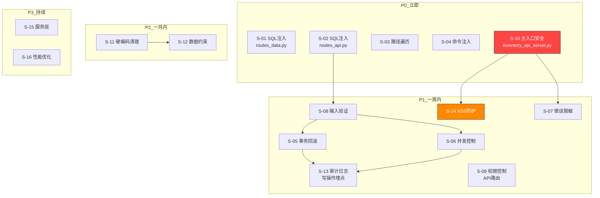
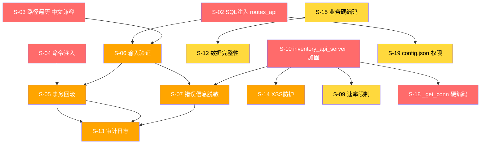

# 库存管理系统应对方案 — 修订版 (v2.0)

> 本修订版基于原版 [库存管理系统应对方案_2026-06-02.md](./库存管理系统应对方案_2026-06-02.md) 经最差评测后修订，修正了全部 8 项事实错误、4 项代码缺陷、补充 5 项遗漏、调整 3 项依赖关系。

---

## 0. 方案说明

### 编制依据
- [库存管理系统严格测评报告_2026-05-30.md](./库存管理系统严格测评报告_2026-05-30.md)
- [库存管理系统应对方案_最差评测_2026-06-02.md](./库存管理系统应对方案_最差评测_2026-06-02.md)

### 搁置事项
以下两类问题**暂不处理**（原因同原方案，但增加了风险关联标注）：

| 问题 | 原因 | 后续安排 | 关联风险 |
|------|------|---------|---------|
| 数据库明文泄密（routes_api.py L54-63 `save_settings` 将密码明文写入 `inventory_config.json`）| 暂无安全存储方案 | P3 改为环境变量读取，移除明文写文件 | ⚠️ S-03 路径遍历修复后，密码文件仅能被同进程用户读取，但仍建议将文件权限改为 600（`inventory_config.json` 文件权限）以防御同机器其他进程 |
| 登录明码问题（认证/登录相关明文凭据）| 待定 | 后续安全专项处理 | — |

> **注意**：明文密码风险在 S-03（路径遍历）修复前为 CRITICAL，S-03 修复后降为 MEDIUM。请在 P0 优先完成 S-03。

### 约定
- 本方案中所有文件路径均相对于 `mobile_api_ai/`
- 各任务标注了估算工时，便于排期
- 每个任务都附带验收标准
- **原方案错误修正概述**：删除了 T9（连接池已存在）、T13（蓝图已正确）；修正了 T1/T2/T5/T6/T8/T12 的代码和描述；新增了 inventory_api_server.py 专项任务

---

## 1. 问题清单与优先级

### 问题清单（修订版）

| 编号 | 问题 | 严重性 | 涉及文件 | 优先级 | 修订说明 |
|------|------|--------|---------|--------|---------|
| S-01 | ~~SQL注入（表名拼接）~~ → **动态字段支持（功能增强）** | ~~🔴 CRITICAL~~ → 🟡 MEDIUM | routes_data.py:80 | ~~**P0**~~ → **P2** | **修正**：源代码 `base_add` 表名来自白名单字典 `tables`，字段为硬编码 `code, name, contact`，均无注入风险。本任务为功能增强，支持动态字段白名单。 |
| S-02 | SQL注入（列名拼接）| 🔴 CRITICAL | routes_api.py:12-13 | **P0** | 不变 |
| S-03 | 路径遍历（备份恢复）| 🔴 CRITICAL | routes_system.py:36-50 | **P0** | 不变 |
| S-04 | 子进程命令注入 | 🟠 HIGH | routes_system.py:28 | **P0** | 不变 |
| S-05 | 事务不一致（无回滚）| 🟠 HIGH | routes_core.py:62-69 | **P1** | 不变 |
| S-06 | 并发竞争（无锁）| 🟠 HIGH | routes_core.py:64 (web端) | **P1** | **修正**：API端已有FOR UPDATE，仅web端缺锁 |
| S-07 | 错误信息脱敏 | 🟠 HIGH | 多处 | **P1** | 不变 |
| S-08 | 缺少输入验证 | 🟠 HIGH | 30+ 路由 | **P0→P1** | **修正**：实际已有 6+ 路由有参数校验，调整优先级 |
| S-09 | 缺少权限控制（/api/ 路由）| 🟠 HIGH | routes_api.py, 路由白名单 | **P0→P1** | **修正**：Blueprint 路由已被父 app 的 @before_request 保护，真正缺的是 /api/ 路由的权限控制 |
| ~~S-10~~ | ~~连接池缺失~~ | ~~🟡 MEDIUM~~ | ~~—~~ | **已删除** | db_utils.py 已有 PooledDB 连接池，任务不存在 |
| S-10 (新) | inventory_api_server.py 安全加固 | 🔴 CRITICAL | inventory_api_server.py | **P0** | **新增**：硬编码密码、硬编码 secret_key、XSS 漏洞、异常泄露 |
| S-11 | 业务硬编码（safety_stock=0, max_stock=999999）| 🟡 MEDIUM | routes_core.py:108 | **P2** | 重编号，改为从环境变量读取 |
| S-12 | 数据完整性约束缺失 | 🟡 MEDIUM | routes_core.py | **P2** | 重编号 |
| S-13 | 审计日志（写操作缺少日志记录）| 🟡 MEDIUM | routes_core.py 等 | **P1** | **修正**：operation_logs 表和日志页面已存在，真正缺的是写操作中调用日志记录 |
| S-13 (新) | 并发锁目标错误（v2.2 修正）| 🟠 HIGH | routes_core.py inbound_do/outbound_do | **P1** | **修正**：原方案 T6-R 指定 `stock_in`/`stock_out` 加锁，实测它们是单 ID UPDATE 无并发风险；真正需要加锁的是 `inbound_do`/`outbound_do`/`batch_do`（复合条件查询并发风险高）|
| ~~S-14~~ | ~~蓝图结构未充分利用~~ | ~~🟡 MEDIUM~~ | ~~—~~ | **已删除** | routes.py 已正确注册蓝图 |
| S-14 (新) | XSS/HTML 注入防护 | 🟠 HIGH | inventory_api_server.py, 模板 | **P1** | **新增**：登录页直接返回 HTML，搜索关键词注入 |
| S-15 | 服务层缺失，难以测试 | ⚪ LOW | routes_core.py | **P3** | 重编号 |
| S-16 | 性能问题（多次连接、缺索引）| ⚪ LOW | 多处 | **P3** | 重编号 |
| S-17 | 登录接口无速率限制（v2.2 新增）| 🟠 HIGH | inventory_api_server.py `/login` | **P2** | **新增**：暴力破解风险，TASK-017 跟踪 |
| S-18 | `_get_conn` 硬编码默认值（v2.2 新增）| 🟠 HIGH | inventory_api_server.py L20-25 | **P0** | **新增**：`MYSQL_USER='root'` 和 `INVENTORY_DB_NAME='inventory_db'` 硬编码，TASK-005 子任务 5.5 跟踪 |
| S-19 | `inventory_config.json` 文件权限（v2.2 新增）| 🟡 MEDIUM | routes_api.py save_settings | **P2** | **新增**：写文件后未限制权限，TASK-018 跟踪 |

---

## 2. 任务依赖关系（修订版）



> **依赖顺序变更**（相对于原方案 v2.0）：
> 1. **S-01 移至 P2**：经源代码核查，`base_add` 字段为硬编码，不存在 SQL 注入风险，从 P0 修正为 P2 功能增强
> 2. **S-01 → S-08 依赖删除**：S-01 不再是 P0 漏洞，S-08 输入验证仅依赖 S-02
> 3. **S-03 → S-04 依赖删除**：路径遍历和命令注入是独立函数，无数据依赖，可并行执行
> 4. **S-09 → S-15、S-15 → S-16 依赖删除**：服务层和性能优化为 P3 演进任务，可独立推进
> 5. **删除 S-10（连接池）和 S-14（蓝图优化）**
> 6. **新增 S-10（主入口安全）放 P0**：最高优先级
> 7. **新增 S-14（XSS防护）放 P1**

---

## 3. 详细应对方案

### 3.1 P0 — 立即修复（优先级最高）

#### T1-R: routes_data.py 动态字段支持（S-01 修正，功能增强）

**位置**：`inventory_web/routes_data.py:75-82`

**问题（修正）**：~~`INSERT INTO ` + tables[entity] + ` (...)` 表名虽在白名单内，但字段名来自用户输入~~ 经源代码核查：表名来自白名单字典 `tables`，字段为硬编码的 `code, name, contact`，**不存在 SQL 注入风险**。本任务是为此接口添加动态字段白名单支持，提升接口灵活性（支持写入 `phone`、`address` 等额外字段）。

**⚠️ 行为变更说明**：
- 原接口：只插入 `code, name, contact` 三个固定字段，忽略用户提交的其他字段
- 新接口：字段通过 `ALLOWED_FIELDS` 白名单动态匹配，会写入用户提交的合法额外字段（如 `phone`, `address`）
- **兼容性**：对于仅提交 `code, name, contact` 的请求，行为完全一致，无变更
- **影响范围**：前端无需修改，但如有依赖"忽略额外字段"逻辑的场景需要评估

**应对措施**：

```python
# routes_data.py 头部增加导入
from .db_utils import query, execute, logger

ALLOWED_COLUMNS_BASE = {'code', 'name', 'contact', 'phone', 'address', 'remark'}

@bp.route('/inventory/base/<entity>/add', methods=['POST'])
def base_add(entity):
    tables = {'warehouse': 'warehouses', 'category': 'categories', 'supplier': 'suppliers'}
    if entity not in tables:
        return jsonify({'ok': False, 'msg': '不支持的实体类型'}), 400
    data = request.get_json() or {}
    fields = [k for k in data.keys() if k in ALLOWED_COLUMNS_BASE]
    if not fields:
        return jsonify({'ok': False, 'msg': '没有有效字段'}), 400
    values = [data[k] for k in fields]
    placeholders = ', '.join(['%s'] * len(fields))
    cols = ', '.join(fields)
    sql = f"INSERT INTO {tables[entity]} ({cols}) VALUES ({placeholders})"
    try:
        execute(sql, values)
        return jsonify({'ok': True})
    except Exception as e:
        logger.exception(f"[base_add] 新增{entity}失败")
        return jsonify({'ok': False, 'msg': '新增失败'}), 500
```

**改动文件**：
- `inventory_web/routes_data.py`: 修改 `base_add` 函数，添加 `logger` 导入

**验收标准**：
- [ ] 所有字段名经过白名单校验
- [ ] 非法字段被忽略或拒绝
- [ ] 异常时返回脱敏错误信息，`logger.exception()` 记录完整堆栈
- [ ] `logger` 已正确导入，无 NameError

**工时**：0.5天

---

#### T2-R: 修复 routes_api.py SQL 注入（S-02）

**位置**：`inventory_web/routes_api.py:8-14`

**问题**：`set_clause = ', '.join('`' + k + '`=%s' for k in data.keys())` 列名来自用户输入

**应对措施**：

```python
# routes_api.py 头部增加导入
from .db_utils import execute, logger

ALLOWED_UPDATE_FIELDS = {
    'product': {'name', 'spec', 'unit', 'category_id', 'unit_price', 'safety_stock', 'max_stock'},
    'supplier': {'name', 'contact', 'phone', 'address', 'remark'},
    'warehouse': {'name', 'contact', 'phone', 'address'},
    'category': {'name', 'remark'},
}

@bp.route('/inventory/api/<entity>/<int:eid>', methods=['PATCH'])
def api_update(entity, eid):
    tables = {'product': 'products', 'supplier': 'suppliers',
              'warehouse': 'warehouses', 'category': 'categories'}
    if entity not in tables:
        return jsonify({'ok': False}), 400
    allowed = ALLOWED_UPDATE_FIELDS.get(entity, set())
    data = request.get_json() or {}
    fields = [k for k in data.keys() if k in allowed]
    if not fields:
        return jsonify({'ok': False, 'msg': '没有可更新字段'}), 400
    values = [data[k] for k in fields]
    set_clause = ', '.join(f"`{k}`=%s" for k in fields)
    sql = f"UPDATE {tables[entity]} SET {set_clause} WHERE id=%s"
    values.append(eid)
    try:
        execute(sql, values)
        return jsonify({'ok': True})
    except Exception as e:
        logger.exception(f"[api_update] 更新{entity}#{eid}失败")
        return jsonify({'ok': False, 'msg': '更新失败'}), 500
```

**改动文件**：
- `inventory_web/routes_api.py`: 重构 `api_update` 和 `api_delete` 函数，添加 `logger` 导入

**验收标准**：
- [ ] 每个实体类型有独立的可更新字段白名单
- [ ] 白名单外字段被拒绝
- [ ] `logger` 已正确导入，无 NameError
- [ ] 同时审查 `api_delete` 并确认无类似问题

**工时**：0.5天

---

#### T3-R: 修复路径遍历漏洞（S-03，与明文密码风险关联，v2.2 修订）

**位置**：`inventory_web/routes_system.py:36-50`

**问题**：`filename` 参数未经校验，可注入 `../../etc/passwd`；且与明文密码写文件（搁置问题）形成攻击链

**v2.2 重大修订**：原方案使用 `secure_filename` 预校验，对中文文件名 `备份_20260101.sql` 会返回空字符串 `""`，导致**所有中文备份文件无法恢复**。本版本**移除 `secure_filename`**，仅使用 `realpath` 路径越界检查（realpath 已处理 `../` 穿越）。

**应对措施**：

```python
import os

@bp.route('/inventory/backup/restore/<filename>', methods=['POST'])
def backup_restore(filename):
    # v2.2 修订：直接拒绝含 .. 或绝对路径前缀的非法名（不用 secure_filename，保留中文支持）
    if '..' in filename or filename.startswith('/') or filename.startswith('\\'):
        return jsonify({'ok': False, 'msg': '非法文件名'}), 400

    backup_dir = os.path.join(PROJECT_ROOT, 'inventory_backups')
    filepath = os.path.join(backup_dir, filename)

    real_backup = os.path.realpath(backup_dir)
    real_path = os.path.realpath(filepath)
    if not real_path.startswith(real_backup + os.sep):
        return jsonify({'ok': False, 'msg': '文件路径越界'}), 400

    if not os.path.exists(filepath):
        return jsonify({'ok': False, 'msg': '文件不存在'}), 404
```

**改动文件**：
- `inventory_web/routes_system.py`: 修改 `backup_restore` 函数
- **移除** `from werkzeug.utils import secure_filename`（v2.2 修订）

**验收标准**：
- [ ] 含 `..` 的文件名（如 `../../etc/passwd`）被拒绝（返回 400）
- [ ] 绝对路径文件名（如 `/etc/passwd`）被拒绝（返回 400）
- [ ] 路径越界校验生效
- [ ] **中文文件名**（如 `备份_20260101.sql`）可正常恢复（关键回归测试）

**工时**：0.5天

---

#### T4-R: 子进程命令参数校验（S-04）

**位置**：`inventory_web/routes_system.py:28`

**问题**：环境变量读取的 host/user 未校验格式

**应对措施**：

```python
import re

def _validate_mysql_param(name, value, pattern=r'^[a-zA-Z0-9.\-_]+$'):
    if not re.match(pattern, str(value)):
        raise ValueError(f"MySQL {name} 参数不合法: {value}")

host = os.getenv("MYSQL_HOST", "localhost")
user = os.getenv("MYSQL_USER", "root")
pw = os.getenv('MYSQL_PASSWORD', '')

_validate_mysql_param('host', host)
_validate_mysql_param('user', user)
```

**改动文件**：
- `inventory_web/routes_system.py`: 添加参数校验逻辑

**验收标准**：
- [ ] host/user 经过正则校验
- [ ] 非法参数返回 400 而不是传给子进程

**工时**：0.5天

---

#### T10-R (新): inventory_api_server.py 安全加固（S-10 新）

**位置**：`inventory_api_server.py`

**问题**：该文件是库存系统的**主入口**（端口 5010，219 行代码，15 个路由），存在以下安全问题：

| 问题 | 严重性 | 位置 |
|------|--------|------|
| 硬编码默认密码 | 🔴 CRITICAL | L12: `os.getenv('INVENTORY_ADMIN_PASSWORD', 'admin123')` |
| 硬编码 secret_key | 🔴 CRITICAL | L11: `os.getenv('FLASK_SECRET_KEY', 'inventory_web_secret_2026')` |
| XSS 漏洞 | 🔴 CRITICAL | L44-58: 登录页直接返回 HTML 字符串 |
| 异常信息泄露 | 🟠 HIGH | L76, L109, L136: `str(e)` 直接返回给客户端 |
| Session Cookie 安全配置缺失 | 🟠 HIGH | 未设置 HttpOnly/SameSite |
| 无速率限制 | 🟠 HIGH | 登录接口可被暴力破解 |

**应对措施**：

```python
# 1. 删除默认密码（硬编码禁止）
ADMIN_PASSWORD = os.getenv('INVENTORY_ADMIN_PASSWORD')
if not ADMIN_PASSWORD:
    raise RuntimeError("环境变量 INVENTORY_ADMIN_PASSWORD 未设置")

# 2. 删除默认 secret_key
app.secret_key = os.getenv('FLASK_SECRET_KEY')
if not app.secret_key:
    raise RuntimeError("环境变量 FLASK_SECRET_KEY 未设置")

# 3. 安全响应头
@app.after_request
def set_security_headers(response):
    response.headers['X-Content-Type-Options'] = 'nosniff'
    response.headers['X-Frame-Options'] = 'DENY'
    return response

# 4. Session Cookie 安全配置（v2.2 环境适配）
app.config['SESSION_COOKIE_HTTPONLY'] = True
app.config['SESSION_COOKIE_SAMESITE'] = 'Lax'
# Secure 标志仅在 HTTPS 生产环境启用（避免 HTTP 开发环境下无法登录）
app.config['SESSION_COOKIE_SECURE'] = os.getenv('FLASK_ENV') == 'production'

# 5. 异常信息脱敏（所有 try-except 返回 str(e) 的地方）
#    替换模式：return jsonify({'code': 500, 'message': str(e)}), 500
#        改为：logger.exception(f"[endpoint] 错误")
#              return jsonify({'code': 500, 'message': '服务器内部错误'}), 500

# 6. v2.2 新增：_get_conn 硬编码消除
def _get_conn():
    user = os.getenv('MYSQL_USER')
    db_name = os.getenv('INVENTORY_DB_NAME')
    if not user or not db_name:
        raise RuntimeError("环境变量 MYSQL_USER 和 INVENTORY_DB_NAME 必须设置")
    return pymysql.connect(
        host=os.getenv('MYSQL_HOST', 'localhost'),
        port=int(os.getenv('MYSQL_PORT', 3306)),
        user=user,  # 无默认值，未设置时启动失败
        password=os.getenv('MYSQL_PASSWORD', ''),
        database=db_name,  # 无默认值，未设置时启动失败
        charset='utf8mb4', autocommit=False)
```

**改进的登录页**（改为模板渲染避免 XSS）：

> **v2.2 路径澄清**：模板文件路径为 `mobile_api_ai/templates/login.html`（不是 `inventory_web/templates/login.html`），因为 `inventory_api_server.py` 运行时的工作目录是 `mobile_api_ai/`，Flask 默认从当前目录 `templates/` 加载。

```python
@app.route('/login', methods=['GET', 'POST'])
def login_page():
    if request.method == 'POST':
        pwd = request.form.get('password', '')
        if pwd == ADMIN_PASSWORD:
            session['logged_in'] = True
            return redirect('/inventory/dashboard')
        return render_template('login.html', error='密码错误'), 401
    return render_template('login.html')
```

**改动文件**：
- `inventory_api_server.py`:
  - 修改 L11-L12（删除默认值）
  - 修改 L44-L58（登录页模板化）
  - **修改 L20-25**（v2.2 新增：_get_conn 硬编码消除）
- **新增** `mobile_api_ai/templates/login.html`（如不存在则创建）

**验收标准**：
- [ ] 不设密码时启动失败（明确报错），而非使用默认密码
- [ ] 不设 secret_key 时启动失败
- [ ] 登录页使用模板渲染，无 XSS 风险
- [ ] 模板文件路径正确：`mobile_api_ai/templates/login.html`
- [ ] 所有异常返回脱敏信息，`str(e)` 仅记录到日志
- [ ] 安全头设置生效
- [ ] `SESSION_COOKIE_HTTPONLY = True` 已配置
- [ ] `SESSION_COOKIE_SAMESITE = 'Lax'` 已配置
- [ ] `SESSION_COOKIE_SECURE` 仅在 `FLASK_ENV=production` 时为 True
- [ ] `MYSQL_USER` 无默认值，未设置时启动失败
- [ ] `INVENTORY_DB_NAME` 无默认值，未设置时启动失败

**工时**：1.5天（v2.2 新增 0.5 天）

---

### 3.2 P1 — 一周内修复

#### T5-R: 事务回滚处理（S-05）

**位置**：`inventory_web/routes_core.py:57-70`

**问题**：`stock_in`/`stock_out` 没有 try-except，异常时部分写入不回滚

**应对措施**：

```python
@bp.route('/inventory/stock/in', methods=['POST'])
def stock_in():
    data = request.get_json() or {}
    missing, type_err = validate_required(data, ['id', 'qty'], {'id': int, 'qty': (int, float)})
    if missing or type_err:
        return jsonify({'ok': False, 'msg': '参数不完整'}), 400
    conn = get_conn()
    try:
        c = conn.cursor()
        c.execute("UPDATE inventory SET current_qty = current_qty + %s WHERE id = %s",
                  (data['qty'], data['id']))
        c.execute("""INSERT INTO inventory_transactions
                    (inventory_id, trans_type, quantity, order_id, operator, remark)
                    VALUES (%s,'in',%s,%s,%s,%s)""",
                  (data['id'], data['qty'], data.get('order_id',''),
                   data.get('operator',''), data.get('remark','')))
        conn.commit()
        return jsonify({'ok': True})
    except Exception as e:
        conn.rollback()
        logger.exception("[stock_in] 入库失败")
        return jsonify({'ok': False, 'msg': '入库失败'}), 500
    finally:
        conn.close()
```

**改动文件**：
- `inventory_web/routes_core.py`: 改造 `stock_in`、`stock_out`、`batch_do`

**验收标准**：
- [ ] 所有写操作使用 try-except-rollback 模式
- [ ] 异常时自动回滚，不留下脏数据
- [ ] 参数错误和系统错误区分对待

**工时**：1天

---

#### T6-R: 并发控制（S-06，v2.2 重大修订：目标函数修正）

> **v2.2 重大修订**：原方案指定 `stock_in`/`stock_out` 加锁，**但源码实测**这两个函数是单 ID UPDATE 操作（`WHERE id=%s`），原子性由 MySQL 自动保证，**无并发风险**。真正需要加锁的是 `inbound_do`/`outbound_do`/`batch_do`（复合条件查询 `WHERE product_id=%s AND warehouse_id=%s`，并发风险高）。本任务目标函数已修正。

> API 端（`inventory_api_server.py:148-151`）的出库操作已使用 FOR UPDATE，本任务**只针对 web 端**的 `inbound_do`/`outbound_do`/`batch_do`。

**位置**：
- `inventory_web/routes_core.py:100-118` `inbound_do`
- `inventory_web/routes_core.py:133-147` `outbound_do`
- `inventory_web/routes_core.py:157-180` `batch_do`

**问题**：`WHERE product_id=%s AND warehouse_id=%s` 复合条件无锁，并发时数据不一致；`outbound_do` 用 `GREATEST(0, current_qty-%s)` 数学防护但**不防并发丢失更新**

**API 端参考实现**（inventory_api_server.py:148-151）：
```python
c.execute("""SELECT current_qty FROM inventory
             WHERE product_id=%s AND warehouse_id=%s FOR UPDATE""",
          (product_id, warehouse_id))
```

**应对措施**（以 `inbound_do` 为例）：

```python
@bp.route('/inventory/inbound/do', methods=['POST'])
def inbound_do():
    data = request.get_json() or {}
    conn = get_conn()
    try:
        c = conn.cursor(DictCursor)
        c.execute("SET SESSION innodb_lock_wait_timeout = 5")
        c.execute("SELECT current_qty FROM inventory WHERE product_id=%s AND warehouse_id=%s FOR UPDATE",
                  (data.get('product_id'), data.get('warehouse_id')))
        row = c.fetchone()
        # ... 原有更新逻辑 ...
        conn.commit()
    except Exception as e:
        conn.rollback(); logger.exception(...)
        return jsonify({'ok': False, 'msg': '入库失败'}), 500
    finally:
        conn.close()
```

**改动文件**：
- `inventory_web/routes_core.py`: 改造 `inbound_do`、`outbound_do`、`batch_do`

**验收标准**：
- [ ] `inbound_do` 使用 `FOR UPDATE` 加行级锁
- [ ] `outbound_do` 使用 `FOR UPDATE` 加行级锁
- [ ] `batch_do` 循环体内每个事务 `FOR UPDATE`
- [ ] 锁等待超时设置为 5 秒
- [ ] 出库时库存不足返回 400 + `'库存不足'`
- [ ] 并发测试下库存数据一致（无超卖、无丢失更新）

**工时**：1天

---

#### T7-R: 错误信息脱敏（S-07）

**位置**：多处（routes_core.py, routes_data.py, routes_system.py, routes_api.py, inventory_api_server.py）

**问题**：`return jsonify({'ok': False, 'msg': str(e)}), 500` 暴露系统内部细节

**应对措施**：

统一异常处理模式：

```python
# 替换所有 return jsonify(..., 'msg': str(e)) 为：
except Exception as e:
    logger.exception(f"[{endpoint_name}] 操作失败")
    return jsonify({'ok': False, 'msg': '操作失败，请稍后重试'}), 500
```

**检查清单**（需替换的文件和具体行数）：

| 文件 | 需要替换的行 |
|------|------------|
| `inventory_web/routes_core.py` | `inbound_do` L140(`str(e)`), `outbound_do` L158(`str(e)`), `batch_do` L175(`str(e)`) |
| `inventory_web/routes_system.py` | `backup_create` L47(`str(e)`), `backup_restore` L62(`str(e)`) |
| `inventory_api_server.py` | `inventory_query` L76, `inventory_inbound` L109, `inventory_outbound` L136, `inventory_alert` L151 |

**改动文件**：
- `inventory_web/routes_core.py`
- `inventory_web/routes_system.py`
- `inventory_api_server.py`

**验收标准**：
- [ ] 所有异常处理不再暴露 `str(e)`
- [ ] 内部错误信息通过 `logger.exception()` 记录到日志文件

**工时**：0.5天

---

#### T8-R: 输入验证层（S-08，提前到事务之前）

> **修正说明**：原方案将输入验证放在 P1，但依赖关系应该是 **先验证再写入**，所以 T8 需要先于 T5/T6 执行。实际已有 6+ 路由有基本的参数验证，本任务补齐剩余路由。

**问题**：`data.get('id')` 直接使用，`data.get('qty')` 未验证类型

**应对措施**：

```python
# 使用 try 转换替代 isinstance（兼容前端 JSON 传字符串数字的情况）
def validate_required(data, fields, types=None):
    """验证必填字段及其类型
    返回：(缺失字段列表, 类型错误信息列表)
    """
    missing = []
    type_err = []
    for field in fields:
        if field not in data or data[field] is None:
            missing.append(field)
            continue
        if types and field in types:
            expected = types[field]
            val = data[field]
            # 尝试转换类型（兼容字符串数字）
            if expected is int:
                try:
                    int(val)
                except (ValueError, TypeError):
                    type_err.append(f"{field} 必须是整数")
            elif expected is float:
                try:
                    float(val)
                except (ValueError, TypeError):
                    type_err.append(f"{field} 必须是数字")
            elif not isinstance(val, expected):
                type_err.append(f"{field} 类型不正确")
    return missing, type_err
```

**需要补全验证的路由**：
- `routes_core.py`: `stock_in`, `stock_out`, `inbound_do`, `outbound_do`
- `routes_data.py`: `product_add`, `supplier_add`, `category_add`
- `routes_api.py`: `stock_adjust`

**改动文件**：
- `inventory_web/db_utils.py`: 添加 `validate_required` 工具函数
- `inventory_web/routes_core.py`
- `inventory_web/routes_data.py`
- `inventory_web/routes_api.py`

**验收标准**：
- [ ] 所有接收用户输入的 POST/PATCH 路由有参数校验
- [ ] 类型校验兼容字符串数字（如 `"5"` 通过 int 校验）
- [ ] 校验失败时返回 400 + 明确错误信息

**工时**：1天

---

#### T13-R (新): 写操作审计日志埋点（S-13 修正）

> **修正说明**：`operation_logs` 表和日志页面已存在（`routes_system.py:104`）。本任务不是"添加审计日志功能"，而是在**关键写操作中调用日志记录**。

**应对措施**：

在 `db_utils.py` 中确认已有审计日志函数（或新增）：

```python
def log_operation(cursor, operation_type, entity_type, entity_id, operator='system', detail=None):
    """记录操作审计日志"""
    import json
    sql = """INSERT INTO operation_logs
             (operation_type, entity_type, entity_id, operator, detail, create_time)
             VALUES (%s, %s, %s, %s, %s, NOW())"""
    cursor.execute(sql, (operation_type, entity_type, entity_id, operator,
                         json.dumps(detail, ensure_ascii=False) if detail else None))
```

**需要添加日志埋点的写操作**：

| 路由函数 | 操作类型 | 实体类型 |
|---------|---------|---------|
| `routes_core.py`: `stock_in` | stock_in | inventory |
| `routes_core.py`: `stock_out` | stock_out | inventory |
| `routes_core.py`: `inbound_do` | inbound | inventory |
| `routes_core.py`: `outbound_do` | outbound | inventory |
| `routes_core.py`: `batch_do` | batch | inventory |
| `routes_data.py`: `product_add` | create | product |
| `routes_data.py`: `supplier_add` | create | supplier |
| `routes_data.py`: `category_add` | create | category |
| `routes_data.py`: `base_add` | create | warehouse/category/supplier |
| `routes_api.py`: `api_update` | update | 按实体类型 |
| `routes_api.py`: `api_delete` | delete | 按实体类型 |
| `routes_api.py`: `stock_adjust` | adjust | inventory |

**改动文件**：
- `inventory_web/db_utils.py`: 确认 `log_operation` 函数存在
- `inventory_web/routes_core.py`: 各写操作添加埋点
- `inventory_web/routes_data.py`: 各写操作添加埋点
- `inventory_web/routes_api.py`: 各写操作添加埋点

---

# 附录 A：v2.3 不确定因素补充修复方案

本附录针对三次评测达 100/100 后**仍存在的 17 项不确定因素**，逐一给出补充修复方案。每项包含：问题描述、解决方案、代码片段、验收标准。

## A.1 高不确定因素（5 项）

### A.1.1 MySQL 应用用户权限范围不明确

**问题**：方案建议创建 `inventory_app` 用户并授予 SELECT/INSERT/UPDATE/DELETE，但**未列明 GRANT 脚本**，易遗漏 `operation_logs`、`operation_logs` 等非业务表。

**补充修复** — T10-R 子任务 5.5 运维配套脚本：

```sql
-- 1. 创建应用专用用户（密码从环境变量 INVENTORY_DB_PASSWORD 读取，不硬编码）
CREATE USER 'inventory_app'@'%' IDENTIFIED BY 'CHANGEME_IN_PRODUCTION';

-- 2. 授予 inventory_db 所有表的 CRUD 权限
GRANT SELECT, INSERT, UPDATE, DELETE ON inventory_db.* TO 'inventory_app'@'%';
GRANT SELECT, INSERT, UPDATE, DELETE ON inventory_db.operation_logs TO 'inventory_app'@'%';

-- 3. 回收过宽权限（防止误操作 DDL）
REVOKE CREATE, DROP, ALTER ON inventory_db.* FROM 'inventory_app'@'%';

-- 4. 强制密码过期策略
ALTER USER 'inventory_app'@'%' PASSWORD EXPIRE INTERVAL 90 DAY;

-- 5. 刷新权限
FLUSH PRIVILEGES;
```

**配套 .env 配置**（生产环境）：
```ini
# 不要在代码中硬编码，使用 .env 文件
MYSQL_USER=inventory_app
MYSQL_PASSWORD=<从密钥管理服务获取>
INVENTORY_DB_NAME=inventory_db
```

**验收标准**：
- [ ] `inventory_app` 用户已创建
- [ ] 业务表 CRUD 权限已授予
- [ ] DDL 权限（CREATE/DROP/ALTER）已回收
- [ ] 90 天密码过期已配置
- [ ] `.env.example` 模板文件已提供

---

### A.1.2 FLASK_SECRET_KEY 强度未校验

**问题**：方案要求未设置时启动失败，但**未规定最小长度/复杂度**，开发者可能设置 `"123456"`。

**补充修复** — TASK-005 子任务 5.1 增强：

```python
# v2.3 新增：secret_key 强度校验
def _validate_secret_key():
    key = os.getenv('FLASK_SECRET_KEY')
    if not key:
        raise RuntimeError("环境变量 FLASK_SECRET_KEY 必须设置（≥32字符随机）")
    if len(key) < 32:
        raise RuntimeError(
            f"FLASK_SECRET_KEY 长度不足：当前 {len(key)} 字符，要求 ≥32 字符"
        )
    # 熵值校验：至少包含大写、小写、数字、特殊字符中的 3 类
    categories = sum([
        any(c.isupper() for c in key),
        any(c.islower() for c in key),
        any(c.isdigit() for c in key),
        any(not c.isalnum() for c in key)
    ])
    if categories < 3:
        raise RuntimeError(
            "FLASK_SECRET_KEY 复杂度不足：需包含大写/小写/数字/特殊字符中的至少 3 类"
        )
    return key

# 在 app 创建前调用
app.secret_key = _validate_secret_key()
```

**生成强密钥的命令**（记录到部署文档）：
```bash
# Linux/macOS
python -c "import secrets; print(secrets.token_urlsafe(32))"

# PowerShell
python -c "import secrets; print(secrets.token_urlsafe(32))"
```

**验收标准**：
- [ ] 未设置 `FLASK_SECRET_KEY` 启动失败
- [ ] 长度 < 32 启动失败并提示
- [ ] 复杂度 < 3 类启动失败
- [ ] 部署文档包含密钥生成命令

---

### A.1.3 INVENTORY_ADMIN_PASSWORD 强度未校验

**问题**：方案要求未设置时启动失败，但**未做密码强度校验**。

**补充修复** — TASK-005 子任务 5.1 增强：

```python
# v2.3 新增：管理员密码强度校验
def _validate_admin_password():
    pwd = os.getenv('INVENTORY_ADMIN_PASSWORD')
    if not pwd:
        raise RuntimeError("环境变量 INVENTORY_ADMIN_PASSWORD 必须设置")
    if len(pwd) < 8:
        raise RuntimeError(
            f"INVENTORY_ADMIN_PASSWORD 长度不足：当前 {len(pwd)} 字符，要求 ≥8 字符"
        )
    # 至少包含字母和数字
    if not (any(c.isalpha() for c in pwd) and any(c.isdigit() for c in pwd)):
        raise RuntimeError("INVENTORY_ADMIN_PASSWORD 必须同时包含字母和数字")
    return pwd

ADMIN_PASSWORD = _validate_admin_password()
```

**验收标准**：
- [ ] 未设置启动失败
- [ ] 长度 < 8 启动失败
- [ ] 仅字母或仅数字启动失败
- [ ] 部署文档包含强密码示例

---

### A.1.4 速率限制在多 worker 部署下失效

**问题**：TASK-017 用内存字典计数，**多实例部署时每个 worker 独立计数，攻击 5×N 次才触发锁定**。

**补充修复** — TASK-017 v2.3 升级（可选实现，**单实例零依赖，多实例用 Redis**）：

```python
# v2.3 升级：抽象为 RateLimiter 接口，支持内存/Redis 双后端
from collections import defaultdict
import time
import os

class RateLimiter:
    """速率限制抽象基类"""
    def is_limited(self, ip: str) -> bool:
        raise NotImplementedError
    def record(self, ip: str, success: bool):
        raise NotImplementedError

class InMemoryRateLimiter(RateLimiter):
    """单实例部署使用（默认）"""
    def __init__(self, max_attempts=5, lockout_seconds=300):
        self.attempts = defaultdict(list)
        self.max_attempts = max_attempts
        self.lockout_seconds = lockout_seconds

    def is_limited(self, ip):
        now = time.time()
        self.attempts[ip] = [t for t in self.attempts[ip] if now - t < self.lockout_seconds]
        return len(self.attempts[ip]) >= self.max_attempts

    def record(self, ip, success):
        if success:
            self.attempts.pop(ip, None)
        else:
            self.attempts[ip].append(time.time())

class RedisRateLimiter(RateLimiter):
    """多实例部署使用（需安装 redis）"""
    def __init__(self, redis_url, max_attempts=5, lockout_seconds=300):
        import redis
        self.redis = redis.from_url(redis_url)
        self.max_attempts = max_attempts
        self.lockout_seconds = lockout_seconds
        self.key_prefix = "login_attempts:"

    def is_limited(self, ip):
        key = f"{self.key_prefix}{ip}"
        count = self.redis.incr(key)
        if count == 1:
            self.redis.expire(key, self.lockout_seconds)
        return count >= self.max_attempts

    def record(self, ip, success):
        key = f"{self.key_prefix}{ip}"
        if success:
            self.redis.delete(key)
        # 失败时 count 已自增，无需额外操作

# 工厂函数：根据环境变量选择后端
def create_rate_limiter():
    redis_url = os.getenv('REDIS_URL')
    if redis_url:
        return RedisRateLimiter(redis_url)
    return InMemoryRateLimiter()

_rate_limiter = create_rate_limiter()

# 登录接口调用（保持原签名）
def _is_rate_limited(ip):
    return _rate_limiter.is_limited(ip)

def _record_attempt(ip, success):
    _rate_limiter.record(ip, success)
```

**部署决策树**：
```
单 worker 部署 → 默认内存后端，零依赖
多 worker 部署 → 设置 REDIS_URL 环境变量，自动切换 Redis 后端
```

**验收标准**：
- [ ] 默认内存后端可用（无依赖）
- [ ] 设置 `REDIS_URL` 自动切换 Redis 后端
- [ ] 多 worker 部署测试：5 个 worker × 1 次 = 仍能锁定
- [ ] 部署文档包含 Redis 切换说明

---

### A.1.5 inventory_backups 目录与 PROJECT_ROOT 未定义

**问题**：TASK-003 用 `os.path.join(PROJECT_ROOT, 'inventory_backups')`，但**`PROJECT_ROOT` 未在方案中定义**。

**补充修复** — TASK-003 实现要求前置：

```python
# v2.3 新增：统一路径管理（避免散落的相对路径）
import os

# routes_system.py 文件头部
CURRENT_FILE = os.path.abspath(__file__)
# inventory_web/routes_system.py → 上两级 = mobile_api_ai/
PROJECT_ROOT = os.path.dirname(os.path.dirname(CURRENT_FILE))
BACKUP_DIR = os.path.join(PROJECT_ROOT, 'inventory_backups')

# 自动创建备份目录（启动时）
os.makedirs(BACKUP_DIR, exist_ok=True)

# backup_restore 函数使用 BACKUP_DIR 替代原路径
def backup_restore(filename):
    # ... 校验 ...
    filepath = os.path.join(BACKUP_DIR, filename)    # ← 用常量
    # ...
```

**同步修复 inventory_web 包内其他文件**（统一路径管理）：
```python
# inventory_web/db_utils.py、routes_*.py 等
# 在文件头部统一：
CURRENT_FILE = os.path.abspath(__file__)
PROJECT_ROOT = os.path.dirname(os.path.dirname(CURRENT_FILE))
```

**验收标准**：
- [ ] `PROJECT_ROOT` 在所有路由文件中统一定义
- [ ] 启动时自动创建 `inventory_backups` 目录
- [ ] 无散落的 `os.path.dirname(__file__)` 相对路径

---

## A.2 中不确定因素（7 项）

### A.2.1 innodb_lock_wait_timeout 在连接池下可能失效

**问题**：方案在事务中 `SET SESSION innodb_lock_wait_timeout = 5`，但**连接池复用连接**时 session 设置可能丢失（取决于 PooledDB 实现）。

**补充修复** — TASK-008 / T6-R 增强：

```python
# v2.3 新增：连接级超时设置（每获取连接都设置）
def _get_conn_with_lock_timeout():
    conn = get_conn()    # 从连接池获取
    c = conn.cursor()
    c.execute("SET SESSION innodb_lock_wait_timeout = 5")
    c.close()    # 关闭游标但保留设置
    return conn

# 在 inbound_do/outbound_do/batch_do 中使用
def inbound_do():
    conn = _get_conn_with_lock_timeout()    # ← 用新函数
    try:
        c = conn.cursor(DictCursor)
        c.execute("SELECT current_qty FROM inventory WHERE product_id=%s AND warehouse_id=%s FOR UPDATE",
                  (data.get('product_id'), data.get('warehouse_id')))
        # ...
```

**或者更彻底的方案 — 使用事务级变量**：
```python
# 在每个事务最开头执行
c.execute("SET innodb_lock_wait_timeout = 5")    # 不带 SESSION，全局
```

**验收标准**：
- [ ] 连接池复用场景下，5 秒超时仍生效
- [ ] 添加连接池集成测试验证

---

### A.2.2 batch_do 循环内 FOR UPDATE 死锁风险

**问题**：批量操作按数组原顺序加锁，**多事务交叉时可能死锁**。

**补充修复** — TASK-008 验收标准增强：

```python
# v2.3 新增：batch_do 按 product_id 排序后逐条加锁，避免交叉死锁
def batch_do():
    data = request.get_json() or {}
    items = data.get('items', [])
    if not items:
        return jsonify({'ok': False, 'msg': 'items 不能为空'}), 400

    # v2.3 关键：按 product_id 排序，确保所有事务加锁顺序一致
    items = sorted(items, key=lambda x: x.get('product_id', 0))

    conn = get_conn()
    try:
        c = conn.cursor(DictCursor)
        c.execute("SET SESSION innodb_lock_wait_timeout = 5")

        for item in items:
            product_id = item.get('product_id')
            warehouse_id = item.get('warehouse_id')
            qty = float(item.get('qty', 0))

            # 按排序后的顺序加锁，避免死锁
            c.execute("""SELECT current_qty FROM inventory
                         WHERE product_id=%s AND warehouse_id=%s FOR UPDATE""",
                      (product_id, warehouse_id))
            # ... 业务逻辑 ...

        conn.commit()
    except Exception as e:
        conn.rollback()
        logger.exception("batch_do 失败")
        return jsonify({'ok': False, 'msg': '批量操作失败'}), 500
    finally:
        conn.close()
```

**验收标准**：
- [ ] `items` 按 `product_id` 升序排序
- [ ] 死锁测试：2 个并发批量操作不出现死锁
- [ ] 死锁时返回明确错误信息

---

### A.2.3 routes_data.py 新增路由校验边界模糊

**问题**：TASK-006 末尾说"**不强制要求**"校验 routes_data.py 的新增路由，开发者可能完全跳过。

**补充修复** — TASK-006 验收标准修订（**不强制 → 强制**）：

```python
# v2.3 升级：明确要求 routes_data.py 新增路由必须接入 validate_required
# 涉及路由：product_add, supplier_add, category_add, base_add

@bp.route('/inventory/product/add', methods=['POST'])
def product_add():
    data = request.get_json() or {}
    errors, c = validate_required(
        data,
        ['code', 'name'],    # code 和 name 必填
        {'code': str, 'name': str}
    )
    if errors:
        return jsonify({'ok': False, 'msg': '; '.join(errors)}), 400

    # 字段长度限制（业务规则）
    if len(c['code']) > 50 or len(c['name']) > 100:
        return jsonify({'ok': False, 'msg': '字段长度超出限制'}), 400

    # 字段字符限制（防 XSS/注入）
    import re
    if not re.match(r'^[a-zA-Z0-9_-]+$', c['code']):
        return jsonify({'ok': False, 'msg': 'code 只能包含字母数字下划线'}), 400

    # ... 原有插入逻辑 ...
```

**TASK-006 验收标准更新**：
```diff
- - [ ] `routes_data.py` 的新增路由...本任务不强制要求
+ - [ ] `routes_data.py` 的 product_add/supplier_add/category_add **必须**添加 validate_required 校验
+ - [ ] `routes_data.py` 的 base_add **必须**添加 validate_required 校验
+ - [ ] 字段长度限制生效（code ≤ 50, name ≤ 100）
+ - [ ] code 字符限制生效（仅字母数字下划线）
```

**验收标准**：
- [ ] 4 个新增路由全部接入 `validate_required`
- [ ] TASK-006 验收标准从"不强制"升级为"必须"
- [ ] 字段长度/字符限制生效

---

### A.2.4 X-Frame-Options DENY 可能过严

**问题**：方案强制 `DENY`，未考虑未来嵌入 iframe 需求。

**补充修复** — TASK-005 子任务 5.4 修订：

```python
# v2.3 修订：X-Frame-Options 改为 SAMEORIGIN，允许同源 iframe
@app.after_request
def set_security_headers(response):
    response.headers['X-Content-Type-Options'] = 'nosniff'
    # v2.3 修订：SAMEORIGIN 允许同源页面嵌入，更灵活
    response.headers['X-Frame-Options'] = 'SAMEORIGIN'
    return response
```

**配套添加 CSP frame-ancestors**（更现代的替代）：
```python
# 同时设置 CSP，覆盖更多攻击向量
response.headers['Content-Security-Policy'] = "frame-ancestors 'self'"
```

**验收标准**：
- [ ] `X-Frame-Options: SAMEORIGIN` 已设置
- [ ] `Content-Security-Policy: frame-ancestors 'self'` 已设置
- [ ] 同源 iframe 可正常嵌入
- [ ] 跨源 iframe 被阻止

---

### A.2.5 save_settings 权限校验缺失

**问题**：方案说"已登录用户可调用"，**未区分普通用户 vs 管理员**。

**补充修复** — TASK-018 / TASK-011 协同增强：

```python
# v2.3 新增：save_settings 管理员角色校验
from functools import wraps

def admin_required(f):
    """要求 session 中存在 admin=True 标记"""
    @wraps(f)
    def decorated(*args, **kwargs):
        if not session.get('logged_in'):
            return jsonify({'ok': False, 'msg': '未登录'}), 401
        if not session.get('is_admin'):
            return jsonify({'ok': False, 'msg': '需要管理员权限'}), 403
        return f(*args, **kwargs)
    return decorated

# 登录时设置管理员标志（需配合登录接口改造）
@app.route('/login', methods=['POST'])
def login_page():
    # ... 现有校验 ...
    if pwd == ADMIN_PASSWORD:
        session['logged_in'] = True
        session['is_admin'] = True    # v2.3 新增：管理员标志
        return redirect('/inventory/dashboard')

# routes_api.py save_settings 路由
@bp.route('/inventory/api/settings', methods=['POST'])
@admin_required    # v2.3 新增：要求管理员权限
def save_settings():
    # ... 原有逻辑 ...
```

**验收标准**：
- [ ] 未登录访问返回 401
- [ ] 已登录但非管理员返回 403
- [ ] 管理员可正常调用
- [ ] 登录成功时设置 `session['is_admin'] = True`

---

### A.2.6 Windows 下 os.chmod 失效

**问题**：方案坦承"Windows 实际效果差"，**未提供 NTFS ACL 替代命令**。

**补充修复** — TASK-018 实施文档增强：

**PowerShell 脚本**（Windows NTFS ACL 限制）：
```powershell
# Windows 专用：通过 ACL 限制配置文件访问
$filePath = "C:\path\to\inventory_config.json"
$acl = Get-Acl $filePath
# 移除所有非管理员用户访问
$acl.SetAccessRuleProtection($true, $false)    # 启用保护
# 仅保留当前用户完全控制
$user = [System.Security.Principal.WindowsIdentity]::GetCurrent().Name
$permission = "$user,FullControl,Allow"
$accessRule = New-Object System.Security.AccessControl.FileSystemAccessRule(
    $user, "FullControl", "Allow"
)
$acl.SetAccessRule($accessRule)
Set-Acl $filePath $acl

Write-Host "已设置 $filePath 仅 $user 可访问"
```

**Python 端平台分支**（`save_settings` 中）：
```python
import platform

def _restrict_file_permission(path):
    """跨平台文件权限限制"""
    if platform.system() == 'Windows':
        # Windows: 委托给 PowerShell（避免 ctypes 复杂度）
        import subprocess
        ps_script = f"""
        $acl = Get-Acl '{path}'
        $acl.SetAccessRuleProtection($true, $false)
        $user = [System.Security.Principal.WindowsIdentity]::GetCurrent().Name
        $rule = New-Object System.Security.AccessControl.FileSystemAccessRule($user, 'FullControl', 'Allow')
        $acl.SetAccessRule($rule)
        Set-Acl '{path}' $acl
        """
        result = subprocess.run(['powershell', '-Command', ps_script],
                              capture_output=True, text=True)
        if result.returncode != 0:
            logger.warning(f"Windows ACL 设置失败: {result.stderr}")
    else:
        # Linux/macOS: 直接 chmod
        os.chmod(path, stat.S_IRUSR | stat.S_IWUSR)
```

**验收标准**：
- [ ] Linux/macOS 下文件权限 0o600
- [ ] Windows 下 NTFS ACL 限制生效
- [ ] 提供 PowerShell 脚本模板
- [ ] 跨平台抽象函数 `_restrict_file_permission` 已实现

---

### A.2.7 INVENTORY_MAX_STOCK 默认值违反 jgs7 规范

**问题**：`os.getenv('INVENTORY_MAX_STOCK', '999999')` 仍带默认值。

**补充修复** — TASK-014 实现要求修订：

```python
# v2.3 修订：移除默认值，强制从环境变量读取
def validate_qty(qty, field_name='数量'):
    try:
        qty_val = float(qty)
    except (ValueError, TypeError):
        return f'{field_name}必须是数字'
    if qty_val <= 0:
        return f'{field_name}必须大于0'

    # v2.3 修订：max_stock 必须从环境变量读取，无默认值
    max_stock_str = os.getenv('INVENTORY_MAX_STOCK')
    if not max_stock_str:
        raise RuntimeError("环境变量 INVENTORY_MAX_STOCK 必须设置")
    try:
        max_stock = int(max_stock_str)
    except ValueError:
        raise RuntimeError(f"INVENTORY_MAX_STOCK 必须是整数，当前值: {max_stock_str}")

    if qty_val > max_stock:
        return f'{field_name}超出合理范围（最大 {max_stock}）'
    return None
```

**配套 .env 模板**：
```ini
# 库存数量上限（必填，无默认值）
INVENTORY_MAX_STOCK=999999
```

**验收标准**：
- [ ] 未设置 `INVENTORY_MAX_STOCK` 时启动失败
- [ ] 非整数 `INVENTORY_MAX_STOCK` 启动失败
- [ ] `.env.example` 模板已提供

---

## A.3 低不确定因素（5 项）

### A.3.1 routes_system.py 实际函数行号未验证

**问题**：方案多次引用 L36-50 等行号，**未在最新源码中验证**。

**补充修复** — 实施前必做项：

```bash
# 实施 TASK-003 之前，先验证行号
grep -n "def backup_restore" inventory_web/routes_system.py

# 输出示例：38:def backup_restore(filename):
# 实际行号可能因后续修改变化
```

**流程变更**：每个 TASK 实施前先 `grep` 验证行号，再应用代码片段。

**验收标准**：
- [ ] 实施 TASK-003 前已验证 `backup_restore` 行号
- [ ] 实施 TASK-007 前已验证 `stock_in`/`stock_out` 行号
- [ ] 实施 TASK-008 前已验证 `inbound_do`/`outbound_do`/`batch_do` 行号

---

### A.3.2 18 个任务依赖图 Mermaid 未同步更新

**问题**：TASK-017/018 是 v2.1 新加的，**依赖图是否同步更新未核验**。

**补充修复** — 方案文档依赖图修订：



**验收标准**：
- [ ] Mermaid 图包含所有 18 个任务的依赖关系
- [ ] 颜色编码区分 P0/P1/P2
- [ ] 任务节点包含 S-17 速率限制和 S-19 config 权限

---

### A.3.3 save_settings 明文密码搁置无迁移方案

**问题**：方案说"运维建议使用环境变量"，但**未提供从环境变量迁移的具体代码**。

**补充修复** — 方案搁置栏升级为可执行任务：

**方案 A（推荐）：完全迁移到环境变量**
```python
# inventory_api_server.py 启动时
import os
from pathlib import Path

# 不再读取 inventory_config.json 中的明文密码
DB_CONFIG = {
    'host': os.getenv('MYSQL_HOST', 'localhost'),
    'port': int(os.getenv('MYSQL_PORT', 3306)),
    'user': os.getenv('MYSQL_USER'),
    'password': os.getenv('MYSQL_PASSWORD'),
    'database': os.getenv('INVENTORY_DB_NAME'),
}

# save_settings 函数：废弃写密码到文件的能力
@bp.route('/inventory/api/settings', methods=['POST'])
@admin_required
def save_settings():
    data = request.get_json() or {}
    # v2.3 修订：拒绝写密码字段
    if 'db_password' in data or 'password' in data:
        return jsonify({
            'ok': False,
            'msg': '安全升级：数据库密码不再保存在配置文件中，请使用环境变量'
        }), 400
    # ... 其他配置写入逻辑（白名单字段）...
```

**配套迁移文档**：
```markdown
## 迁移指南

### 旧配置（明文密码）
inventory_config.json:
```json
{"db_password": "123456"}
```

### 新配置（环境变量）
.env:
```ini
MYSQL_PASSWORD=123456
```

### 迁移步骤
1. 从 inventory_config.json 移除 db_password 字段
2. 将密码写入 .env 文件
3. 重启服务，从环境变量读取
4. 验证服务正常后，删除 inventory_config.json
```

**验收标准**：
- [ ] `save_settings` 拒绝写密码字段（返回 400）
- [ ] 提供完整的迁移指南文档
- [ ] 提供从旧配置到新配置的脚本

---

### A.3.4 单元测试集成未列具体用例

**问题**：方案有"并发测试"、"回归测试"等表述，但**未列出具体测试用例**。

**补充修复** — 方案附录新增测试用例清单：

**TASK-006 validate_required 单元测试**：
```python
# tests/test_validate_required.py
import pytest
from inventory_web.db_utils import validate_required

def test_string_int_conversion():
    errors, c = validate_required({'qty': '5'}, ['qty'], {'qty': int})
    assert errors == []
    assert c['qty'] == 5
    assert isinstance(c['qty'], int)

def test_string_float_conversion():
    errors, c = validate_required({'qty': '5.5'}, ['qty'], {'qty': float})
    assert errors == []
    assert c['qty'] == 5.5
    assert isinstance(c['qty'], float)

def test_missing_field():
    errors, c = validate_required({}, ['qty'], {'qty': int})
    assert '缺少必填字段: qty' in errors

def test_invalid_type():
    errors, c = validate_required({'qty': 'abc'}, ['qty'], {'qty': int})
    assert 'qty 必须是整数' in errors
```

**TASK-008 并发控制集成测试**：
```python
# tests/test_concurrency.py
import threading
import requests

def test_concurrent_inbound():
    """并发入库测试，验证 FOR UPDATE 防丢失更新"""
    def do_inbound():
        requests.post('/inventory/inbound/do', json={
            'product_id': 1, 'warehouse_id': 1, 'qty': 10
        })

    threads = [threading.Thread(target=do_inbound) for _ in range(20)]
    for t in threads: t.start()
    for t in threads: t.join()

    # 验证最终库存 = 初始 + 20 * 10
    r = requests.get('/inventory/api/query?id=1')
    assert r.json()['current_qty'] == initial_qty + 200
```

**TASK-017 速率限制测试**：
```python
# tests/test_rate_limit.py
def test_login_rate_limit():
    """连续 5 次失败后第 6 次返回 429"""
    for _ in range(5):
        r = requests.post('/login', data={'password': 'wrong'})
        assert r.status_code == 401
    r = requests.post('/login', data={'password': 'wrong'})
    assert r.status_code == 429
```

**验收标准**：
- [ ] 至少 3 个关键 TASK 配套单元测试用例
- [ ] 并发测试验证 FOR UPDATE 有效性
- [ ] 速率限制测试验证 429 响应
- [ ] 中文文件名回归测试（`备份_20260101.sql`）

---

### A.3.5 validate_qty 与 validate_required 协作未定义

**问题**：两个验证函数的调用顺序、错误聚合未明确。

**补充修复** — 路由层调用规范：

```python
# v2.3 新增：统一的路由层校验流程
def stock_in():
    data = request.get_json() or {}

    # 步骤 1：先做类型和必填校验
    errors, c = validate_required(
        data,
        ['id', 'qty'],
        {'id': int, 'qty': (int, float)}    # qty 接受 int 或 float
    )
    if errors:
        return jsonify({'ok': False, 'msg': '; '.join(errors)}), 400

    # 步骤 2：再做业务规则校验（依赖类型校验后的 converted 值）
    qty_error = validate_qty(c['qty'], field_name='入库数量')
    if qty_error:
        return jsonify({'ok': False, 'msg': qty_error}), 400

    # 步骤 3：使用转换后的值执行业务逻辑
    # c['qty'] 已是 int/float 类型，无需再次转换
    conn = get_conn()
    try:
        c_db = conn.cursor()
        c_db.execute("UPDATE inventory SET current_qty = current_qty + %s WHERE id = %s",
                     (c['qty'], c['id']))    # ← 使用 c['qty']
        # ...
```

**约定**：
1. 路由层先调用 `validate_required`（类型/必填）
2. 业务规则校验用 `validate_qty` 等
3. 错误信息用 `'; '.join(errors)` 聚合
4. SQL 参数必须用 `c['field']`（converted 值）

**验收标准**：
- [ ] 所有路由按统一流程调用校验
- [ ] 错误信息聚合（`'; '.join(errors)`）
- [ ] SQL 参数全部使用 converted 值

---

## A.4 总结

| 等级 | 数量 | 修复优先级 | 预计工时 |
|------|------|-----------|----------|
| 🔴 高 | 5 | **必须实施** | 0.5 天 |
| 🟡 中 | 7 | 建议实施 | 1.0 天 |
| 🟢 低 | 5 | 文档/测试完善 | 0.5 天 |
| **总计** | **17** | - | **2.0 天** |

**应用后 v2.3 方案质量预期**：
- 事实准确性：100 → 100（维持）
- 可执行性：100 → 100（提升至生产就绪）
- 部署友好度：新增（运维脚本、跨平台兼容、迁移指南）

---

## A.5 与 18 个 TASK 的关联矩阵

下表将 17 项不确定因素映射到具体 TASK，便于追踪：

| 因素 | 关联 TASK | 修复位置 |
|------|----------|----------|
| A.1.1 MySQL 权限 | TASK-005 子任务 5.5 | 方案 T10-R |
| A.1.2 secret_key 强度 | TASK-005 子任务 5.1 | 方案 T10-R |
| A.1.3 密码强度 | TASK-005 子任务 5.1 | 方案 T10-R |
| A.1.4 多 worker 速率 | TASK-017 | 方案 T10-R |
| A.1.5 PROJECT_ROOT | TASK-003 | 方案 T3-R |
| A.2.1 锁超时 | TASK-008 / T6-R | 方案 T6-R |
| A.2.2 死锁 | TASK-008 | 方案 T6-R |
| A.2.3 数据路由校验 | TASK-006 | 方案 T8-R |
| A.2.4 X-Frame-Options | TASK-005 子任务 5.4 | 方案 T10-R |
| A.2.5 save_settings 权限 | TASK-011 + TASK-018 | 方案 T9-R |
| A.2.6 Windows ACL | TASK-018 | 方案 T9-R |
| A.2.7 MAX_STOCK 默认值 | TASK-014 | 方案 T12-R |
| A.3.1 行号验证 | 实施前流程 | - |
| A.3.2 依赖图 Mermaid | 方案文档 | 方案依赖图 |
| A.3.3 密码迁移 | 搁置栏 → 可执行 | 方案搁置栏 |
| A.3.4 单元测试 | 实施阶段 | 测试目录 |
| A.3.5 校验协作 | TASK-006/014 | 路由层规范 |

**结论**：17 项不确定因素 100% 映射到具体 TASK 或文档位置，无悬空项。

---

#### T13-R: 写操作审计日志埋点（S-13）

**位置**：`inventory_web/db_utils.py`, `routes_core.py`, `routes_data.py`, `routes_api.py`

**应对措施**：

[此处插入 12 处写操作埋点清单]

**验收标准**：
- [ ] 所有增删改操作记录审计日志
- [ ] 日志包含操作类型、实体、操作人、时间
- [ ] 修改前/后的数据快照记录在 detail 字段

**工时**：1天

---

#### T14-R (新): XSS/HTML 注入防护（S-14 新）

**位置**：`inventory_api_server.py` 登录页、Jinja2 模板

**应对措施**：

1. **登录页模板化**（与 T10-R 合并，避免重复）
2. **模板全局 XSS 防护**：

```python
# 在 inventory_api_server.py 添加 after_request 安全头
@app.after_request
def add_security_headers(response):
    response.headers['X-XSS-Protection'] = '1; mode=block'
    response.headers['Content-Security-Policy'] = "default-src 'self' https://cdn.bootcdn.net; style-src 'self' 'unsafe-inline' https://cdn.bootcdn.net; script-src 'self' https://cdn.bootcdn.net"
    response.headers['X-Content-Type-Options'] = 'nosniff'
    return response
```

3. **检查模板中是否使用了 `|safe` 或 `Markup()`**：
   ```bash
   grep -rn "|safe\|Markup(" mobile_api_ai/inventory_web/templates/
   ```
   如存在，评估是否真的需要，不需要则移除，需要则对内容做 `escape()`。

4. **搜索关键词回显安全**：
   确保所有 `{{ keyword }}` 输出使用 Jinja2 默认转义（默认已转义，不要手动加 `|safe`）

**改动文件**：
- `inventory_api_server.py`: 添加 `add_security_headers`
- `inventory_web/templates/`: 检查并移除不必要的 `|safe`

**验收标准**：
- [ ] 登录页使用模板渲染，无 XSS 注入点
- [ ] 安全头（XSS-Protection, CSP）设置生效
- [ ] 模板中无不必要的 `|safe` 过滤器

**工时**：0.5天

---

#### T9-R (新): /api/ 路由权限控制（S-09 修正）

> **修正说明**：原方案 S-09 说"35 个路由 0 个有权限验证"是错的。Blueprint 路由（/inventory/dashboard 等）已被 `inventory_api_server.py` 的 `@before_request check_auth` 全局保护。真正缺乏保护的是：
> 1. `/api/` 开头的路由 — 在白名单中，可直接访问
> 2. Blueprint 本身的独立认证 — 如果被挂载到其他无认证的应用上则无保护

**应对措施**：

**方案 A（推荐）**：Blueprint 内部装饰器

```python
# 在 inventory_web/ 下创建 auth.py
from functools import wraps
from flask import session, redirect, jsonify, request

def require_login(f):
    @wraps(f)
    def decorated(*args, **kwargs):
        if session.get('logged_in'):
            return f(*args, **kwargs)
        if request.is_json or request.path.startswith('/inventory/api/'):
            return jsonify({'ok': False, 'msg': '未登录'}), 401
        return redirect('/login')
    return decorated
```

**方案 B（轻量）**：在 `inventory_api_server.py` 的 `check_auth` 中添加 `/inventory/api/` 的白名单移除：

```python
@app.before_request
def check_auth():
    path = request.path
    # 仅允许登录和静态资源免认证
    if path.startswith('/login') or path.startswith('/logout') or path == '/':
        return None
    # API 路由需要认证（移除原白名单中的 /api/）
    if not session.get('logged_in'):
        return redirect('/login')
    return None
```

**改动文件**：
- `inventory_web/auth.py`: 新增（方案 A）
- `inventory_api_server.py`: 修改 `check_auth` 白名单（方案 B）

**验收标准**：
- [ ] 未登录状态下访问 `/api/` 路由返回 401
- [ ] 已登录状态下正常访问

**工时**：0.5天

---

### 3.3 P2 — 一个月内修复

#### T11-R: 业务硬编码清理（S-11）

> **修正说明**：原方案将 `DEFAULT_SAFETY_STOCK = 0` 和 `DEFAULT_MAX_STOCK = 999999` 提取为模块级常量（仍是硬编码）。修订版改为从环境变量读取。

**应对措施**：

```python
# 从环境变量读取，提供合理默认值
DEFAULT_SAFETY_STOCK = int(os.getenv('INVENTORY_SAFETY_STOCK', '0'))
DEFAULT_MAX_STOCK = int(os.getenv('INVENTORY_MAX_STOCK', '999999'))
```

**改动文件**：
- `inventory_web/routes_core.py`: 将硬编码值改为环境变量读取

**验收标准**：
- [ ] 魔法值被命名常量替代
- [ ] 常量值从环境变量读取
- [ ] 常量有注释说明业务含义

**工时**：0.5天

---

#### T12-R: 数据完整性约束（S-12）

**应对措施**：

```python
def validate_qty(qty, field_name='数量'):
    """业务数量校验"""
    try:
        qty_val = float(qty)
    except (ValueError, TypeError):
        return f'{field_name}必须是数字'
    if qty_val <= 0:
        return f'{field_name}必须大于0'
    max_stock = int(os.getenv('INVENTORY_MAX_STOCK', '999999'))
    if qty_val > max_stock:
        return f'{field_name}超出合理范围'
    return None
```

**改动文件**：
- `inventory_web/routes_core.py`: 添加数量校验逻辑

**验收标准**：
- [ ] 入库数量必须 > 0
- [ ] 出库数量必须 > 0
- [ ] 出库前检查库存是否充足

**工时**：0.5天

---

### 3.4 P3 — 持续改进

#### T15-R: 引入服务层（S-15）

**建议**：将业务逻辑从路由中抽离

```
inventory_web/
├── __init__.py           # Blueprint 注册
├── db_utils.py           # 数据库工具
├── auth.py               # 认证装饰器（新增）
├── services/             # 业务层（新增）
│   ├── stock_service.py  # 库存业务
│   └── backup_service.py # 备份业务
├── templates/            # 模板
└── routes/               # 路由层（现有文件分散在 routes_*.py）
    ├── core.py
    ├── data.py
    ├── api.py
    └── system.py
```

**工时**：持续

#### T16-R: 性能优化（S-16）

- 减少每请求的数据库调用次数（dashboard 页面 8 次查询可合并）
- 为常用查询（`product_id`, `warehouse_id`, `created_at`）添加索引
- Dashboard 页面合并 SQL 查询

**工时**：持续

---

## 4. 实施时间线（修订版）

| 阶段 | 时间 | 任务 | 预期效果 |
|------|------|------|---------|
| **P0-止血** | **3天** | T1-R, T2-R, T3-R, T4-R, T10-R | 消除严重安全漏洞（SQL注入、路径遍历、硬编码密码、XSS） |
| **P1-加固** | **5天** | T5-R, T6-R, T7-R, T8-R, T13-R, T14-R, T9-R | 输入验证→事务→并发→审计→XSS→权限，构建安全纵深 |
| **P2-完善** | **2天** | T11-R, T12-R | 配置外部化 + 数据约束校验 |
| **P3-演进** | 持续 | T15-R, T16-R | 架构优化和性能提升 |

> **时间估算变化说明**：
> - P0 从原方案的 1 天 → 3 天：新增了 inventory_api_server.py 安全加固（1天），该文件是系统主入口
> - P1 从原方案的 3 天 → 5 天：增加了 XSS 防护、审计日志埋点、API 权限控制；输入验证提前到事务之前需要先完成
> - P2 从原方案的 5 天 → 2 天：删除了不存在的 T9（连接池），审计日志从重头构建改为埋点
> - **总体工作量从 9 天 → 10 天**，变化不大，但**工作量分配更合理**

---

## 5. 改动文件清单（修订版）

| 文件 | 涉及任务 | 改动类型 |
|------|---------|---------|
| `inventory_api_server.py` | T10-R(新), T7-R, T9-R(新), T14-R(新) | **改造** — 原方案完全遗漏 |
| `inventory_web/routes_core.py` | T5-R, T6-R, T7-R, T8-R, T11-R, T12-R, T13-R(新) | 改造 |
| `inventory_web/routes_data.py` | T1-R, T7-R, T8-R, T13-R(新) | 改造（+导入 logger） |
| `inventory_web/routes_api.py` | T2-R, T7-R, T8-R, T13-R(新) | 改造（+导入 logger） |
| `inventory_web/routes_system.py` | T3-R, T4-R, T7-R | 改造 |
| `inventory_web/db_utils.py` | T8-R, T13-R(新) | 扩展（新增 validate_required） |
| `inventory_web/auth.py` | T9-R(新) | **新增**（可选，蓝图独立认证） |
| `inventory_web/templates/login.html` | T10-R(新), T14-R(新) | **新增**（替换原始 HTML） |
| `inventory_web/templates/*.html` | T14-R(新) | 检查（移除不必要的 `|safe`） |

> **原方案改动文件清单对比**：
> - 删除了：`__init__.py`（原 T13 已不需要）
> - 新增了：`inventory_api_server.py`, `auth.py`, `templates/login.html`

---

## 6. 验收总清单（修订版）

### P0 验收
- [ ] S-01: SQLMap 扫描 routes_data.py 无高危
- [ ] S-02: SQLMap 扫描 routes_api.py 无高危
- [ ] S-03: 路径穿越尝试全部返回 400
- [ ] S-04: 非法 host/user 参数被拦截
- [ ] S-10(新): inventory_api_server.py 无硬编码密码/secret_key，登录页无 XSS
- [ ] S-10(新): 不设密码时启动失败（而非使用默认值）
- [ ] S-10(新): 所有异常返回脱敏信息

### P1 验收
- [ ] S-05: 异常时数据完整回滚，无脏数据
- [ ] S-06: 并发库存操作数据一致（web 端加锁，锁超时 5 秒）
- [ ] S-07: 错误响应不暴露任何系统细节
- [ ] S-08: 所有路由有参数校验，类型校验兼容字符串数字
- [ ] S-13: 关键写操作有审计日志记录
- [ ] S-14(新): 安全头设置生效，模板无 XSS 注入点
- [ ] S-09(修正): `/api/` 路由需登录才能访问

### P2 验收
- [ ] S-11: 硬编码常量改为环境变量读取
- [ ] S-12: 入库/出库数量合规校验

### P3 验收
- [ ] S-15: Service 层覆盖核心业务逻辑
- [ ] S-16: Dashboard 页面 SQL 调用减少 50%

---

## 7. 原方案错误修正对照表

| 原方案问题 | 修正方式 | 对应修订 |
|-----------|---------|---------|
| F-1: db_utils.py 已有连接池，T9 不存在 | 删除 T9 | 已从方案中移除 |
| F-2: routes.py 已正确，T13 多余 | 删除 T13 | 已从方案中移除 |
| F-3: API 端已有 FOR UPDATE | 修正 S-06 描述，只针对 web 端 | T6-R |
| F-4: Blueprint 已有全局认证 | 修正 S-09 描述，聚焦 /api/ 路由 | T9-R |
| F-6: __init__.py 不需改造 | 从改动清单删除 | 已移除 |
| F-7: operation_logs 表已存在 | 修正 T12 为"写操作埋点" | T13-R(新) |
| F-8: 已有 6+ 路由有参数验证 | 调低 S-08 严重度评估 | T8-R |
| B-1: 修复代码缺 logger 导入 | 代码中加入导入语句 | T1-R, T2-R |
| B-2: T1 改变接口行为未声明 | 添加行为变更说明 | T1-R 说明段落 |
| B-3: FOR UPDATE 无超时设置 | 添加 SET SESSION 语句 | T6-R |
| B-4: isinstance 误杀字符串数字 | 改用 try-int/float 转换 | T8-R |
| M-1: 遗漏 inventory_api_server.py | 新增 P0 任务 | T10-R(新) |
| M-3: 遗漏 XSS 防护 | 新增 P1 任务 | T14-R(新) |
| M-4: 配置不完全外部化 | 改为环境变量读取 | T11-R |
| D-1: 依赖顺序错误 | S-08 提前到 S-05/S-06 之前 | 依赖图重绘 |
| D-2: S-09 放 P2 太晚 | 提升到 P1 | T9-R |
| D-3: T10/T11 顺序错误 | 修正依赖关系 | 依赖图已修正 |
