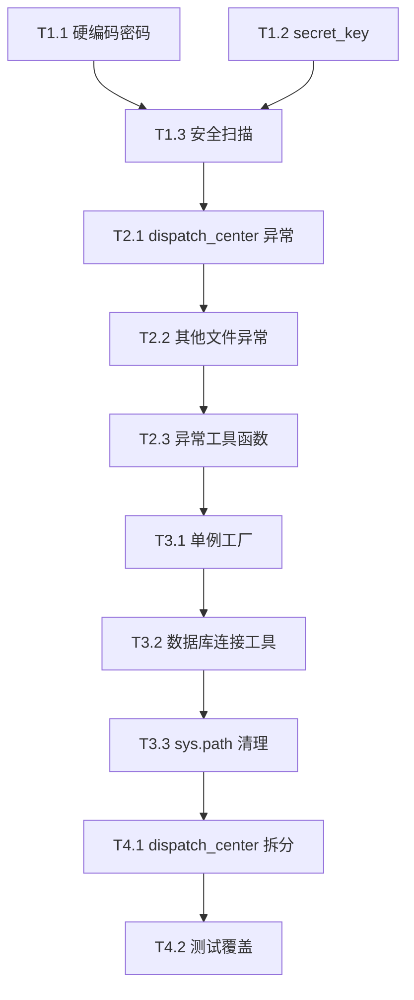

# 项目优化方案 - 2026-05-30

## 1. 优化目标

基于 [项目测评报告_2026-05-30.md](项目测评报告_2026-05-30.md) 的发现，制定系统化的优化方案。

**目标**：
- 消除安全隐患（硬编码密码、弱密钥）
- 提升代码质量（异常处理、日志规范）
- 改善可维护性（去重、模块拆分）
- 提升测试覆盖率

## 2. 优化阶段划分

### 阶段划分原则

- **P0 (立即)**: 安全风险，必须当天处理
- **P1 (1周内)**: 代码质量，影响稳定性
- **P2 (2周内)**: 架构优化，提升可维护性
- **P3 (1月内)**: 长期规划，持续改进

### 依赖关系

```
P0 硬编码清理 → P1 异常处理 → P2 架构重构 → P3 测试覆盖
   ↓                ↓              ↓
   可独立          可独立          依赖 P1
```

## 3. 任务分解

### T1.1 硬编码密码清理 [P0] [0.5h]

**输入契约**：
- 前置依赖：无
- 输入数据：scripts/ 目录下的所有 Python 文件
- 环境依赖：git 历史

**输出契约**：
- 输出数据：清理后的脚本文件
- 交付物：提交记录
- 验收标准：
  - `git grep "88888888"` 返回 0 匹配
  - `git grep "cs123456"` 返回 0 匹配
  - 所有密码从环境变量读取

**实现约束**：
- 使用 `os.environ.get('MYSQL_PASSWORD', '')` 模式
- 不提供默认值（防止留默认值导致再次硬编码）
- 更新 `.env.example` 添加说明

**修改文件清单**：
| 文件 | 当前行 | 修改内容 |
|------|--------|----------|
| `scripts/fix_production_orders.py` | 25 | `'88888888'` → `os.environ.get('MYSQL_PASSWORD', '')` |
| `scripts/check_process_records.py` | 17 | `'88888888'` → 环境变量 |
| `scripts/tools/sync_container_to_cs.py` | 97 | `'cs123456'` → 环境变量 |

### T1.2 secret_key 硬编码修复 [P0] [0.2h]

**输入契约**：
- 前置依赖：无
- 输入数据：`inventory_api_server.py:18`

**输出契约**：
- 输出数据：移除默认值的 secret_key
- 验收标准：
  - 无硬编码密钥
  - 启动时检查环境变量

**实现约束**：
```python
# 修复前
app.secret_key = os.getenv('FLASK_SECRET_KEY', 'inventory_web_secret_2026')

# 修复后
app.secret_key = os.environ['FLASK_SECRET_KEY']  # 必须设置，否则启动失败
```

### T1.3 全局敏感信息扫描脚本 [P0] [1h]

**输入契约**：
- 工具：grep / PowerShell Select-String
- 范围：项目所有 Python 文件

**输出契约**：
- 输出：扫描报告
- 位置：`scripts/tools/security_scan.py`

**实现要点**：
- 扫描模式：`password.*=.*['"][^'"]+['"]`
- 扫描模式：`api_key.*=.*['"][^'"]+['"]`
- 扫描模式：`secret.*=.*['"][^'"]+['"]`
- 自动检查：URL含密码的硬编码

### T2.1 裸 except 替换（dispatch_center.py） [P1] [2h]

**输入契约**：
- 前置依赖：无
- 文件：`dispatch_center.py`（8 处）
- 上下文：每处所在函数功能

**输出契约**：
- 输出：替换后的 `except Exception as e: logger.exception(...)`
- 验收标准：
  - `grep -n "except:" dispatch_center.py` 返回 0 匹配（除注释外）
  - 所有异常都有日志记录

**实现约束**：
- 使用 `logger.exception()` 自动记录 traceback
- 不可静默吞掉异常，除非确实安全

**替换示例**：
```python
# 修复前
try:
    do_something()
except:
    pass

# 修复后
try:
    do_something()
except Exception as e:
    logger.exception(f"操作失败: {e}")
```

### T2.2 裸 except 替换（其余文件） [P1] [2h]

**输入契约**：
- 前置依赖：T2.1 完成
- 文件清单：
  - `container_center_api.py` (2处)
  - `api/legacy_routes.py` (1处)
  - `storage_layer.py` (2处)
  - `app.py` (2处)
  - `storage/mysql_storage.py` (1处)
  - `scripts/tools/*.py` (多处)

**输出契约**：同 T2.1

### T2.3 异常处理工具函数 [P1] [1h]

**输入契约**：
- 目的：统一异常处理模式

**输出契约**：
- 新增：`core/safe_execute.py`
- 提供：
  - `safe_call(func, *args, default=None, **kwargs)` - 安全调用
  - `@safe_log(logger)` 装饰器

### T3.1 ContainerCenter 单例工厂 [P1] [1h]

**输入契约**：
- 前置依赖：无
- 调用方：5+ 处

**输出契约**：
- 新增：`container_center_factory.py`
- 函数：`get_container_center()`
- 验证：调用方改为使用工厂函数

**实现要点**：
```python
_container_center = None

def get_container_center():
    global _container_center
    if _container_center is None:
        from container_center_v5 import ContainerCenter
        _container_center = ContainerCenter()
    return _container_center
```

### T3.2 数据库连接工具函数 [P1] [1h]

**输入契约**：
- 前置依赖：无
- 现有：5+ 处 `pymysql.connect(**MYSQL_CFG...)`

**输出契约**：
- 新增：`core/db_connection.py`
- 函数：
  - `get_db_connection(timeout=DB_CONNECT_TIMEOUT)` - 同步
  - `get_db_connection_context()` - 上下文管理器

### T3.3 sys.path 清理 [P2] [2h]

**输入契约**：
- 前置依赖：T3.2 完成
- 现有：15+ 处 `sys.path.insert`

**输出契约**：
- 统一在 `core/config.py` 设置
- 各文件移除重复设置
- 验证：所有 import 仍可正常工作

**实施步骤**：
1. 移除 `dispatch_center.py`, `container_center_api.py` 等入口的 sys.path 设置
2. 验证 `core/config.py` 中的 sys.path 设置已涵盖所有需求
3. 重启所有服务验证

### T4.1 dispatch_center.py 拆分 [P2] [8h]

**问题**：当前 6300+ 行，单文件过大

**拆分方案**：
```
dispatch_center/
├── __init__.py          # 创建 app, 注册蓝图
├── core_routes.py       # 核心 API（status、tasks、processes）
├── operator_routes.py   # 操作员管理
├── template_routes.py   # 消息模板
├── feedback_routes.py   # 反馈
├── config_routes.py     # 配置管理
├── enterprise_routes.py # 企业架构
└── proxy_routes.py      # 容器中心代理
```

**风险控制**：
- 采用渐进式迁移
- 保留 `dispatch_center.py` 作为入口
- 逐步迁移路由到子模块

### T4.2 单元测试覆盖 [P3] [持续]

**目标**：覆盖率从当前 ~20% 提升到 60%+

**优先级模块**：
1. 容器中心核心 (`container_center_v5.py`)
2. 调度中心核心 (`dispatch_center.py`)
3. 数据模型 (`models/`)
4. 工具函数 (`core/`, `utils/`)

## 4. 执行计划

### 第1天 (P0)
- [ ] T1.1 硬编码密码清理
- [ ] T1.2 secret_key 修复
- [ ] T1.3 安全扫描脚本

### 第2-3天 (P1)
- [ ] T2.1 dispatch_center.py 异常处理
- [ ] T2.2 其他文件异常处理
- [ ] T2.3 异常工具函数
- [ ] T3.1 ContainerCenter 单例
- [ ] T3.2 数据库连接工具

### 第4-7天 (P2)
- [ ] T3.3 sys.path 清理
- [ ] T4.1 dispatch_center.py 拆分

### 第8天+ (P3)
- [ ] T4.2 持续提升测试覆盖率

## 5. 质量门控

### 每个任务的验收标准

1. **功能正常**：所有现有功能不受影响
2. **服务可启动**：所有服务端口能正常启动
3. **测试通过**：现有测试用例全部通过
4. **代码规范**：
   - 无新的硬编码
   - 无裸 except
   - 使用 logger 而非 print

### 阶段性检查

每个阶段结束后：
- 运行安全扫描脚本（T1.3）
- 运行项目测评脚本
- 对比改进前后指标

## 6. 风险评估

| 风险 | 概率 | 影响 | 应对 |
|------|------|------|------|
| 拆分后导入路径错误 | 中 | 高 | 渐进式迁移，保留入口 |
| 异常处理引入性能问题 | 低 | 中 | 仅在边界处理异常 |
| 修改后服务无法启动 | 中 | 高 | 重启后立即验证 |
| 环境变量未设置 | 中 | 中 | 提供 .env.example 模板 |

## 7. 依赖图



## 8. 验收报告

完成所有任务后，生成 [ACCEPTANCE_项目优化.md](ACCEPTANCE_项目优化.md) 记录：
- 完成情况
- 改进指标
- 遗留问题
- TODO 事项

## 9. 相关文档

- [项目测评报告_2026-05-30.md](项目测评报告_2026-05-30.md) - 测评依据
- [问题整改方案.md](问题整改方案.md) - 历史整改方法
- [问题上下文记录.md](问题上下文记录.md) - 历史问题记录
- [架构问题修复方案_配置_模块_依赖.md](架构问题修复方案_配置_模块_依赖.md) - 架构参考
